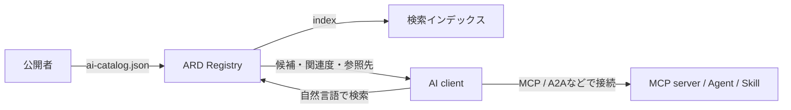
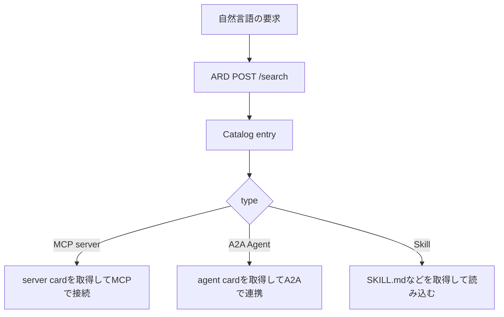

## まず動かす

MCPサーバーやSkillsをAIエージェントへつなぐ機会が増えてきました。数個なら設定ファイルへ並べれば済みますが、数十、数百と増えたとき、今度は「このタスクには何を使えばよいのか」を探す必要が出てきます。

その発見部分を標準化しようとしているのが、2026年6月に発表された **Agentic Resource Discovery（ARD）** です。

説明から入るより、まず検索結果を見たほうが早いと思います。ARDプロジェクトが公開しているGitHub Copilot向けconnectorでは、GitHub Agent Finderの検索先として次のエンドポイントが使われています。

```bash
curl -sS https://agentfinder.github.com/api/v1/search \
  -H 'content-type: application/json' \
  -d '{
    "query": {
      "text": "query a PostgreSQL database",
      "filter": {
        "type": ["application/mcp-server+json"]
      }
    },
    "pageSize": 3
  }' \
  | jq '.results[] | {displayName, type, score}'
```

2026年7月15日に実行すると、次の3件が返りました。


再利用しやすいように、同じ結果をJSONでも載せます。

<!-- evidence: command="POST GitHub Agent Finder /api/v1/search with PostgreSQL query and MCP type filter"; log="chat run 2026-07-15" -->

```json
{
  "displayName": "PostgreSQL",
  "type": "application/mcp-server+json",
  "score": 100
}
{
  "displayName": "DBHub",
  "type": "application/mcp-server+json",
  "score": 90
}
{
  "displayName": "Axiom",
  "type": "application/mcp-server+json",
  "score": 60
}
```

自然言語の要求から、候補となるMCPサーバーが関連度順に返っています。ただし、別の問い合わせなら必ず見つかるわけではありません。

```bash
curl -sS https://agentfinder.github.com/api/v1/search \
  -H 'content-type: application/json' \
  -d '{"query":{"text":"summarize a PDF"},"pageSize":3}' \
  | jq '{results}'
```

同じ日に試した結果は0件でした。

```json
{
  "results": []
}
```

ここがARDを試して最初にしっくり来たところです。ARDは、どこかに存在するツールを必ず見つけてくれる魔法ではありません。**どのRegistryを検索するか、そのRegistryが何を収録しているか、各ツールがどんなメタデータを公開しているか**で結果は変わります。

:::message
この記事では、ARDの公開カタログと検索APIをローカルで動かし、公式の適合性テストを通します。見つけたMCPサーバーやAgentを実際にインストール・実行するところまでは扱いません。また、ARD仕様は執筆時点で v0.9 Draft です。
:::

## MCPがあるのに、なぜARDが必要なのか

MCPは、AIアプリケーションが外部のツールやデータソースへ接続するためのプロトコルです。A2AはAgent同士の連携、Skillsは手順や知識の再利用に使われます。

一方のARDは、接続や実行の方法を決めません。**接続する前に、何が利用可能かを公開し、検索し、候補を返す層**です。

| 仕組み | 主な役割 |
|---|---|
| ARD | MCP server、A2A Agent、Skillなどを公開・検索・発見する |
| MCP | 見つけたMCP serverへ接続し、ツールやリソースを利用する |
| A2A | 見つけたAgentの情報を読み、Agent同士で連携する |
| Skills | 見つけた手順や知識をAgentへ読み込ませる |

今のツール選択では、利用可能なツールの説明をまとめてLLMのコンテキストへ入れ、その中から選ばせる構成をよく見かけます。数が少ないうちは素直ですが、増えるほど説明だけでコンテキストを使います。似た名前のツールが増えると、選択も難しくなります。

ARDは、その選択の前段を検索サービスへ出します。



つまり、ARDとMCPは競合ではありません。

**ARDは探すところまで。MCPは見つけたあと。**

## ARDを構成する3つの要素

最小構成で見ると、ARDには次の3者がいます。

1. **Publisher**: 自分のドメインで利用可能な資源を公開する
2. **Registry**: 公開されたカタログを収集し、検索可能にする
3. **Client**: タスクを自然言語で問い合わせ、返った候補を評価する

Publisherが置く静的ファイルが `ai-catalog.json` です。標準の配置先は次のwell-known URIです。

```text
https://<publisher-domain>/.well-known/ai-catalog.json
```

Registryはこのファイルを収集してインデックスを作り、`POST /search` などのREST APIを公開します。Clientは自分が信頼するRegistryを選び、そこへ問い合わせます。

中央に唯一の巨大Registryを置く前提ではありません。公開Registry、ベンダーのRegistry、社内専用Registryを使い分けたり、Registry同士を連携させたりする構成です。

## 最小のai-catalog.jsonを作る

今回はMCP server、A2A Agent、Skillを1件ずつ公開するカタログを作ります。URLは例示用で、実在するサービスではありません。

:::details ai-catalog.jsonの全体

```json:ai-catalog.json
{
  "specVersion": "1.0",
  "host": {
    "displayName": "Example Dev Tools",
    "identifier": "did:web:example.com"
  },
  "entries": [
    {
      "identifier": "urn:air:example.com:server:postgres",
      "displayName": "PostgreSQL Query Server",
      "type": "application/mcp-server-card+json",
      "url": "https://example.com/mcp/postgres.json",
      "description": "Queries a PostgreSQL database with read-only tools.",
      "capabilities": ["QueryDatabase", "DescribeSchema"],
      "representativeQueries": [
        "query a PostgreSQL database",
        "show the schema of a PostgreSQL table"
      ]
    },
    {
      "identifier": "urn:air:example.com:agent:incident-triage",
      "displayName": "Incident Triage Agent",
      "type": "application/a2a-agent-card+json",
      "url": "https://example.com/agents/incident-triage.json",
      "description": "Classifies incidents and proposes an initial response.",
      "representativeQueries": [
        "triage this production incident",
        "summarize the likely impact of this alert"
      ]
    },
    {
      "identifier": "urn:air:example.com:skill:release-notes",
      "displayName": "Release Notes Skill",
      "type": "text/markdown; profile=\"urn:air:agent-skills\"",
      "url": "https://example.com/skills/release-notes/SKILL.md",
      "description": "Creates release notes from merged pull requests.",
      "representativeQueries": [
        "write release notes for this version",
        "summarize merged pull requests for users"
      ]
    }
  ]
}
```

:::

項目を絞って読むと、だいたい次の意味です。

| 項目 | 意味 |
|---|---|
| `identifier` | Publisherのドメインを含む論理的な識別子 |
| `displayName` | 人が読む表示名 |
| `type` | MCP server、A2A Agent、Skillなど資源の種類 |
| `url` / `data` | 資源への参照、または埋め込んだ定義本体 |
| `description` | 検索や表示に使う短い説明 |
| `capabilities` | 絞り込みに使える能力名 |
| `representativeQueries` | この資源が候補になる代表的な自然言語クエリ |

### identifierはドメインにひも付く

ARDの `identifier` は、次の形式を使います。

```text
urn:air:<publisher>:<namespace>:<name>
```

たとえば、次の識別子ならPublisherは `example.com` です。

```text
urn:air:example.com:server:postgres
```

名前の衝突を避けるだけでなく、あとで `trustManifest` のidentityとPublisherのドメインを照合するための土台にもなります。

### urlとdataはどちらか1つ

各entryは、参照先を示す `url` か、定義を直接埋め込む `data` のどちらか一方を持ちます。両方を同時に入れるのはエラーです。

ARDはMCP server cardやA2A agent cardの中身を独自形式に変換しません。`type` で種類を示し、実際の定義は `url` または `data` から取得します。この薄い包み方のおかげで、異なる資源を同じ検索面に並べられます。

### representativeQueriesは検索の種になる

`description` だけだと、公開者が使う言葉と利用者が入力する言葉がずれることがあります。`representativeQueries` には「この資源を必要とする人が、どう質問するか」を2〜5件書きます。

```json
"representativeQueries": [
  "query a PostgreSQL database",
  "show the schema of a PostgreSQL table"
]
```

Registryは、これらをsemantic searchの索引作成に利用できます。ただし、どのembedding modelやranking algorithmを使うかはRegistry側の実装です。同じカタログでも、Registryが違えば順位は変わりえます。

## 公式の適合性テストを通す

ARDの公式リポジトリには、Python製のConformance Testing CLIが入っています。今回は2026年7月15日時点の次のcommitで確認しました。

<!-- evidence: command="git -C /tmp/ard-spec-20260715 rev-parse HEAD"; log="afd447d88ed165427687d8af37e8d42398552b56" -->

```text
afd447d88ed165427687d8af37e8d42398552b56
```

まずリポジトリを取得し、commitを固定します。

```bash
git clone https://github.com/ards-project/ard-spec.git
cd ard-spec
git checkout afd447d88ed165427687d8af37e8d42398552b56
```

CLI自体はPython標準ライブラリだけでも動きます。JSON Schemaまで厳密に検証したいので、今回は一時的なvirtual environmentへ `jsonschema` を追加しました。

```bash
python3 -m venv .venv
source .venv/bin/activate
python -m pip install jsonschema
```

先ほどのファイルを、たとえば `conformance/examples/article-ai-catalog.json` に保存して検証します。

```bash
./conformance/bin/conformance-test \
  manifest conformance/examples/article-ai-catalog.json
```

3件とも、JSON Schemaと独自のsemantic checkを通りました。

<!-- evidence: command="PATH=/tmp/ard-conformance-venv/bin:$PATH ./bin/conformance-test manifest examples/article-ai-catalog.json"; log="chat run 2026-07-15" -->

```text
Strict JSON Schema validation passed.
Found 3 entries to validate.

Entry: PostgreSQL Query Server
  Valid URN format. Publisher: 'example.com', Name: 'postgres'.
  Correct Value-or-Reference delivery format (using url).

Entry: Incident Triage Agent
  Valid URN format. Publisher: 'example.com', Name: 'incident-triage'.
  Correct Value-or-Reference delivery format (using url).

Entry: Release Notes Skill
  Valid URN format. Publisher: 'example.com', Name: 'release-notes'.
  Correct Value-or-Reference delivery format (using url).

CONFORMANCE STATUS: PASS
Validated with 0 critical specification errors and 0 warnings.
```

### わざと壊してみる

検査内容を見るために、1つのentryへ次の3つを入れてみます。

- `identifier` をURNではない文字列にする
- `url` と `data` を両方入れる
- `representativeQueries` を1件だけにする

```json
{
  "identifier": "not-a-domain-anchored-urn",
  "displayName": "Broken Example",
  "type": "application/mcp-server-card+json",
  "url": "https://example.com/mcp.json",
  "data": {},
  "representativeQueries": ["only one query"]
}
```

結果は2件のerrorと1件のwarningでした。

```text
Identifier 'not-a-domain-anchored-urn' does not match RFC 8141 URN pattern
'urn:air:<publisher>:<namespace>:<agent-name>'.

Constraint violation: both 'url' and 'data' are provided.
MUST provide exactly one.

'representativeQueries' array has size 1.
2 to 5 queries are recommended for vector index embedding.

CONFORMANCE STATUS: FAIL
Found 2 critical specification errors.
```

`representativeQueries` の件数は推奨なのでwarningですが、URNとValue-or-Referenceの違反はerrorです。終了コードも `1` になりました。CIへ組み込むなら、この差をそのまま利用できます。

## Registryの検索APIを動かす

公式リポジトリには、カタログ検証、mock Registryの起動、API検証までをまとめたスクリプトもあります。

```bash
cd conformance
./bin/run-conformance-demo
```

内部では、だいたい次の順で動きます。

1. `examples/` 配下のカタログを検証する
2. Python標準ライブラリだけで書かれたmock Registryを `127.0.0.1:9010` で起動する
3. `GET /agents`、`POST /search`、`POST /explore` を検証する
4. mock Registryを終了する

実行結果はすべてPASSでした。

<!-- evidence: command="PATH=/tmp/ard-conformance-venv/bin:$PATH ./bin/run-conformance-demo"; log="chat run 2026-07-15" -->

```text
Step 1: All mock manifests are fully spec-compliant!

GET /agents responded successfully with 200 OK.
GET /agents response contains valid 'items' list (4 items).

POST /search responded successfully with 200 OK.
POST /search returned valid results list (0 items).

POST /explore responded successfully with 200 OK.
POST /explore returned valid facets object.

CONFORMANCE STATUS: PASS
```

mock Registryを起動したまま、`weather` で検索してみます。

```bash
python3 conformance/examples/basic/registry-server.py
```

別のターミナルから問い合わせます。

```bash
curl -sS http://127.0.0.1:9010/search \
  -H 'content-type: application/json' \
  -d '{"query":{"text":"weather"},"pageSize":3}' \
  | jq '.results[] | {displayName, type, score, source}'
```

```json
{
  "displayName": "Weather Data Node",
  "type": "application/mcp-server-card+json",
  "score": 80,
  "source": "http://127.0.0.1:9010/"
}
```

これで、静的なカタログを検証し、検索APIから候補を返すところまで動きました。

## 適合性テストがPASSでも、検索品質は別

ここで、少し意地悪な問い合わせをしました。`type` をA2A Agentだけに絞りながら、`weather` を検索します。

```bash
curl -sS http://127.0.0.1:9010/search \
  -H 'content-type: application/json' \
  -d '{
    "query": {
      "text": "weather",
      "filter": {
        "type": ["application/a2a-agent-card+json"]
      }
    },
    "pageSize": 1
  }' \
  | jq '.results[] | {displayName, type, score}'
```

返ったのは、A2A AgentではなくMCP server cardでした。

<!-- evidence: command="POST local ARD mock /search with weather query, A2A type filter, and pageSize=1"; log="chat run 2026-07-15" -->

```json
{
  "displayName": "Weather Data Node",
  "type": "application/mcp-server-card+json",
  "score": 80
}
```

このcommitのmock Registryは `query.text` による単純な文字列検索はしますが、`filter` と `pageSize` を検索処理へ反映していません。それでもConformance Testing CLIはPASSします。現時点のCLIが確認するのは、主にendpointのstatus codeとresponse envelope、entryの必須項目だからです。

これはテストが無意味という話ではありません。次の2つを分けて考える必要がある、という話です。

- **Protocol conformance**: 必要なendpointやresponse shapeを備えているか
- **Search semantics / quality**: filter、pagination、rankingを期待どおり実装しているか

後者は、Registry実装ごとのtest caseが別途必要です。`CONFORMANCE STATUS: PASS` を見て、検索の意味や品質まで証明されたと読むのは危ないです。

## 発見後は各プロトコルへ引き渡す

検索結果には `type` と `url`、または埋め込まれた `data` が含まれます。Clientは `type` を見て、その先の扱いを変えます。



ARD自身は、検索で見つけた資源を自動インストールしません。GitHub Agent Finderも、候補を見つけるところまでで、勝手に接続しない方針を明記しています。

発見と実行を分けることで、Client側に次の判断を残せます。

- このRegistryを信頼するか
- このPublisherを信頼するか
- この資源をインストールしてよいか
- どの権限とsandboxで実行するか

## scoreは安全性の点数ではない

検索結果の `score` は、自然言語の要求とentryがどれくらい関連しているかを示す値です。ARD仕様では0〜100のrelevance scoreとして定義されています。

ここで大事なのは、**scoreが高くても、安全とは限らない**ことです。

```text
Relevance != Trust != Authorization != Runtime Safety
```

たとえば、PostgreSQL向けMCP serverが検索意図に完全一致して `score: 100` だったとしても、次のことは別に確認する必要があります。

- 本当に表示されたPublisherが運営しているか
- 配布物や参照先が改ざんされていないか
- 自分の組織で利用を許可されているか
- database credentialをどう渡すか
- read-onlyに見えるツールが、本当に書き込まないか
- 実行時のfilesystemやnetworkをどこまで許すか

ARDは、このうちPublisher identityやattestationを載せるために `trustManifest` を用意しています。

```json
{
  "trustManifest": {
    "identity": "spiffe://example.com/server/postgres",
    "identityType": "spiffe",
    "attestations": [
      {
        "type": "SOC2-Type2",
        "uri": "https://example.com/trust/soc2.pdf"
      }
    ]
  }
}
```

ただし、メタデータが書かれていることと、その内容を検証したことも別です。ClientやRegistryは、URNのPublisher domain、identity、署名、attestationの参照先を自分のpolicyで検証する必要があります。

ARDは信頼を自動で与えるのではなく、**信頼を判断するための材料を運ぶ場所**を標準化しています。

## federationは「どこを探すか」の選択肢

`POST /search` には `federation` という項目があります。

| 値 | 意味 |
|---|---|
| `none` | 問い合わせたRegistry内だけを検索する |
| `referrals` | ほかのRegistry候補を返し、Client側でたどる |
| `auto` | 問い合わせたRegistry側で上流の結果を統合する |

これは、公開Registryだけに寄せず、社内Registryや専門Registryを組み合わせるための仕組みです。

一方で、どのRegistryをたどるかはtrust boundaryそのものです。Clientが検索先URLを勝手に推測するのではなく、許可されたRegistry一覧を持ち、その範囲で検索する形が現実的だと思います。

## 今の段階で導入するなら

いきなり組織内のすべてのMCP serverやAgentを自動発見させるのは、まだ少し早いです。小さく始めるなら、次の順がよさそうです。

### 1. 静的カタログを作る

まず、利用を許可している資源だけを `ai-catalog.json` に並べます。この段階ではsemantic searchがなくても、棚卸しとして使えます。

### 2. CIでmanifestを検証する

公式Conformance Testing CLIを使い、URN、Value-or-Reference、schemaの崩れを止めます。Draft仕様なので、CLIとschemaはcommitやversionを固定しておいたほうが安全です。

### 3. 社内Registryで検索する

公開Registryへ出せない内部MCP serverやSkillsは、社内Registryだけに収録します。検索結果をそのまま実行せず、候補提示までに留めます。

### 4. Client側にallowlistと承認を残す

検索対象のRegistry、許可するPublisher、resource type、実行環境をpolicyで絞ります。自動インストールではなく、人が候補を選ぶところから始めるのが無難です。

発見できる範囲を増やすより、**誰が何を公開し、誰がどこまで検索・実行できるか**を先に決める方が大事です。

## 実際に動かして分かったこと

### 1. ai-catalog.jsonはかなり薄い

ARD独自の巨大なAgent定義を書くわけではありません。既存のMCP server card、A2A agent card、Skillなどを `type` と `url` で包みます。

新しい実行protocolを増やすというより、異なる資源へ共通の検索用ラベルを付ける発想です。

### 2. representativeQueriesが検索品質の入口になる

`description` だけでなく、利用者が実際に入力しそうな文を載せられます。公開者側が検索され方を設計できる一方で、過剰な文言や似たqueryが増えるとrankingを汚す可能性もあります。

検索用metadataの品質管理は、ARDを導入したあとに地味に効きそうです。

### 3. protocol準拠と実装品質は別に見る必要がある

公式mock RegistryはConformance Testing CLIを通りますが、`filter` と `pageSize` は反映しませんでした。準拠testは必要ですが、それだけでは検索の意味までは保証しません。

つまり、schema validation、protocol conformance、search quality evaluationは別物です。

### 4. Draft仕様の揺れが、すでに見える

今回固定したcommitでは、公式仕様は v0.9 Draftです。一方、mock Registryのdocstringには古い `v0.4` という表記が残っていました。

media typeにも揺れがあります。仕様と公式conformance exampleは `application/mcp-server-card+json` を使っていますが、GitHub Agent Finderの実レスポンスは `application/mcp-server+json` でした。

どちらかを雑に「間違い」と決めるより、今は仕様と実装が並行して動いている段階だと読むのがよさそうです。記事や実装では、日付、commit、実際のresponseを一緒に残しておく必要があります。

## 限界

一番大きな限界は、ARDがまだ v0.9 Draftであり、長期運用された標準ではないことです。

そのため、この記事で言えるのは次の範囲です。

- `ai-catalog.json` で複数種類のagentic resourceを表現できる
- 公式CLIでmanifestとRegistry APIの基本構造を検証できる
- GitHub Agent Finderの公開endpointから、自然言語に応じた候補が返る
- 発見とMCP / A2Aなどの実行を分離する設計を、最小構成で確認できる

一方で、まだ言えないこともあります。

- ARDが業界の標準として定着するか
- 数千、数百万件でのranking品質やlatency
- federationしたRegistry間で順位をどう公平に統合できるか
- 悪意あるmetadataや検索spamを十分に防げるか
- `trustManifest` が実運用でどこまで検証されるか
- Conformance Testing CLIのPASSが検索機能の完全性を保証するか

次に進めるなら、社内向けの小さなallowlist Registryを作り、10〜20件程度の実際のMCP serverやSkillsを入れて、代表queryに対するprecisionと誤選択を記録したいです。仕様の説明より、その評価dataの方が導入判断には効くと思います。

## まとめ

今回やったことを振り返ると、次のとおりです。

- GitHub Agent Finderへ自然言語で問い合わせ、MCP server候補を取得した
- MCP server、A2A Agent、Skillを並べた `ai-catalog.json` を作った
- 公式CLIで正常系と意図的な失敗を検証した
- mock Registryを起動し、`POST /search` から候補を取得した
- conformanceと検索品質、関連度と信頼性が別物だと確認した
- v0.9 Draftらしい仕様と実装の揺れも確認した

MCPで接続方法がそろっても、接続先を探す問題は残ります。

ARDは、その手前に検索可能な目録を置こうとしています。

## 参考

参考にした一次情報と、実際に動かした公式リポジトリです。

- [Agentic Resource Discovery Specification](https://agenticresourcediscovery.org/spec/)
- [ARD — How to publish](https://agenticresourcediscovery.org/how_to_publish/)
- [ARD — How to add ARD support to your agent](https://agenticresourcediscovery.org/how_to_build_a_client/)
- [ards-project/ard-spec](https://github.com/ards-project/ard-spec)
- [ards-project/connectors — GitHub Copilot connector](https://github.com/ards-project/connectors/tree/main/skills/github-copilot)
- [Google Developers Blog — Announcing the Agentic Resource Discovery specification](https://developers.googleblog.com/en/announcing-the-agentic-resource-discovery-specification/)
- [Microsoft Command Line — Introducing the Agentic Resource Discovery specification](https://commandline.microsoft.com/agentic-resource-discovery-specification-ard/)
- [GitHub Changelog — Agent finder for GitHub Copilot now available](https://github.blog/changelog/2026-06-17-agent-finder-for-github-copilot-now-available/)
