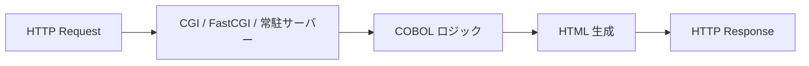

## 作ったもの

GnuCOBOL + CGI で、Next.js（pages router 寄り）の機能を**最小限だけ**再現し、**何行で足りるか**を数えたデモです。

- GitHub: [https://github.com/masanori0209/cobol-cgi-ssr](https://github.com/masanori0209/cobol-cgi-ssr)
- ルーティング、テンプレート、リクエストごとの HTML 生成、動的ルート、疑似 `getServerSideProps` 相当に加え、**POST フォーム・Cookie セッション・indexed file への投稿** まで足した拡張版も同リポジトリに入っています
- 「速い」「本番向き」は主張しません。分解と行数測定が目的です

```bash
git clone https://github.com/masanori0209/cobol-cgi-ssr
cd cobol-cgi-ssr
docker compose up --build
BASE_URL=http://127.0.0.1:8080 ./scripts/run-all.sh
```


:::message
この記事は **GnuCOBOL + CGI の玩具実装** の話です。日立 VOS3 上の本番 Web 化（XMAP3、Lumada モダナイゼーション）の手順書ではありません。VOS3 の提供終了ニュースは動機のひとつですが、デモはオープン環境で動かしています。
:::

## はじめに

2026年5月29日、日立はメインフレーム向け OS [VOS3 の販売終了（2027年11月）と保守終了（2034年12月）](https://www.itmedia.co.jp/enterprise/articles/2606/23/news059.html) を発表しました。[日経 xTECH も「地銀勘定系も転換点」と整理](https://xtech.nikkei.com/atcl/nxt/column/18/00001/11799/)しています。

そのニュースを見て、ふと昔のことを思い出しました。新卒の頃、VOS 系の現場で COBOL の開発・保守をしていた時期があります（JCL や TSS などよく利用していました）。いまは Vue.js や Django、最近は React や Rust など Web 寄りの仕事が中心です。

VOS3 の話と、いまの仕事がどう結びつくわけでもないのですが、「COBOL で画面に近いものを組み立てていた記憶」を、GnuCOBOL と CGI で一度再現してみたくなったのが、このデモのきっかけです。Next.js の機能を分解して、何行くらいで足りるか数える、というのはその延長です。

本番の VOS 系 Web 化が **CGI で COBOL が HTML を吐く** 一本道かと言えば、そうでもありません。日立 [XMAP3](https://www.hitachi.co.jp/Prod/comp/soft1/xmap3/info/index.html) のように、**TSS のパネル定義を Web へ載せ替える**製品ルートもあります。今回のデモは、その本番ルートの代わりではなく、**「SSR そのものは古いプロトコルでも成立する」** ことを、行数付きで確かめる実験です。

## CGI と SSR は別レイヤの話

よく混同されるので、先に置きます。


|         | 何の話か                       | 隣に並ぶ概念                       |
| ------- | -------------------------- | ---------------------------- |
| **SSR** | HTML を**どこで**組み立てるか（サーバー側） | CSR、SSG、hydration            |
| **CGI** | Web サーバーとプログラムの**接続方式**    | FastCGI、常駐 HTTP サーバー、API ラッパ |





GnuCOBOL が `stdout` に `Content-Type` と HTML を出す CGI は、**接続方式が CGI で、レンダリングモデルが SSR** です。Next.js の Server Component や `getServerSideProps` と「HTML をサーバーで作る」点では同じ側に立ちます。違うのは bundler、npm エコシステム、クライアント hydration など**周辺**です。

## 調査で見つかった「オープン COBOL Web」の地図

今回のデモを作る前に、関連実装をざっくり調べました。


| 系統              | 代表例                                                                                                                                                | 今回との関係              |
| --------------- | -------------------------------------------------------------------------------------------------------------------------------------------------- | ------------------- |
| **CGI + HTML**  | [GnuCOBOL FAQ 1.13](https://gnucobol.sourceforge.io/faq/index.html)、[Qiita: GnuCOBOLでHTML出力](https://qiita.com/tukiyo3/items/50f1ffa23e7dbc69c9e6) | SSR の素。今回の土台        |
| **ミニフレームワーク**   | [COBOL on Wheelchair](https://github.com/azac/cobol-on-wheelchair)（routing + `{{template}}`）                                                       | ルーティングとテンプレートの参考にした |
| **JSON API 寄り** | HTTP サーバ／スクリプト言語が外側で COBOL を呼ぶ構成（製品・社内 PoC が多い）                                                                                                    | HTML SSR とは別レイヤ     |
| **VOS 本番ルート**   | [XMAP3 FAQ](https://www.hitachi.co.jp/Prod/comp/soft1/xmap3/faq/faq08.html)（TSS＋パネル定義の Web 化）                                                      | 玩具デモの対極。敬意を持って表に残す  |


「COBOL で Next.js」という製品はありません。あるのは **1990年代からの CGI＝SSR** と、そこに routing / template を足した PoC 群です。

## Next.js の機能分解と、今回やった／やらない

対象は **pages router 時代のイメージ** です。App Router の RSC までは追いません。


| Next.js の機能           | 今回の COBOL 相当                                                 | デモでの扱い                                     |
| --------------------- | ------------------------------------------------------------ | ------------------------------------------ |
| SSR（HTML をサーバーで生成）    | CGI `DISPLAY` HTML                                           | **やった**（最初からここ）                            |
| ファイル／表形式ルーティング        | `config.cbl` の `routing-pattern`                             | **やった**                                    |
| 動的ルート `/posts/[id]`   | `/posts/%id` + PATH マッチ                                      | **やった**                                    |
| `getServerSideProps`  | `postlistfill` で indexed file 読み取り → テンプレートへ              | **やった**（`` で一覧を `.cow` 側に）          |
| `layout.tsx`          | `views/layout.cow` + ``                         | **やった**（partials 分割）                          |
| CSS / スタイル注入          | `static/app.css` + `{{extra_css}}`                           | **やった**（ページごとに `<style>` 追記可能）              |
| Django 風テンプレート       | ``, ``, ``                     | **やった**（最小 subset。`extends` / auto-escape はなし） |
| ページ描画ヘルパ            | `renderpage.cbl` + `page-ctx`                                | **やった**（コントローラから layout へ一発）              |
| 404                   | ルート未一致時の HTML                                                | **やった**                                    |
| bundler / npm         | —                                                            | **やらない**                                   |
| hydration / クライアント JS | `static/app.js` + `page_script` + `{{extra_js}}`           | **やった**（最小。React/Vue 級の SPA ではない）         |
| 認証・セッション              | Cookie + `data/sessions/` ファイルストア                            | **拡張版でやった**（ログインはユーザー名のみ）                  |
| POST フォーム             | `CONTENT_LENGTH` + stdin、`application/x-www-form-urlencoded` | **拡張版でやった**                                |
| 本番データ（永続化）            | indexed file `data/posts.dat`                                | **拡張版でやった**（`` で一覧表示）                 |
| API Routes / JSON     | —                                                            | **やらない**（JSON API ラッパ領域。HTML SSR とは別）      |
| 常駐化（FastCGI）          | —                                                            | **やっていない**（ベンチは spawn-per-request CGI のまま） |


つまり **「SSR 本体は安い。DX を足すと一気に行数が乗る」** という仮説を、行数で見る記事です。

## 実装コスト（行数）

`scripts/count-lines.sh` で `wc -l` 集計した結果です。空行も含むので、ざっくりした見積もりとして読んでください。

### 最小版（ルーティング + SSR の芯）


| 機能ブロック                   | ファイル                    | 行数      |
| ------------------------ | ----------------------- | ------- |
| ルータ（PATH_INFO + CGI ヘッダ） | `src/ssr.cbl`           | 151     |
| ルート表                     | `src/config.cbl`        | 13      |
| テンプレート `{{var}}`         | `src/ssrtemplate.cbl`   | 65      |
| データ取得（GSSP 相当）           | `src/postsdata.cbl`     | 90      |
| ページコントローラ計               | `src/controllers/*.cbl` | 113     |
| HTML ビュー                 | `views/layout.cow`      | 30      |
| **COBOL 合計**             |                         | **432** |


### 拡張版（POST / セッション / indexed file / テンプレート強化）


| 機能ブロック                    | ファイル                    | 行数       |
| ------------------------- | ----------------------- | -------- |
| ルータ + メソッド振り分け            | `src/ssr.cbl`           | 121      |
| ルート表（9 ルート）               | `src/config.cbl`        | 37       |
| テンプレートエンジン                | `src/ssrtemplate.cbl`   | 399      |
| 投稿一覧用変数埋め                 | `src/postlistfill.cbl`  | 86       |
| CGI POST / Cookie / セッション | `cgilib.cbl` ほか         | 286      |
| indexed file（`posts.dat`） | `src/postsdata.cbl`     | 207      |
| ページコントローラ計                | `src/controllers/*.cbl` | 343      |
| HTML ビュー（partials 含む）      | `views/**/*.cow`        | 54       |
| **COBOL 合計**              |                         | **1479** |


読み方のメモです。

- **SSR 相当（ヘッダ + HTML 出力）** だけなら、Hello World 級の CGI は数十行で済みます（[GnuCOBOL FAQ のサンプル](https://gnucobol.sourceforge.io/faq/index.html)どおり）
- **ルーティング + 動的パス** が `ssr.cbl` の大半（151行）を占めました。HTML を返す SSR より、パスマッチの方が行数を食いやすい、というのが今回の実感です
- **テンプレート** は最初 `{{var}}` だけ（65行）だったが、Django 風タグを足して **399行** まで増えた。再帰 `include` ではテンプレート行バッファを深さごとに分離する必要があった（後述）
- **データ取得** は indexed file（`posts.dat`）。`postlistfill.cbl` が `post_id_1` / `post_title_1` … をテンプレート変数に載せ、`views/posts/list.cow` の `` で一覧化する
- **432 → 1479 行**（約3.4倍）で、POST パース、Cookie セッション、ファイル永続化、テンプレート partial、CSS 注入まで載った。FastCGI 常駐化はまだ入れていない

Next.js 本体と**行数を直接比較する意味は薄い**です（言語も生成物も違う）。この表が示しているのは、「Next.js が肩代わりしている部分のうち、CGI 時代はどこにコストがあったか」という分解図に近いです。

## デモの構成

```text
cobol-cgi-ssr/
├── src/
│   ├── ssr.cbl           # CGI 入口 + PATH_INFO ルーティング
│   ├── config.cbl        # ルート表（copy で include）
│   ├── ssrtemplate.cbl   # {{var}} + 
│   ├── postlistfill.cbl  # 投稿一覧用テンプレート変数
│   ├── cgilib.cbl        # POST stdin / Cookie / セッションファイル
│   ├── postsdata.cbl     # postserv（INIT / LIST / LOOKUP / ADD）
│   └── controllers/      # home / about / posts / login / postnew …
├── views/
│   ├── layout.cow
│   ├── partials/         # head.cow, nav.cow
│   └── posts/list.cow
├── static/app.css        # 共通 CSS（Apache が静的配信）
├── ssr.cgi               # ビルド成果物（Apache から実行）
└── scripts/
    ├── build.sh
    ├── run-all.sh
    └── count-lines.sh
```

Apache は `.htaccess` で存在しないパスを `ssr.cgi/$1` に流します（[COBOL on Wheelchair](https://github.com/azac/cobol-on-wheelchair) と同型）。

```apache
RewriteRule ^(.*)$ ssr.cgi/$1 [L]
```

### 最小 SSR（Hello 相当）

GnuCOBOL CGI の核はこれだけです。

```cobol
display
  'Content-Type: text/html; charset=utf-8'
  newline
  '<html><body>hello</body></html>'
end-display.
```

これは **SSR** です。接続が CGI かどうかは別問題、という話の出発点になります。

### ルート表

`config.cbl` にパスとコントローラ名を並べます。

```cobol
move 4 to nroutes.
move "/" to routing-pattern(1).
move "home" to routing-destiny(1).
move "/posts/%id" to routing-pattern(4).
move "postdetail" to routing-destiny(4).
```

`%id` は PATH の一段をキャプチャし、`postdetail` に `query-value(1)` として渡ります。

### 疑似 getServerSideProps + Django 風テンプレート

`postslist` は `postlistfill` で indexed file を読み、`post_count` / `post_id_1` … をテンプレート変数に載せます。HTML の組み立て自体は `views/posts/list.cow` 側です。

```cobol
call 'postlistfill' using the-vars filled-count
move "page_template" to SSR-varname(n)
move "posts/list.cow" to SSR-varvalue(n)
move "extra_css" to SSR-varname(n+1)
move ".posts-table { margin-top: 0.5rem; }" to SSR-varvalue(n+1)
call 'ssrtemplate' using the-vars "layout.cow"
```

`views/posts/list.cow` はこういう形です（Django の template language に近い、最小 subset）。

```django

<p class="posts-action"><a href="/posts/new">Create a post</a></p>

<p class="posts-hint">Login to create posts.</p>

<table class="posts-table">
  <tbody>

    <tr>
      <td>{{post_id}}</td>
      <td><a href="/posts/{{post_id}}">{{post_title}}</a></td>
    </tr>

  </tbody>
</table>
```

CSS は2段構えです。

- 共通: `static/app.css` を `<link>` で読み込む（Apache がそのまま配信）
- ページ固有: コントローラから `{{extra_css}}` を渡し、`views/partials/head.cow` が `<style>` を差し込む

`` や auto-escape、フィルタは入れていません。あくまで「Django / Jinja の**雰囲気**を COBOL で再現する」ラインです。

### クライアント JavaScript（玩具フレームワーク）

SSR だけでも動きますが、Web アプリっぽくするために **JavaScript も差し込める** ようにしました。CSS の `{{extra_css}}` と同型です。

| 仕組み | 役割 |
|---|---|
| `static/app.js` | 全ページ共通（nav の active 付与、`window.CobolSsr`） |
| `page_script` | ページ専用ファイル（例: `pages/home.js` → `/static/pages/home.js`） |
| `{{extra_js}}` | インライン `<script>` 断片（短い初期化向け） |

`views/partials/scripts.cow` が `</body>` 直前に読み込みます。コントローラは `renderpage` に `page-ctx` を渡すだけです。

```cobol
move spaces to page-ctx
move "COBOL CGI SSR demo" to page-title
move "pages/home.cow" to page-template
move "pages/home.js" to page-script
call 'renderpage' using page-ctx cgictx
```

React の hydration や bundler までは入れていません。**「COBOL が HTML を返し、必要なら静的 JS を足す」** くらいのフレームワークです。本番で UI を厚くするなら、ここから Vite 等を横に置く想定です。

## 実装して分かったこと

### 1. SSR 自体は「古い」が、驚くほど単純

リクエストごとにプロセスが起動し、COBOL が HTML を組み立てて `stdout` へ出す——この形は 1990 年代からあります。[GnuCOBOL FAQ の CGI 節](https://gnucobol.sourceforge.io/faq/index.html) や [Docker で環境を固めた例](https://koduki.hatenablog.com/entry/2016/01/03/104740) も、結局は `Content-Type` を出して HTML を返す、という芯は同じです。流行の話題というより、小さく残り続けている部類だと思います。

### 2. 難しいのは routing と「境界の型」

GnuCOBOL 3.x では、同一ソース内の `CALL 'checkquery'` がモジュール未検出になることがありました。今回は **段落（PERFORM）に寄せて** 1 プログラムにまとめています。

テンプレート側では、コントローラと `ssrtemplate` で `SSR-varvalue` **の PIC 長を copybook で統一** しないと、LINKAGE の解釈がずれて HTML が壊れます。Next.js なら TypeScript の型で早い段階で気づくところ、COBOL CGI では実行時まで静かです。

### 3. VOS の Web 化は、もともと「HTML を COBOL が書く」だけではなかった

VOS3 では **TSS（Time Sharing System）** が対話オンラインの実行環境で、**パネル定義**（XMAP 系のマップ／論理マップ）が画面レイアウトを担います。COBOL AP はその上で動き、今回の CGI デモのように COBOL が直接 HTML を組む形とは、最初から別ルートです。

[XMAP3 の FAQ](https://www.hitachi.co.jp/Prod/comp/soft1/xmap3/faq/faq08.html) では、Web 化の選択肢として C/S と Web があり、Web の場合はブラウザ向け I/F の追加で改造量が増える、と書かれています。COBOL 学会資料の [名鉄コム事例](https://www.cobol.gr.jp/wp-content/uploads/2024/11/06-7.pdf) でも、TP1 / COBOL / XMAP3 の組み合わせが語られています。

今回の 432 行デモは、その**本番ルートの簡略模型ではありません**。あくまで「SSR の芯をオープン COBOL で触る」ための玩具です。

### 4. 「Next.js 的」に足したもの（拡張版）

最小版のあと、POST / セッション / indexed file に加え、**CSS 注入** と **Django 風テンプレート** も載せました。


| 項目              | 拡張版での実装                                                                        | 行数が載る場所（目安）                                         |
| --------------- | ------------------------------------------------------------------------------ | --------------------------------------------------- |
| POST フォーム       | `CONTENT_LENGTH` + stdin を `cgilib.cbl` で読み、`formget` で `title` / `body` を取り出す | `cgilib.cbl` 一帯                                     |
| セッション           | `Set-Cookie: ssr_sid=…` + `data/sessions/` にユーザー名を保存                           | `cgilib.cbl`                                        |
| 本番データ           | GnuCOBOL indexed file（`data/posts.dat`）。`ADD` で追記、`LOOKUP` で `/posts/:id`      | `postsdata.cbl`, `postlistfill.cbl`                 |
| CSS 注入          | `static/app.css` + `{{extra_css}}`                                             | `views/partials/head.cow`, 各コントローラ                |
| テンプレート partial | ``, ``              | `ssrtemplate.cbl`（399行）, `views/**/*.cow`           |
| 条件分岐 / ループ      | ``, ``                        | `ssrtemplate.cbl`, `views/posts/list.cow`           |
| クライアント JS       | `static/app.js` + `page_script` + `{{extra_js}}`                               | `views/partials/scripts.cow`, `renderpage.cbl`      |
| ページ描画ヘルパ        | `renderpage.cbl` + `page-ctx`                                                 | 各コントローラ（一覧だけ例外）                              |
| 常駐化             | **未実装**                                                                        | `run-all.sh` 末尾の10回 GET は spawn-per-request CGI のまま |


追加ルートの例です。


| メソッド     | パス           | 役割                                   |
| -------- | ------------ | ------------------------------------ |
| GET/POST | `/login`     | ログインフォーム / セッション開始                   |
| GET      | `/logout`    | セッション破棄                              |
| GET/POST | `/posts/new` | 投稿フォーム（要ログイン） / indexed file へ `ADD` |


:::message
**テンプレートエンジンは「動くが、Django ほど賢くない」です。** 再帰 `` では、GnuCOBOL の再帰 `CALL` が同一 working-storage を共有するため、テンプレート行バッファを深さ別スタックに分けました。`` は `post_id_1` のような連番変数を COBOL 側で埋める前提で、コレクション型はありません。
:::

COBOL on Wheelchair も README 上 **POST は未完成** です。今回の拡張で、ルーティングより「フォーム・テンプレート・境界」の行数が一気に増える感覚はそのまま再現できました。

## 限界

一番大きい限界は、**このデモが VOS3 や本番勘定系を再現していない** ことです。GnuCOBOL on Docker と、AP10000 + VOS3 + XMAP3 では、前提が別物です。

そのため、この記事で言えるのは次の範囲です。

- CGI はレンダリングモデルとして SSR である
- pages router 相当の機能を COBOL で分解すると、routing / template / data fetch に行数が載る
- 行数 432（最小）/ 1481（拡張）は **このリポジトリの wc -l 結果** であり、最適化後の下限でも本番相当でもない
- **テンプレート** + **`renderpage` ヘルパ** + **静的 JS** で、玩具ながら「ルート → コントローラ → テンプレート → クライアント」の一本線が通る

一方で、まだ言えないこともあります。

- VOS3 固有のオンライン処理を Web 化する実工数
- FastCGI 化した場合のレイテンシ改善幅（未計測）
- npm / Vite / React 級の SPA 体験（クライアント JS は素の `<script>` 読み込みのみ）
- Next.js App Router / RSC との一対一対応

次に進めるなら、FastCGI 常駐化と `` / auto-escape の要不要を決めて、行数とレイテンシを同じ枠組みで測り直すのがよさそうです。

## まとめ

今回やったことを振り返ると、次のとおりです。

- VOS3 提供終了のニュースをきっかけに、GnuCOBOL + CGI で Next.js 機能を分解した
- SSR 本体は古くからある。今回のコストの大半は routing とテンプレート境界に載った
- 最小版は 432 行（COBOL）+ 31 行（HTML テンプレ）で `/`、`/about`、`/posts`、`/posts/:id` まで動く
- 拡張版は **1481 行**まで増やし、POST・Cookie セッション・indexed file 投稿に加え、CSS / テンプレート / クライアント JS / `renderpage` ヘルパを足した（FastCGI は未着手）
- 本番の VOS Web 化は XMAP3 等の別ルートであり、この玩具とは切り分ける

VOS3 は 2034 年に保守が終わる。Next.js は毎年進化する。間にあるのは、**リクエストを受けて HTML を返す、地味に同じ仕事** です。接続方式（CGI かどうか）と、レンダリングモデル（SSR か CSR か）を混ぜないで読むのが、このデモのつくり意図です。

## 参考リンク

調査とデモ作成で参照した資料です。

- [日立 VOS3 販売・保守終了（ITmedia）](https://www.itmedia.co.jp/enterprise/articles/2606/23/news059.html)
- [日経 xTECH：地銀勘定系も転換点](https://xtech.nikkei.com/atcl/nxt/column/18/00001/11799/)
- [COBOL on Wheelchair](https://github.com/azac/cobol-on-wheelchair)
- [GnuCOBOL FAQ（CGI）](https://gnucobol.sourceforge.io/faq/index.html)
- [XMAP3 製品情報（日立）](https://www.hitachi.co.jp/Prod/comp/soft1/xmap3/info/index.html)
- デモリポジトリ: [https://github.com/masanori0209/cobol-cgi-ssr](https://github.com/masanori0209/cobol-cgi-ssr)

