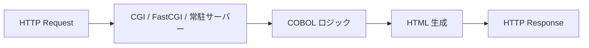

## 作ったもの

**[cobol-webfw](https://github.com/masanori0209/cobol-webfw)** — GnuCOBOL + CGI の**ミニ Web フレームワーク**です。

**物差しは Next.js**（pages router 寄りの機能分解）でした。**できあがった形は、意外と Django 寄り**です。`config.cbl` → controller → `views/*.html` → `renderpage`、POST フォーム、Cookie セッション、indexed file への CRUD——層を足していったら、Next.js というより **MTV（Model–Template–View）** の並びに見えてきました。

- GitHub: [https://github.com/masanori0209/cobol-webfw](https://github.com/masanori0209/cobol-webfw)
- 行数レポート（`scripts/count-lines.sh`）付き。測定の透明性は残したまま、FW として触れる形にしてあります。

```bash
git clone https://github.com/masanori0209/cobol-webfw
cd cobol-webfw
docker compose up --build
BASE_URL=http://127.0.0.1:8080 ./scripts/run-all.sh
```


`run-all.sh` で主要ルートを叩いた例です。


:::message
この記事は **GnuCOBOL + CGI のミニ Web フレームワーク（cobol-webfw）** の話です。**Next.js の機能を行数の物差しにした** のが出発点で、層を足した先が **Django っぽい MTV** に見える、という経緯を書いています。
:::

## はじめに

2026年5月29日、日立はメインフレーム向け OS [VOS3 の販売終了（2027年11月）と保守終了（2034年12月）](https://www.itmedia.co.jp/enterprise/articles/2606/23/news059.html) を発表しました。[日経 xTECH も「地銀勘定系も転換点」と整理](https://xtech.nikkei.com/atcl/nxt/column/18/00001/11799/)しています。

そのニュースを見て、ふと昔のことを思い出しました。新卒の頃、VOS 系の現場で COBOL の開発・保守をしていた時期があります（JCL や TSS などよく利用していました）。いまは Vue.js や Django、最近は React や Rust など Web 寄りの仕事が中心です。

VOS3 の話と、いまの仕事がどう結びつくわけでもないのですが、COBOL で Web Framework をつくってみたくなったのがきっかけです。

**Next.js の機能を分解して、何行くらいで足りるか数える** —— それが最初の目的でした。ルーティングと SSR の芯（432 行）まで行った時点では、まだ「測定用デモ」でした。

そこから POST フォーム、Cookie セッション、indexed file、``、`renderpage.cbl` と足していくうちに、見え方が変わりました。Next.js の `getServerSideProps` や `layout.tsx` を追っていたはずなのに、手元にあるのは **urls → view → template → 永続化** の並び。いまの Django 仕事の感覚に近いです。リポジトリ名も `cobol-webfw` に変え、ページ追加手順まで README に書けるところまで来ました。

意図して Next.js も Django もクローンしたわけではありません。層を1つ足すたびに行数が載る、という測定の都合が、結果として **Django 寄りのミニ Web FW** に見える形まで来た、というのが正直なところです。

今回の cobol-webfw は、**「SSR そのものは古いプロトコルでも成立する」** ことと、**「FW 的な層を足すと行数がどう増えるか」** を、wc -l 付きで確かめる実験です。

## CGI と SSR は別レイヤの話

少し混同されるので、先に置きます。


|         | 何の話か                       | 隣に並ぶ概念                       |
| ------- | -------------------------- | ---------------------------- |
| **SSR** | HTML を**どこで**組み立てるか（サーバー側） | CSR、SSG、hydration            |
| **CGI** | Web サーバーとプログラムの**接続方式**    | FastCGI、常駐 HTTP サーバー、API ラッパ |





GnuCOBOL が `stdout` に `Content-Type` と HTML を出す CGI は、**接続方式が CGI で、レンダリングモデルが SSR** です。Next.js も Django も、ここでは同じ側（サーバーで HTML を組む）に立ちます。違いはその**上に載せる層**です。今回の cobol-webfw は、測り始めは Next.js 寄り、なんやかんやこれも欲しいよなあ、と増やしていったら Django 寄り——というズレが面白かった、という話です。

## 調査で見つかった「オープン COBOL Web」の地図

今回の cobol-webfw を作る前に、関連実装をざっくり調べました。


| 系統                     | 代表例                                                                                                                                                | 今回との関係          |
| ---------------------- | -------------------------------------------------------------------------------------------------------------------------------------------------- | --------------- |
| **CGI + HTML**         | [GnuCOBOL FAQ 1.13](https://gnucobol.sourceforge.io/faq/index.html)、[Qiita: GnuCOBOLでHTML出力](https://qiita.com/tukiyo3/items/50f1ffa23e7dbc69c9e6) | SSR の素。今回の土台    |
| **routing + template** | CGI SSR にルート表と `{{var}}` を足した PoC 群                                                                                                                | 今回の延長線上         |
| **JSON API 寄り**        | HTTP サーバ／スクリプト言語が外側で COBOL を呼ぶ構成（製品・社内 PoC が多い）                                                                                                    | HTML SSR とは別レイヤ |


「COBOL で Web Framework を完全に利用可能」という製品はありません。あるのは **1990年代からの CGI＝SSR** と、そこに routing / template を足した PoC 群です。

## 物差しは Next.js——層を足すと Django 側に見えてきた

**行数を測るときのチェックリスト**は Next.js（pages router 時代のイメージ）で作りました。App Router の RSC までは追いません。表の「やった」は、**行数を測るために足した層** です。


| Next.js の機能           | cobol-webfw の COBOL 相当                                       | 扱い                                         |
| --------------------- | ------------------------------------------------------------ | ------------------------------------------ |
| SSR（HTML をサーバーで生成）    | CGI `DISPLAY` HTML                                           | **やった**（最初からここ）                            |
| ファイル／表形式ルーティング        | `config.cbl` の `routing-pattern`                             | **やった**                                    |
| 動的ルート `/posts/[id]`   | `/posts/%id` + PATH マッチ                                      | **やった**                                    |
| `getServerSideProps`  | `postlistfill` で indexed file 読み取り → テンプレートへ                 | **やった**（`` で一覧を `.html` 側に）       |
| `layout.tsx`          | `views/layout.html` + ``                        | **やった**（partials 分割）                       |
| CSS / スタイル注入          | `static/app.css` + `{{extra_css}}`                           | **やった**（ページごとに `<style>` 追記可能）             |
| テンプレートタグ              | ``, ``, ``                     | **やった**（`extends` / auto-escape はなし）       |
| ページ描画ヘルパ              | `renderpage.cbl` + `page-ctx`                                | **やった**（コントローラから layout へ一発）               |
| 404                   | ルート未一致時の HTML                                                | **やった**                                    |
| bundler / npm         | —                                                            | **やらない**                                   |
| hydration / クライアント JS | `static/app.js` + `page_script` + `{{extra_js}}`             | **やった**（最小。React/Vue 級の SPA ではない）          |
| 認証・セッション              | Cookie + `data/sessions/` ファイルストア                            | **第2段でやった**（ログインはユーザー名のみ）                  |
| POST フォーム             | `CONTENT_LENGTH` + stdin、`application/x-www-form-urlencoded` | **第2段でやった**                                |
| 本番データ（永続化）            | indexed file `data/posts.dat`                                | **第2段でやった**（`` で一覧表示）             |
| API Routes / JSON     | —                                                            | **やらない**（JSON API ラッパ領域。HTML SSR とは別）      |
| 常駐化（FastCGI）          | —                                                            | **やっていない**（ベンチは spawn-per-request CGI のまま） |


つまり **「SSR 本体は安い。DX を足すと一気に行数が乗る」** という仮説を、行数で見る記事です。層を足し切った先が、いまの cobol-webfw です。

### できあがりは MTV（Django 寄り）

Next.js の表を埋めていくうちに、頭の中の対応がこちらに寄りました。


| cobol-webfw             | 役割                                   |
| ----------------------- | ------------------------------------ |
| `config.cbl`            | URL → コントローラ名                        |
| `src/controllers/*.cbl` | リクエスト処理、データ取得、テンプレート変数               |
| `views/**/*.html`       | HTML テンプレート（``）  |
| `postsdata.cbl`         | indexed file への READ/WRITE（ORM ではない） |
| `renderpage.cbl`        | layout + 共通変数 + 描画の入口                |


Next.js 的に言う `getServerSideProps` や `layout.tsx` も、こう並べると **view + template + 永続化** の話に見えます。bundler や hydration、RSC は入れていないので、**2010年代のサーバー完結 SSR** に近い、というのが体感です（Django の MTV から見ると馴染みやすい）。

## 実装コスト（行数）——432 行から 1481 行へ


`scripts/count-lines.sh` で `wc -l` 集計した結果です。空行も含むので、ざっくりした見積もりとして読んでください。**最小版は測定の出発点、拡張版は FW 化した到着点** です。

### 第1段（ルーティング + SSR の芯）——まだ「測定デモ」


| 機能ブロック                   | ファイル                    | 行数      |
| ------------------------ | ----------------------- | ------- |
| ルータ（PATH_INFO + CGI ヘッダ） | `src/ssr.cbl`           | 151     |
| ルート表                     | `src/config.cbl`        | 13      |
| テンプレート `{{var}}`         | `src/ssrtemplate.cbl`   | 65      |
| データ取得（GSSP 相当）           | `src/postsdata.cbl`     | 90      |
| ページコントローラ計               | `src/controllers/*.cbl` | 113     |
| HTML ビュー                 | `views/layout.html`     | 30      |
| **COBOL 合計**             |                         | **432** |


### 第2段（POST / セッション / テンプレ / renderpage）——ここから Web FW


| 機能ブロック                    | ファイル                    | 行数       |
| ------------------------- | ----------------------- | -------- |
| ルータ + メソッド振り分け            | `src/ssr.cbl`           | 121      |
| ルート表（9 ルート）               | `src/config.cbl`        | 37       |
| テンプレートエンジン                | `src/ssrtemplate.cbl`   | 399      |
| 投稿一覧用変数埋め                 | `src/postlistfill.cbl`  | 86       |
| CGI POST / Cookie / セッション | `cgilib.cbl` ほか         | 286      |
| indexed file（`posts.dat`） | `src/postsdata.cbl`     | 207      |
| ページコントローラ計                | `src/controllers/*.cbl` | 343      |
| HTML ビュー（partials 含む）     | `views/**/*.html`       | 54       |
| **COBOL 合計**              |                         | **1479** |


読み方のメモです。


- **SSR 相当（ヘッダ + HTML 出力）** だけなら、Hello World 級の CGI は数十行で済みます（[GnuCOBOL FAQ のサンプル](https://gnucobol.sourceforge.io/faq/index.html)どおり）
- **ルーティング + 動的パス** が `ssr.cbl` の大半（151行）を占めました。HTML を返す SSR より、パスマッチの方が行数を食いやすい、というのが今回の実感です
- **テンプレート** は最初 `{{var}}` だけ（65行）だったが、`` を足して **399行** まで増えた。再帰 `include` ではテンプレート行バッファを深さごとに分離する必要があった（後述）
- **データ取得** は indexed file（`posts.dat`）。`postlistfill.cbl` が `post_id_1` / `post_title_1` … をテンプレート変数に載せ、`views/posts/list.html` の `` で一覧化する
- **432 → 1481 行**（約3.4倍）で、POST パース、Cookie セッション、ファイル永続化、テンプレート partial、CSS 注入、`renderpage` まで載った。この時点で「ページ追加手順」が README に書けるレベルまで来ている

Next.js 本体とも Django 本体とも**行数を直接比較する意味は薄い**です（言語も生成物も違う）。この表が示しているのは、**「FW 的な層を COBOL で自前実装すると、どこに行数が載るか」** という分解図です。

## cobol-webfw の構成

```text
cobol-webfw/
├── src/
│   ├── ssr.cbl           # CGI 入口 + PATH_INFO ルーティング
│   ├── config.cbl        # ルート表（copy で include）
│   ├── ssrtemplate.cbl   # {{var}} + 
│   ├── postlistfill.cbl  # 投稿一覧用テンプレート変数
│   ├── cgilib.cbl        # POST stdin / Cookie / セッションファイル
│   ├── postsdata.cbl     # postserv（INIT / LIST / LOOKUP / ADD）
│   └── controllers/      # home / about / posts / login / postnew …
├── views/
│   ├── layout.html
│   ├── partials/         # head.html, nav.html
│   └── posts/list.html
├── static/app.css        # 共通 CSS（Apache が静的配信）
├── ssr.cgi               # ビルド成果物（Apache から実行）
└── scripts/
    ├── build.sh
    ├── run-all.sh
    └── count-lines.sh
```

Apache は `.htaccess` で存在しないパスを `ssr.cgi/$1` に流します。**Next.js 分解の測定から始まり、MTV っぽい形まで育った** 設計です。

```apache
RewriteRule ^(.*)$ ssr.cgi/$1 [L]
```

### 最小 SSR（Hello 相当）

GnuCOBOL CGI の核はこれだけです。

```cobol
display
  'Content-Type: text/html; charset=utf-8'
  newline
  '<html><body>hello</body></html>'
end-display.
```

これは **SSR** です。接続が CGI かどうかは別問題、という話の出発点になります。

### ルート表

`config.cbl` にパスとコントローラ名を並べます。

```cobol
move 4 to nroutes.
move "/" to routing-pattern(1).
move "home" to routing-destiny(1).
move "/posts/%id" to routing-pattern(4).
move "postdetail" to routing-destiny(4).
```


`%id` は PATH の一段をキャプチャし、`postdetail` に `query-value(1)` として渡ります。

### データ取得 + テンプレート

`postslist` は `postlistfill` で indexed file を読み、`post_count` / `post_id_1` … をテンプレート変数に載せます。HTML の組み立て自体は `views/posts/list.html` 側です。

```cobol
call 'postlistfill' using the-vars filled-count
move "page_template" to SSR-varname(n)
move "posts/list.html" to SSR-varvalue(n)
move "extra_css" to SSR-varname(n+1)
move ".posts-table { margin-top: 0.5rem; }" to SSR-varvalue(n+1)
call 'ssrtemplate' using the-vars "layout.html"
```

`views/posts/list.html` はこういう形です。

```django

<p class="posts-action"><a href="/posts/new">Create a post</a></p>

<p class="posts-hint">Login to create posts.</p>

<table class="posts-table">
  <tbody>

    <tr>
      <td>{{post_id}}</td>
      <td><a href="/posts/{{post_id}}">{{post_title}}</a></td>
    </tr>

  </tbody>
</table>
```

indexed file から読んだ一覧は、ブラウザではこう見えます。


`/posts/1` のように動的ルートを開くと、lookup 結果が detail ページになります。


CSS は2段構えです。

- 共通: `static/app.css` を `<link>` で読み込む（Apache がそのまま配信）
- ページ固有: コントローラから `{{extra_css}}` を渡し、`views/partials/head.html` が `<style>` を差し込む

`` や auto-escape、フィルタは入れていません。

### クライアント JavaScript（FW としての最後の1枚）

SSR だけでも動きますが、Web アプリっぽくするために **JavaScript も差し込める** ようにしました。CSS の `{{extra_css}}` と同型です。ここまで来ると、もはや「1本の CGI スクリプト」ではなく、**cobol-webfw というミニ FW** の話になります。


| 仕組み             | 役割                                                      |
| --------------- | ------------------------------------------------------- |
| `static/app.js` | 全ページ共通（nav の active 付与、`window.CobolSsr`）               |
| `page_script`   | ページ専用ファイル（例: `pages/home.js` → `/static/pages/home.js`） |
| `{{extra_js}}`  | インライン `<script>` 断片（短い初期化向け）                            |


`views/partials/scripts.html` が `</body>` 直前に読み込みます。コントローラは `renderpage` に `page-ctx` を渡すだけです。

```cobol
move spaces to page-ctx
move "cobol-webfw" to page-title
move "pages/home.html" to page-template
move "pages/home.js" to page-script
call 'renderpage' using page-ctx cgictx
```

React の hydration や bundler までは入れていません。**COBOL が HTML を返し、必要なら静的 JS を足す** —— それくらいのミニ SSR FW です。UI を厚くするなら、ここから Vite 等を横に置く想定です。

## 実装して分かったこと

### 1. SSR 自体は「古い」が、驚くほど単純

リクエストごとにプロセスが起動し、COBOL が HTML を組み立てて `stdout` へ出す——この形は 1990 年代からあります。[GnuCOBOL FAQ の CGI 節](https://gnucobol.sourceforge.io/faq/index.html) や [Docker で環境を固めた例](https://koduki.hatenablog.com/entry/2016/01/03/104740) も、結局は `Content-Type` を出して HTML を返す、という芯は同じです。流行の話題というより、小さく残り続けている部類だと思います。

### 2. 難しいのは routing と「境界の型」

GnuCOBOL 3.x では、同一ソース内の `CALL 'checkquery'` がモジュール未検出になることがありました。今回は **段落（PERFORM）に寄せて** 1 プログラムにまとめています。

テンプレート側では、コントローラと `ssrtemplate` で `SSR-varvalue` **の PIC 長を copybook で統一** しないと、LINKAGE の解釈がずれて HTML が壊れます。Django なら型やテンプレート lint で早い段階で気づくところ、COBOL CGI では実行時まで静かです。

### 3. 層を足すたびに行数が載り、Django 寄りの FW になった（第2段）


第1段のあと、POST / セッション / indexed file に加え、**CSS 注入**、``、`renderpage.cbl` も載せました。測定の都合で1層ずつ足した結果、**ページ追加手順**（`config.cbl` → controller → `views/*.html` → `renderpage`）まで README に書けるようになった。ルーティングより **境界（テンプレート / LINKAGE / file I/O）** の行数が一気に増えた、というのが第2段の実感です。


| 項目             | 第2段（FW 化後）での実装                                                                 | 行数が載る場所（目安）                                         |
| -------------- | ------------------------------------------------------------------------------ | --------------------------------------------------- |
| POST フォーム      | `CONTENT_LENGTH` + stdin を `cgilib.cbl` で読み、`formget` で `title` / `body` を取り出す | `cgilib.cbl` 一帯                                     |
| セッション          | `Set-Cookie: ssr_sid=…` + `data/sessions/` にユーザー名を保存                           | `cgilib.cbl`                                        |
| 本番データ          | GnuCOBOL indexed file（`data/posts.dat`）。`ADD` で追記、`LOOKUP` で `/posts/:id`      | `postsdata.cbl`, `postlistfill.cbl`                 |
| CSS 注入         | `static/app.css` + `{{extra_css}}`                                             | `views/partials/head.html`, 各コントローラ                 |
| テンプレート partial | ``, ``             | `ssrtemplate.cbl`（399行）, `views/**/*.html`          |
| 条件分岐 / ループ     | ``, ``                        | `ssrtemplate.cbl`, `views/posts/list.html`          |
| クライアント JS      | `static/app.js` + `page_script` + `{{extra_js}}`                               | `views/partials/scripts.html`, `renderpage.cbl`     |
| ページ描画ヘルパ       | `renderpage.cbl` + `page-ctx`                                                  | 各コントローラ（一覧だけ例外）                                     |
| 常駐化            | **未実装**                                                                        | `run-all.sh` 末尾の10回 GET は spawn-per-request CGI のまま |


追加ルートの例です。


| メソッド     | パス           | 役割                                   |
| -------- | ------------ | ------------------------------------ |
| GET/POST | `/login`     | ログインフォーム / セッション開始                   |
| GET      | `/logout`    | セッション破棄                              |
| GET/POST | `/posts/new` | 投稿フォーム（要ログイン） / indexed file へ `ADD` |


:::message
**テンプレートエンジンは機能最小です。** 再帰 `` では、GnuCOBOL の再帰 `CALL` が同一 working-storage を共有するため、テンプレート行バッファを深さ別スタックに分けました。`` は `post_id_1` のような連番変数を COBOL 側で埋める前提で、コレクション型はありません。
:::


## 限界

一番大きい限界は、**cobol-webfw が本番向け Web FW ではない** ことです。GnuCOBOL + Docker 上のオープン環境で動かした実験であり、エンタープライズ COBOL の本番前提とは切り分けて読んでください。

そのため、この記事で言えるのは次の範囲です。

- CGI はレンダリングモデルとして SSR である
- **物差しは Next.js、形は MTV（Django 寄り）** に見える
- 行数 432（第1段）/ 1481（第2段・FW 化後）は **このリポジトリの wc -l 結果** であり、最適化後の下限でも本番相当でもない
- 測定の途中で **テンプレート + `renderpage` + 静的 JS** まで足し、ミニ Web FW（cobol-webfw）になった

一方で、まだ言えないこともあります。


- FastCGI 化した場合のレイテンシ改善幅（未計測）
- npm / Vite / React 級の SPA 体験（クライアント JS は素の `<script>` 読み込みのみ）
- Next.js App Router / RSC との一対一対応（物差しにした Next.js より、**先に行く層**は Django 側）

次に進めるなら、FastCGI 常駐化と `` / auto-escape の要不要を決めて、行数とレイテンシを同じ枠組みで測り直すのがよさそうです。

## まとめ


今回やったことを振り返ると、次のとおりです。

- GnuCOBOL + CGI で **Next.js を物差しにした行数測定**を始めた（きっかけは `はじめに` に書いたとおり）
- CGI は最初から SSR。第1段（432 行）で routing と SSR の芯が見えた
- 層を足すうちに POST・セッション・テンプレ・`renderpage` まで来て、**Django 寄りのミニ Web FW**（cobol-webfw）になった（第2段 1481 行）
- 行数レポートは残したまま。測定の透明性と、FW として触れる形の両方を持っている

行数を数えるつもりが、MTV のミニ FW を組み立てていた——それが cobol-webfw の話です。

## 参考リンク

調査と cobol-webfw 作成で参照した資料です。

- [日立 VOS3 販売・保守終了（ITmedia）](https://www.itmedia.co.jp/enterprise/articles/2606/23/news059.html)
- [日経 xTECH：地銀勘定系も転換点](https://xtech.nikkei.com/atcl/nxt/column/18/00001/11799/)
- [GnuCOBOL FAQ（CGI）](https://gnucobol.sourceforge.io/faq/index.html)
- ミニ Web FW（cobol-webfw）: [https://github.com/masanori0209/cobol-webfw](https://github.com/masanori0209/cobol-webfw)（旧 `cobol-cgi-ssr` は同 URL へリダイレクト）

