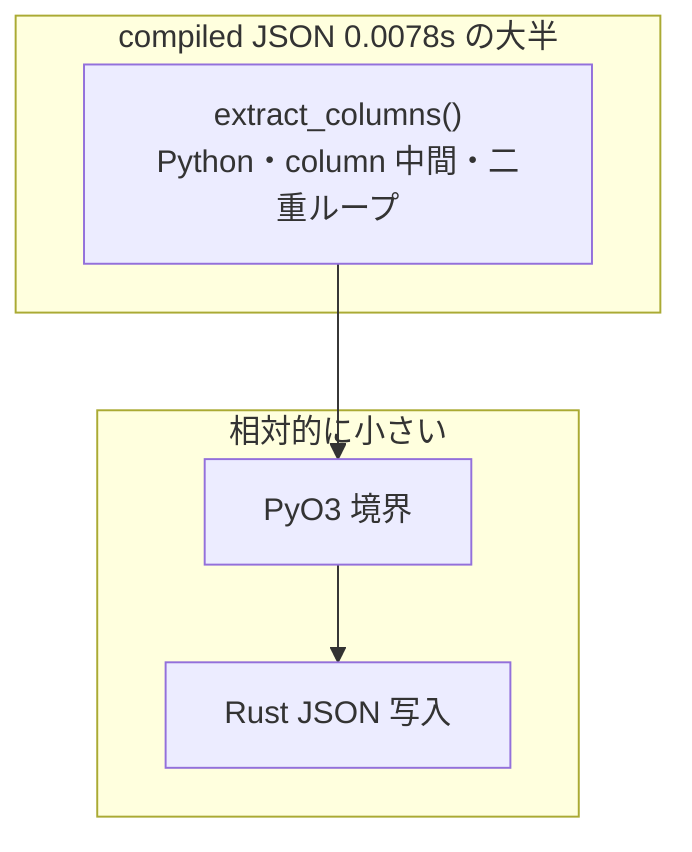

## はじめに

Django REST Framework（DRF）の **一覧 `ModelSerializer`（`many=True`）** が重い。前回 [cProfile → pybind11](https://zenn.dev/m2lab/articles/python-cprofile-pybind11) のときと同じく、**計測してからネイティブ化** してみよう、と思いました。

今回試したのはこういう順番です。

1. **PyO3 でモデルから `getattr`** … DRF より速いが、手書き Python より遅い
2. **Field 定義を compile して columnar 化 + PyO3 dict** … DRF 比 ~3 倍。ここが効いた
3. **JSON bytes 直出し** … dict 経路と比べて **+3% 程度** しか縮まなかった


結論を先に書くと、**DRF 比 ~3 倍までは Field compile で届いた**一方、**PyO3 / JSON bytes 直出しは、今回のボトルネックにはあまり刺さらなかった** です。うまくいった報告というより、**計測しながら試したメモ** に近い内容です。

試行錯誤のコードは `[drf-compiled-serializer](https://github.com/masanori0209/drf-compiled-serializer)` に残しています（Alpha・再現用）。

```bash
git clone https://github.com/masanori0209/drf-compiled-serializer.git
cd drf-compiled-serializer
python3 -m venv .venv && source .venv/bin/activate
pip install -U pip maturin
PYO3_USE_ABI3_FORWARD_COMPATIBILITY=1 pip install -e .
python scripts/seed_data.py --products 10000
python scripts/benchmark.py --products 5000 --rounds 5
```

:::message
`drf-compiled-serializer` は本番導入向けではありません。**N+1 を潰したうえでの in-memory ベンチ** と、**5,000 件・nested 1 段・対応 field のみ** の結果です。POST/PUT validation や Browsable API 完全互換は対象外です。
:::

## 題材

商品一覧 API 想定です。`Product` に read-only nested `Category` を載せ、`**select_related("category")` で N+1 は先に潰したうえで** Serializer 層だけを計測しています。DB が支配的な API では、ここまでの改善は全体レイテンシに効きにくいです（それも後で触れます）。

## 試行 0: DRF が本当に重いか

cProfile では `ListSerializer.to_representation` と `fields.get_attribute` が cumulative 上位でした。


```text
 5000    0.016    0.085  serializers.py:530(to_representation)
35000    0.009    0.028  fields.py:92(get_attribute)
```

**1 行ごとの Field dispatch** が hot path だと分かったので、「そのループを Rust に逃がせば速くなるはず」という発想に至りました。ここまではよかったです。

## 試行 1: PyO3 で行ごと `getattr`（Prototype）

最初は Django モデルインスタンスを Rust に渡し、**行 × フィールド分 `getattr`** して dict を組み立てました。

期待: Rust だから DRF より大幅に速い。

結果: DRF よりは速い。**でも手書き Python dict ループより遅い。**

理由は単純で、**PyO3 境界での属性アクセス** が、CPython の `LOAD_ATTR` より高くつきます。「Rust にした」だけでは勝てない、という最初の教訓でした。

## 試行 2: Field compile + columnar + PyO3 dict

次に [drf-fastserializers](https://github.com/ankitksr/drf-fastserializers) 系の考え方を借り、**起動時に DRF Field 定義を compile** しました。

- 固定 getter で値を読む（`fields.get_attribute()` を通らない）
- column 化してから PyO3 で `list[dict]` を batch 組み立て
- `CompiledSerializerMixin` を MRO 先頭に置く drop-in

### 数字（dict 段階）

ある実行例（macOS / Python 3.14 / Apple Silicon / Django 5.2 / DRF 3.17、5,000 件 × 5 回）:


| 方式                    | median      |
| --------------------- | ----------- |
| DRF `ModelSerializer` | 0.0181s     |
| compile + PyO3 dict   | **0.0059s** |
| 手書き Python dict       | **0.0016s** |


DRF 比 **約 3.1 倍**。ここが **今回いちばん効いた改善** です。pytest では compile 出力が DRF `.data` と一致することも確認しています。

一方で **手書き Python の約 3.8 倍遅い**。Rust で dict を組み立てる Pass 2 が、まだ重いです。

## 試行 3: JSON bytes 直出し（Rust の役割を JSON encoder に寄せる）

「一覧 API の成果物は JSON だから、`list[dict]` を経由しなくていいのでは」という筋は通ります。PyDict を量産せず、**column から JSON bytes まで Rust で書く** `render_list_json()` を足しました。

### 数字（JSON E2E）


| 方式                            | median      |
| ----------------------------- | ----------- |
| DRF `.data` + `JSONRenderer`  | 0.0206s     |
| compile dict + `JSONRenderer` | 0.0080s     |
| **compile JSON bytes 直出し**    | **0.0078s** |
| 手書き dict + `json.dumps`       | **0.0039s** |


読み取れること:

- DRF 定番 JSON 比 **約 2.6 倍** — 悪くはない
- dict 経路（0.0080s）→ JSON bytes（0.0078s）は **約 3% しか縮まない**
- 手書き + stdlib json には **約 2 倍負けたまま**

JSON bytes 直出しは、**Rust で JSON を書く筋** としては筋が通る。ただ **数字的には期待ほど伸びなかった**、が正直なところです。

## なぜ Rust が効きにくかったか

内訳を整理すると、こうなります。




手書き Python（0.0039s json / 0.0016s dict）は **1 パス** です。compile 経路は:

1. `extract_columns` で `dict[str, list]` を作る（Python）
2. それを PyO3 に渡す
3. Rust が JSON を書く

**Pass 1 が支配的** なので、Pass 2 の PyDict をやめても（JSON bytes 直出し）全体はほとんど動きません。Rust を足す前に、**アーキテクチャ上すでに 2 パス** になっていたのが根本でした。

## 結局、何が効いて何が効かなかったか


| やったこと                    | 効果                          | 所感                                     |
| ------------------------ | --------------------------- | -------------------------------------- |
| N+1 潰し（`select_related`） | 本番では最優先                     | 今回の計測の外だが前提                            |
| **Field compile**        | **DRF 比 ~3x**               | **ここが本丸。Rust を足さなくても DRF 比 ~3x**               |
| PyO3 dict 組み立て           | DRF には効く / 手書き Python には負ける | Rust の得意分野ではなかった                       |
| JSON bytes 直出し           | +3% 程度                      | 「Rust だから速い」にはつながらなかった                 |
| maturin / PyO3 ビルド       | 運用コスト                       | Python 3.14 では forward compat が必要な場合あり |


**Rust 自体が無意味だったわけではない** ですが、**今回のボトルネックに対しては、Field compile のほうが先に効いた** というのが数字の読み方です。

## じゃあ、一覧 API はどうするのが現実的か

今回の試行を踏まえると、優先順位はだいたいこうです。

1. **queryset 最適化**（N+1、不要 field、インデックス）
2. **read 専用 path で Serializer を簡略化**（plain Serializer、`.values()`、SQL 側 flatten）
3. **JSON renderer を orjson 系に**（dict 経路は DRF のままでも encode だけ速くなる）
4. **Field compile**（今回の mixin 相当。DRF 定義を残したいとき）
5. **Rust** — extract 1 パス化や JSON encoder 特化まで設計を詰めたうえで。既製の pydantic-core / orjson 系と差別化できるか要検討

**Field compile だけ** でも DRF 比 ~3 倍は取れるので、Rust を足す前にここまで試す価値はあります。

## 限界

- SQLite・合成 10,000 件・in-memory・Apple Silicon 1 台の数字
- 5,000 件規模では固定オーバーヘッドの比率が大きい。件数を変えると倍数も変わる
- `SerializerMethodField` 等は非対応で DRF fallback
- `render_list_json()` は DRF `Response(serializer.data)` と別 API
- **本番 SLO を改善した証明ではない**


## まとめ

今回やったことを振り返ると:

- DRF 一覧 Serializer は **Field dispatch が重い** ことが cProfile で確認できた
- **Field compile + columnar** で DRF 比 median **約 3 倍**（dict 段階）
- **PyO3 dict → JSON bytes** まで試したが、**手書き Python json には届かず**、JSON bytes 化の追加効果も **~3%** だった
- **効いたのは compile 側** — Rust は今回の順番では後半だった


DRF 一覧が遅いとき、**計測 → compile まで試す → 参照実装と比べる → そのあとで Rust を検討**、の順のほうが、遠回りしにくかったです。

## 参考リンク

- 再現用リポジトリ: [https://github.com/masanori0209/drf-compiled-serializer](https://github.com/masanori0209/drf-compiled-serializer)
- 前回: [cProfile → pybind11](https://zenn.dev/m2lab/articles/python-cprofile-pybind11)
- [Improve Serialization Performance in Django Rest Framework | Haki Benita](https://hakibenita.com/django-rest-framework-slow)
- [drf-fastserializers](https://github.com/ankitksr/drf-fastserializers)

