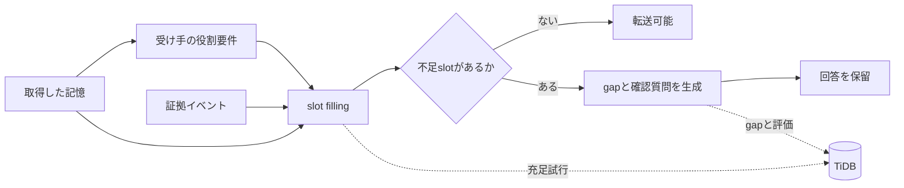

## はじめに

Slackや議事録に、次のような記憶が残っていたとします。

```text
A社は今回だけCSVで対応し、APIは次フェーズにする
```

通常のRAGなら、この記憶を検索して「A社は今回だけCSVで対応し、APIは次フェーズです」と回答できます。

しかし、翌週から顧客対応を引き継ぐCS担当者は、この一文だけで安全に回答できるでしょうか。

たとえば、次の情報が足りないかもしれません。

- 「今回だけ」が指す範囲
- 顧客にAPI延期を説明済みか
- CSが回答してよい範囲
- CSV対応が失敗した場合の代替手段
- 技術チームへのエスカレーション先

この記事では、このような **正しいが引き継げない記憶** を検出するための小さな評価基盤、`HandoverGap RAG` を作りました。

[Zennfes Spring 2026 の「TiDBで作るAI時代のデータ基盤」コンテスト](https://zenn.dev/contests/zennfes-spring-2026-tidb)では、RAGやAIエージェントのメモリ機能に関する実装知見がテーマになっています。TiDB Cloud / mem9 の利用は加点ですが必須ではないとのことなので、今回はTiDBを「単なるVector Store」ではなく、**引き継ぎ可能性を検査するための監査ストア**として使う設計にしました。

:::message
PyPI公開はまだなので、記事中のPyPIリンクは仮です。ローカル実装とGitHub公開を前提に書いています。
:::

## Correctness と Transferability は違う

RAGの評価では、検索関連度や回答正確性がよく見られます。

ただ、業務引き継ぎではもう一つ見たい軸があります。

```text
Correctness != Transferability
```

記憶が正しく、関連していて、矛盾していなくても、別の役割の人がそのまま運用するには暗黙前提が足りないことがあります。

この不足を、今回の実装では **Tacit Context Gap** と呼ぶことにしました。

たとえば、先ほどの記憶は意思決定としては正しいかもしれません。しかしCSが顧客に回答するには、顧客への説明状況や回答権限が必要です。一方、Engineerが実装を引き継ぐなら、判断理由、技術制約、再検討トリガー、関連Issueが必要になります。

つまり「引き継げるかどうか」は、記憶そのものだけではなく、**受け手の役割**によって変わります。

## HandoverGap RAG の考え方

HandoverGap RAGは、次の流れで記憶を評価します。



やっていることはシンプルです。

1. 記憶の種別を見ます
2. 引き継ぎ先ロールに必要なslotを読み込みます
3. 記憶と証拠イベントでslotを埋めようとします
4. 埋まらないslotをgapとして扱います
5. gapごとに確認質問を生成します
6. 重要な前提が足りない場合は回答を保留します

CS向けには、たとえば次のslotを要求します。

- `communication_status`
- `scope`
- `authority`
- `fallback_plan`
- `escalation_path`
- `customer_facing_wording`

Engineer向けには、要求slotが変わります。

- `rationale`
- `technical_constraint`
- `implementation_scope`
- `trigger_for_reconsideration`
- `related_issue`
- `failure_modes`

「同じ記憶を、誰に引き継ぐのか」で評価結果が変わるのがポイントです。

## Naive RAG は答え、HandoverGap は止まる

CLIでは、同梱のサンプルシナリオを使って検出できます。

```bash
handovergap detect --scenario S001 --role CS
```

期待する出力イメージは次のようなものです。

```text
Memory:
A社は今回だけCSVで対応し、APIは次フェーズにする

Detected Gaps:
[HIGH] communication_gap
  顧客にAPI延期を説明済みか不明

[HIGH] authority_gap
  CSが回答してよい範囲が不明

Clarification Questions:
1. 顧客にはAPI延期を説明済みですか？
2. CSが次フェーズ時期を回答してよい範囲はどこまでですか？
```

Streamlitデモでは、同じ記憶に対して3つの方式を並べて比較します。


- Naive RAG: 取得した記憶をそのまま回答する
- Hybrid RAG: 関連証拠と警告を加える
- HandoverGap RAG: 不足slotを示し、回答を保留して質問する

ここで重要なのは、HandoverGap RAGは「気の利いた回答」を作るのではなく、**足りない前提を足りないまま表示する**ことです。

業務引き継ぎでは、もっともらしい補完が事故につながることがあります。だから、わからないものを `missing` として残すことを機能として扱いました。

## TiDB を単なる Vector Store にしない

HandoverGapで保存したいのは、最終回答だけではありません。

- どの証拠を検索したか
- どのslotを埋めようとしたか
- どのslotが不足したか
- どのgapを検出したか
- どの確認質問を生成したか
- 最終的に転送を許可したか

そのため、TiDBを **slot / evidence / gap の評価ストア**として設計しました。

主要テーブルは次のような構成です。

```text
source_events
memory_items
memory_chunks
memory_type_schemas
successor_role_requirements
memory_slots
slot_fill_attempts
context_gaps
clarification_questions
transfer_assessments
evaluation_runs
evaluation_results
```

TiDBの使いどころは、単一のベクトル検索に閉じません。

| TiDBの機能 | HandoverGapでの用途 |
|---|---|
| SQL | role、slot、状態、スコアの管理 |
| Vector Search | slotごとの関連証拠検索 |
| Full-text Search | 顧客名、Issue ID、固有名詞の検索 |
| JSON | Slack、Issue、議事録などのメタデータ保持 |
| Transaction | gap、質問、assessmentの一貫した更新 |

たとえば `communication_status` を埋めたい場合、記憶全体への1回のRAG検索ではなく、slotごとに検索意図を作ります。

```text
Memory:
A社は今回だけCSVで対応し、APIは次フェーズにする

Slot:
communication_status

Search hints:
- 顧客に説明済み
- 合意済み
- API延期
- CSV暫定対応
```

この粒度で `slot_fill_attempts` を保存しておくと、「なぜ回答を止めたのか」をあとから説明しやすくなります。

スキーマはCLIから確認できます。

```bash
handovergap schema --dialect tidb
```

ローカルMVPではTiDB接続を必須にしていません。ライブ接続を使う場合だけoptional dependencyを入れる想定です。

```bash
pip install "handovergap[tidb]"
```

## HandoverGapBench mini

再現可能な比較のため、20件の合成シナリオを同梱しました。

データセットの単位は次の形です。

```json
{
  "scenario_id": "S001",
  "memory": "A社は今回だけCSVで対応し、APIは次フェーズにする",
  "evidence_events": [
    {
      "source_type": "slack",
      "content": "じゃあ今回だけCSVで。APIは次フェーズでいいです。"
    },
    {
      "source_type": "issue",
      "content": "API連携は未着手。CSVインポートで暫定対応する。"
    }
  ],
  "successor_role": "CS",
  "handover_task": "顧客問い合わせ対応",
  "gold_gaps": [
    {
      "gap_type": "scope_gap",
      "slot_name": "scope",
      "description": "今回だけが初回リリースのみを指すのか不明"
    },
    {
      "gap_type": "communication_gap",
      "slot_name": "communication_status",
      "description": "顧客にAPI延期を説明済みか不明"
    }
  ],
  "gold_questions": [
    "顧客にはAPI延期を説明済みですか？",
    "CSが次フェーズ時期を回答してよい範囲はどこまでですか？"
  ],
  "unsafe_transfer_label": true
}
```

評価指標は3つにしました。

| 指標 | 見たいこと |
|---|---|
| Tacit Gap Recall | gold gapを検出できた割合 |
| Unsafe Transfer Prevention | unsafeな記憶の転送を止めた割合 |
| Question Coverage | gold questionに対応する質問を生成した割合 |

比較対象は、次の3方式です。

- `naive_rag`: 取得した記憶をそのまま回答する
- `hybrid_rag`: 記憶に関連証拠と警告を足す
- `handovergap`: role-conditioned slot fillingでgapを検出する

## 評価結果

2026年6月14日に、次のコマンドで評価しました。

```bash
handovergap evaluate --compare
```

結果は次の通りです。

| Method | Scenarios | Tacit Gap Recall | Unsafe Transfer Prevention | Question Coverage |
|---|---:|---:|---:|---:|
| naive_rag | 20 | 0.00 | 0.00 | 0.00 |
| hybrid_rag | 20 | 0.26 | 0.59 | 0.26 |
| handovergap | 20 | 1.00 | 1.00 | 1.00 |

この結果は、HandoverGapが本番環境でも100%正しいという意味ではありません。

今回のMVPでは、合成データセットと決定的ルールを一緒に設計しています。そのため、この `1.00` は一般化性能ではなく、**設計したgapを実装が正しく拾えているかの整合性検査**に近いです。

実運用の評価として主張するには、独立したアノテーション、未知データ、LLMによる意味的slot fillingの揺れを含めた検証が必要です。

## 実装して分かったこと

### 1. 不足情報を回答文で補わない

暗黙前提がない場合、LLMはそれらしい補完を作れてしまいます。

しかし、引き継ぎでは「知らないことを知らないまま扱う」ほうが重要な場面があります。HandoverGapでは、足りないslotを `missing` として残し、確認質問に変換することを優先しました。

### 2. role-conditioned でなければ引き継ぎ評価にならない

同じ記憶でも、CS、Engineer、Salesで必要情報は変わります。

情報の充足度を一律に測るだけでは、CSには必要だがEngineerには不要な情報を区別できません。

### 3. 評価過程を保存すると説明できる

最終回答だけを保存しても、なぜ止めたのかは説明しづらいです。

gapからmissing slot、role requirement、検索した証拠、生成質問へ辿れると、後からレビューできます。ここがTiDBを使う主要な理由です。


## 試し方

リポジトリはこちらです。

- GitHub: [https://github.com/masanori0209/handovergap](https://github.com/masanori0209/handovergap)
- PyPI: [https://pypi.org/project/handovergap/](https://pypi.org/project/handovergap/)（仮リンク）

現時点で試す場合は、リポジトリをcloneしてeditable installします。

```bash
git clone https://github.com/masanori0209/handovergap.git
cd handovergap
python3 -m venv .venv
. .venv/bin/activate
python -m pip install -e ".[dev,demo]"

handovergap demo
handovergap detect --scenario S001 --role CS
handovergap evaluate --compare
```

PyPI公開後は、次のように試せる想定です。

```bash
pip install handovergap

handovergap demo
handovergap detect --scenario S001 --role CS
handovergap evaluate --compare
```

デモを起動する場合:

```bash
pip install "handovergap[demo]"
handovergap serve
```

TiDBモード:

```bash
pip install "handovergap[tidb]"
handovergap schema --dialect tidb
```

## 限界

現時点のMVPには、はっきりした限界があります。

- HandoverGapBench miniは合成データです
- gold gapの定義には主観が入ります
- 現在の検出器は決定的ルールです
- LLMによる意味的slot fillingはまだ行っていません
- Question Coverageはslot一致で評価し、意味的同値判定は行っていません
- 組織ごとに役割要件と重要度の調整が必要です
- 実データではプライバシー、アクセス制御、保持期間の設計が必要です
- ライブTiDB環境での負荷・障害試験は今後の課題です

## まとめ

RAGが正しい記憶を返しても、その記憶が後任者にとって安全に利用できるとは限りません。

HandoverGap RAGは、受け手の役割ごとに不足する暗黙前提を検出し、回答する前に確認質問へ変換します。

TiDBは、検索結果だけでなく、slot filling、gap検出、確認質問、transfer assessmentまで含めた評価過程を保存する基盤として使えます。

最後に、このプロジェクトの一番短い説明を置いておきます。

> Naive RAGは答える。HandoverGap RAGは、足りない前提を聞き返す。
