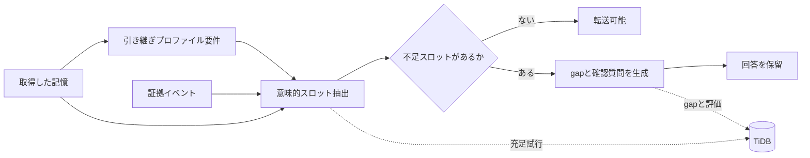

## はじめに

Slackや議事録に、次のような記憶が残っていたとします。

```text
A社は今回だけCSVで対応し、APIは次フェーズにする
```

通常のRAGなら、この記憶を検索して「A社は今回だけCSVで対応し、APIは次フェーズです」と回答できます。

しかし、翌週から顧客対応を引き継ぐ人は、この一文だけで安全に回答できるでしょうか。

たとえば、次の情報が足りないかもしれません。

- 「今回だけ」が指す範囲
- 顧客にAPI延期を説明済みか
- 顧客向けに回答してよい範囲
- CSV対応が失敗した場合の代替手段
- 技術チームへのエスカレーション先

この記事では、このような **正しいが引き継げない記憶** を検出するための小さな評価基盤、`HandoverGap RAG` を作りました。

[Zennfes Spring 2026 の「TiDBで作るAI時代のデータ基盤」コンテスト](https://zenn.dev/contests/zennfes-spring-2026-tidb)では、RAGやAIエージェントのメモリ機能に関する実装知見がテーマになっています。今回はTiDBを「単なるVector Store」ではなく、**引き継ぎ可能性を検査するための監査ストア**として使う設計にしました。

## Correctness と Transferability は違う

RAGの評価では、検索関連度や回答正確性がよく見られます。

ただ、業務引き継ぎではもう一つ見たい軸があります。

```text
Correctness != Transferability
```

記憶が正しく、関連していて、矛盾していなくても、別の責任範囲を持つ人がそのまま運用するには暗黙前提が足りないことがあります。

この不足を、今回の実装では **Tacit Context Gap** と呼ぶことにしました。

たとえば、先ほどの記憶は意思決定としては正しいかもしれません。しかし顧客に説明する人には、顧客への説明状況や回答権限が必要です。一方、技術運用を引き継ぐ人には、判断理由、技術制約、再検討トリガー、関連Issueが必要になります。

つまり「引き継げるかどうか」は、記憶そのものだけではなく、**引き継ぎ先の責任範囲**によって変わります。

## HandoverGap RAG の考え方

HandoverGap RAGは、次の流れで記憶を評価します。



やっていることはシンプルです。

1. 記憶の種別を見ます
2. 引き継ぎプロファイルに必要なスロットを読み込みます
3. 記憶と証拠イベントでスロットを埋めようとします
4. 埋まらないスロットをgapとして扱います
5. gapごとに確認質問を生成します
6. 重要な前提が足りない場合は回答を保留します

サポート引き継ぎプロファイルでは、たとえば次のスロットを要求します。

- `communication_status`
- `scope`
- `authority`
- `fallback_plan`
- `escalation_path`
- `customer_facing_wording`

技術運用引き継ぎプロファイルでは、要求スロットが変わります。

- `rationale`
- `technical_constraint`
- `implementation_scope`
- `trigger_for_reconsideration`
- `related_issue`
- `failure_modes`

同じ記憶でも、顧客に説明する人、技術運用を引き継ぐ人、商談を引き継ぐ人では、必要な前提が異なるのがポイントです。

## Naive RAG は答え、HandoverGap は止まる

CLIでは、同梱のサンプルシナリオを使って検出できます。

```bash
handovergap detect --scenario S001 --role CS
```

期待する出力イメージは次のようなものです。

```text
Memory:
A社は今回だけCSVで対応し、APIは次フェーズにする

Detected Gaps:
[HIGH] communication_gap
  顧客にAPI延期を説明済みか不明

[HIGH] authority_gap
  顧客向けに回答してよい範囲が不明

Clarification Questions:
1. 顧客にはAPI延期を説明済みですか？
2. 次フェーズ時期を回答してよい範囲はどこまでですか？
```

Streamlitデモでは、同じ記憶に対して3つの方式を並べて比較します。


- Naive RAG: 取得した記憶をそのまま回答する
- Hybrid RAG: 関連証拠と警告を加える
- HandoverGap RAG: 不足スロットを示し、回答を保留して質問する

ここで重要なのは、HandoverGap RAGは「気の利いた回答」を作るのではなく、**足りない前提を足りないまま表示する**ことです。

業務引き継ぎでは、もっともらしい補完が事故につながることがあります。だから、わからないものを `missing` として残すことを機能として扱いました。

## TiDB を単なる Vector Store にしない

HandoverGapで保存したいのは、最終回答だけではありません。

- どの証拠を検索したか
- どのスロットを埋めようとしたか
- どのスロットが不足したか
- どのgapを検出したか
- どの確認質問を生成したか
- 最終的に転送を許可したか

そのため、TiDBを **スロット / 証拠 / gap の監査ストア**として設計しました。

主要テーブルは次のような構成です。

```text
source_events
memory_items
memory_chunks
successor_role_requirements
memory_slots
slot_fill_attempts
context_gaps
clarification_questions
transfer_assessments
evaluation_runs
evaluation_results
```

TiDBの使いどころは、単一のベクトル検索に閉じません。

| TiDBの機能 | HandoverGapでの用途 |
|---|---|
| SQL | profile、slot、状態、スコアの管理 |
| Vector Search | slotごとの関連証拠検索 |
| Full-text Search | 顧客名、Issue ID、固有名詞の検索 |
| JSON | Slack、Issue、議事録などのメタデータ保持 |
| Transaction | gap、質問、assessmentの一貫した更新 |

たとえば `communication_status` を埋めたい場合、記憶全体への1回のRAG検索ではなく、スロットごとに検索意図を作ります。

```text
Memory:
A社は今回だけCSVで対応し、APIは次フェーズにする

Slot:
communication_status

Search hints:
- 顧客に説明済み
- 合意済み
- API延期
- CSV暫定対応
```

この粒度で `slot_fill_attempts` を保存しておくと、「なぜ回答を止めたのか」をあとから説明しやすくなります。

スキーマはCLIから確認できます。

```bash
handovergap schema --dialect tidb
```

ローカルサンプルではTiDB接続を必須にしていません。ライブ接続を使う場合だけoptional dependencyを入れる想定です。

```bash
pip install "handovergap[tidb]"
```

ライブ検証ではTiDB CloudのDeveloper Tierに接続し、同梱schemaの作成、合成memoryの保存、スロット抽出試行、context gap、transfer assessment、評価結果の保存まで確認しました。

```json
{
  "status": "ok",
  "inserted": {
    "slot_fill_attempts": 1,
    "context_gaps": 1,
    "transfer_assessments": 1,
    "evaluation_runs": 3
  },
  "counts": {
    "slot_fill_attempts": 1,
    "context_gaps": 1,
    "transfer_assessments": 1
  }
}
```

## HandoverGapBench mini

再現可能な比較のため、20件の合成シナリオを同梱しました。

データセットの単位は次の形です。

```json
{
  "scenario_id": "S001",
  "memory": "A社は今回だけCSVで対応し、APIは次フェーズにする",
  "evidence_events": [
    {
      "source_type": "slack",
      "content": "じゃあ今回だけCSVで。APIは次フェーズでいいです。"
    },
    {
      "source_type": "issue",
      "content": "API連携は未着手。CSVインポートで暫定対応する。"
    }
  ],
  "successor_role": "CS",
  "handover_task": "顧客問い合わせ対応",
  "gold_gaps": [
    {
      "gap_type": "scope_gap",
      "slot_name": "scope",
      "description": "今回だけが初回リリースのみを指すのか不明"
    },
    {
      "gap_type": "communication_gap",
      "slot_name": "communication_status",
      "description": "顧客にAPI延期を説明済みか不明"
    }
  ],
  "gold_questions": [
    "顧客にはAPI延期を説明済みですか？",
    "次フェーズ時期を回答してよい範囲はどこまでですか？"
  ],
  "unsafe_transfer_label": true
}
```

評価指標は5つにしました。

| 指標 | 見たいこと |
|---|---|
| Tacit Gap Recall | gold gapを検出できた割合 |
| Unsafe Transfer Prevention | unsafeな記憶の転送を止めた割合 |
| Question Coverage | gold questionに対応する質問を生成した割合 |
| Safe Transfer Allowance | 安全な記憶を止めずに通せた割合 |
| Blocked Precision | ブロックした記憶のうち実際にunsafeだった割合 |

比較対象は、次の3方式です。

- `naive_rag`: 取得した記憶をそのまま回答する
- `hybrid_rag`: 記憶に関連証拠と警告を足す
- `handovergap`: profile-conditioned slot fillingでgapを検出する

## 評価結果

2026年6月14日に、次のコマンドで評価しました。

```bash
handovergap evaluate --compare
```

結果は次の通りです。

| Method | Scenarios | Tacit Gap Recall | Unsafe Transfer Prevention | Question Coverage | Safe Transfer Allowance | Blocked Precision |
|---|---:|---:|---:|---:|---:|---:|
| naive_rag | 20 | 0.00 | 0.00 | 0.00 | 1.00 | 0.00 |
| hybrid_rag | 20 | 0.21 | 0.59 | 0.21 | 0.67 | 0.91 |
| handovergap | 20 | 1.00 | 0.65 | 1.00 | 1.00 | 1.00 |

ここで大事なのは、`1.00` を本番精度の主張として読まないことです。

後続の監査で、以前の評価にはリークがあることが分かりました。具体的には、検出器やbaselineが評価専用ラベルを参照してしまう経路がありました。この経路は修正済みですが、同梱データセットは依然として `required_slots - provided_slots == gold_gaps` という構造に強く揃っています。

そのため、mini datasetの `Tacit Gap Recall = 1.00` は、独立した一般化性能ではなく、**設計したスロット/gapを実装が拾えているかの整合性検査**として扱うべきです。

## holdout と意味的スロット抽出の揺れ

追加で、既存20件とは別のholdoutデータを用意しました。holdoutには合成reviewer A/Bのスロットラベルとadjudicated goldを持たせ、さらにLLMの意味的スロット抽出で起きやすい揺れを3 profileで模擬しています。

```bash
handovergap evaluate --dataset holdout --stress-filling
```

| Method | Scenarios | Tacit Gap Recall | Unsafe Transfer Prevention | Question Coverage | Safe Transfer Allowance | Blocked Precision |
|---|---:|---:|---:|---:|---:|---:|
| handovergap/provided | 6 | 1.00 | 0.67 | 1.00 | 1.00 | 1.00 |
| handovergap/conservative | 6 | 1.00 | 0.67 | 1.00 | 0.67 | 0.67 |
| handovergap/optimistic | 6 | 0.64 | 0.67 | 0.64 | 1.00 | 1.00 |

`optimistic` profileは、曖昧な証拠をLLMが「スロットが埋まっている」と楽観的に解釈する状況を模擬しています。このときTacit Gap RecallとQuestion Coverageは0.64まで落ちました。これは良い意味で、機構の弱点を隠していません。

さらにOpenAI APIを使った実LLMによる意味的スロット抽出も任意検証として実行しました。

```bash
python harness/validation/openai_slot_filling_check.py --dataset holdout --persist-tidb
```

実行したモデルごとの結果は次の通りです。

| Method | Scenarios | Tacit Gap Recall | Unsafe Transfer Prevention | Safe Transfer Allowance | Blocked Precision |
|---|---:|---:|---:|---:|---:|
| handovergap/openai-slot-fill/gpt-4.1-mini | 6 | 0.91 | 0.33 | 0.67 | 0.50 |
| handovergap/openai-slot-fill/gpt-5-mini | 6 | 0.45 | 0.33 | 0.67 | 0.50 |
| handovergap/openai-slot-fill/gpt-5-mini/gpt5_strict | 6 | 1.00 | 0.67 | 1.00 | 1.00 |

実LLMでは、`gpt-4.1-mini` は単純な`optimistic` profileよりTacit Gap Recallが改善しました。一方でUnsafe Transfer Preventionは0.33、Blocked Precisionは0.50まで落ちました。

さらに `gpt-5-mini` では、同じpromptでもTacit Gap Recallが0.45まで下がりました。詳細ログを見ると、LLMが契約影響や判断理由を楽観的に埋めすぎるケースと、安全なhandoverでも `needs_clarification` に寄るケースがありました。

そこで `gpt-5-mini` 向けに、スロットごとの受理条件、未確定情報をfilledにしない条件、合成holdoutの証拠要約をどう扱うかをpromptへ追加しました。その結果、Tacit Gap Recallは1.00まで改善しました。

ただし、このpromptはholdoutのannotation protocolに近づいています。本番精度ではなく、**モデル別prompt調整が効く**という証拠として扱うべきです。また安全ケース `U006` では不要な `timeline_confidence` gapを出しており、現在のheadline metricsは過剰な確認質問を十分に罰していません。

`gpt-5-mini` の初回6件検証では、入力1,901 tokens、出力8,136 tokens、うちreasoning 5,184 tokensを使用し、推定費用は約 `$0.0167` でした。調整後promptでは、入力4,351 tokens、出力8,803 tokens、うちreasoning 6,400 tokensで、推定費用は約 `$0.0187` でした。

費用は小さい一方、結果の揺れは大きい。これは「意味的スロット抽出は効く可能性があるが、モデル選択、prompt、ブロック判定ポリシー、スロット定義、評価指標にはまだ改善余地が大きい」という示唆です。

## 実装して分かったこと

### 1. 不足情報を回答文で補わない

暗黙前提がない場合、LLMはそれらしい補完を作れてしまいます。

しかし、引き継ぎでは「知らないことを知らないまま扱う」ほうが重要な場面があります。HandoverGapでは、足りないスロットを `missing` として残し、確認質問に変換することを優先しました。

### 2. 引き継ぎプロファイルに条件づけなければ評価にならない

同じ記憶でも、サポート引き継ぎ、技術運用引き継ぎ、商談引き継ぎで必要情報は変わります。

情報の充足度を一律に測るだけでは、顧客説明には必要だが技術運用には不要な情報を区別できません。

### 3. 評価過程を保存すると説明できる

最終回答だけを保存しても、なぜ止めたのかは説明しづらいです。

gapから不足スロット、プロファイル要件、検索した証拠、生成質問へ辿れると、後からレビューできます。ここがTiDBを使う主要な理由です。


## 試し方

リポジトリとパッケージはこちらです。

- GitHub: [https://github.com/masanori0209/handovergap](https://github.com/masanori0209/handovergap)
- PyPI: [https://pypi.org/project/handovergap/](https://pypi.org/project/handovergap/)
- 使い方ページ: [https://masanori0209.github.io/handovergap/](https://masanori0209.github.io/handovergap/)

最新確認済みリリースは `handovergap==0.1.3` です。

```bash
pip install handovergap

handovergap demo
handovergap detect --scenario S001 --role CS
handovergap evaluate --compare
```

デモを起動する場合:

```bash
pip install "handovergap[demo]"
handovergap serve
```

OpenAIによる意味的スロット抽出とTiDBへの監査保存まで画面から試す場合:

```bash
pip install "handovergap[live]"
handovergap serve
```

実LLM + TiDBモードでは、架空の引き継ぎケースに対して次の処理を行います。

1. 取得した記憶と関連証拠を表示
2. OpenAI modelでプロファイルに必要なスロットを意味的に抽出
3. HandoverGap detectorで不足スロット、確認質問、transferabilityを判定
4. `slot_fill_attempts`、`context_gaps`、`transfer_assessments`をTiDBへ保存

この実LLM + TiDBデモは `gpt-5-mini` とTiDB Cloud Developer Tierで疎通確認済みです。画面は日本語をデフォルトにし、英語へ切り替えられます。ローカルサンプルでは「サポート引き継ぎ」「技術運用引き継ぎ」「商談引き継ぎ」として表示し、コード上の `CS` / `Engineer` / `Sales` は同梱プリセットIDとして扱います。

## 限界

現時点のMVPには、はっきりした限界があります。

- HandoverGapBench miniとholdoutは合成データです
- gold gapの定義には主観が入ります
- CLIの初回体験は決定的ルールで動き、OpenAIやTiDBを必須にしません
- Streamlitの実LLM + TiDBモードと検証スクリプトでは、OpenAIによる意味的スロット抽出を実行できます
- LLMがスロットを控えめ/楽観的に埋めた場合の揺れはholdout stress profileで模擬し、任意のOpenAI実接続でも検証しています
- Question Coverageはスロット一致で評価し、意味的同値判定は行いません
- 現在のheadline metricsは、過剰な確認質問を十分に罰していません
- 組織ごとに引き継ぎプロファイル要件と重要度の調整が必要です
- 実データではプライバシー、アクセス制御、保持期間の設計が必要です
- ライブTiDBへのschema作成、評価結果保存、実LLM + TiDBデモからのスロット/gap/transfer監査保存は検証済みですが、負荷・障害試験は今後の課題です

## まとめ

RAGが正しい記憶を返しても、その記憶が後任者にとって安全に利用できるとは限りません。

HandoverGap RAGは、引き継ぎ先の責任範囲ごとに不足する暗黙前提を検出し、回答する前に確認質問へ変換します。

TiDBは、検索結果だけでなく、スロット抽出、gap検出、確認質問、transfer assessmentまで含めた評価過程を保存する基盤として使えます。

最後に、このプロジェクトの一番短い説明を置いておきます。

> Naive RAGは答える。HandoverGap RAGは、足りない前提を聞き返す。
