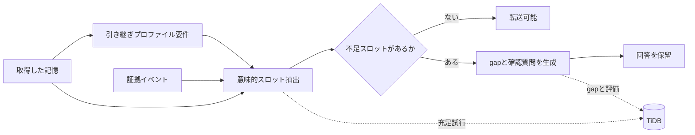
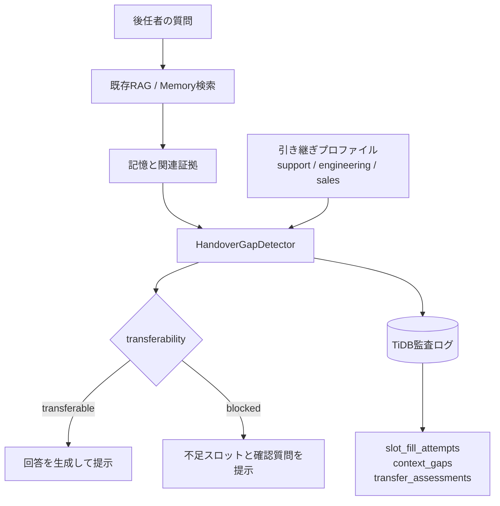
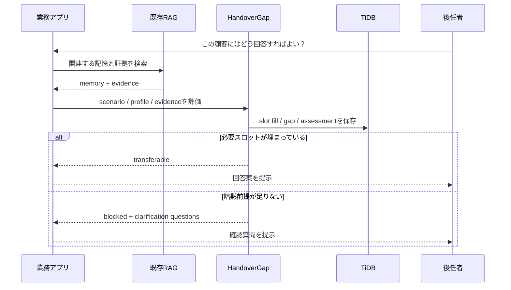

## 作ったもの

`HandoverGap RAG` という、**RAGが返した記憶を「後任者がそのまま使ってよい状態か」で検査するゲート**を作りました。正しく検索できた記憶でも、引き継ぐ相手の責任範囲によっては暗黙の前提が足りず、そのまま渡すと事故ります。そこを回答前に検出して、足りない前提を確認質問へ変換します。判断の過程（どのスロットを埋めようとして、どこが不足し、なぜ止めたか）はTiDBに監査ログとして残します。

- GitHub: https://github.com/masanori0209/handovergap
- PyPI: https://pypi.org/project/handovergap/
- 使い方ページ: https://masanori0209.github.io/handovergap/

同じ記憶に対して Naive RAG / Hybrid RAG / HandoverGap RAG の3方式を並べて比較できるデモを用意しました。Naive RAG が補完して答えてしまう一方で、HandoverGap RAG は足りない前提を `missing` として残し、回答を保留して聞き返します。


```bash
pip install handovergap
handovergap detect --scenario S001 --role CS   # 不足スロットと確認質問を検出
handovergap evaluate --compare                 # 3方式を同じデータで比較
```

> Naive RAGは答える。HandoverGap RAGは、足りない前提を聞き返す。

## はじめに

最近、RAGやAIエージェントの「メモリ」を触っていて、ずっと気になっていたことがあります。

それは、検索で正しい記憶が取れても、そのまま次の人に渡してよいとは限らない、という点です。

たとえばSlackや議事録に、次のような記憶が残っていたとします。

```text
A社は今回だけCSVで対応し、APIは次フェーズにする
```

通常のRAGなら、この記憶を検索して「A社は今回だけCSVで対応し、APIは次フェーズです」と回答できます。

ただ、翌週から顧客対応を引き継ぐ人が、この一文だけを見て安全に回答できるかというと、かなり怪しいです。

たとえば、こういう情報が抜けています。

- 「今回だけ」がどの範囲を指しているのか
- 顧客にAPI延期を説明済みなのか
- 顧客向けにどこまで回答してよいのか
- CSV対応が失敗した場合、次に何をするのか
- 誰にエスカレーションすればよいのか

この「正しいけれど、そのまま引き継ぐには危ない記憶」を検出したくて、小さな評価基盤として `HandoverGap RAG` を作りました。

[Zennfes Spring 2026 の「TiDBで作るAI時代のデータ基盤」コンテスト](https://zenn.dev/contests/zennfes-spring-2026-tidb)では、RAGやAIエージェントのメモリ機能に関する実装知見がテーマになっています。今回はTiDBを「単なるVector Store」ではなく、**引き継ぎ可能性を検査するための監査ストア**として使う設計にしました。

:::message
この記事は、TiDBを使ったRAG実装の完成形というより、「業務の引き継ぎで本当に怖いのは、検索できないことより、足りない前提を補完してしまうことでは？」という仮説を、MVPとして動かしてみた備忘録です。
:::

この記事の持ち帰りポイントは4つです。

1. 正しさと引き継ぎ可能性は別に測る
2. 後任の責任範囲ごとに必須スロットを定義する
3. 不足情報をLLMで補完せず、確認質問へ変換する
4. スロット抽出、gap、質問、transfer判断をTiDBに残し、あとから説明できるようにする

## Correctness と Transferability は違う

RAGの評価では、検索関連度や回答正確性がよく見られます。

ただ、業務引き継ぎで見たい軸は、それだけでは足りない気がしています。

```text
Correctness != Transferability
```

記憶が正しい。関連もしている。矛盾もしていない。

でも、別の責任範囲を持つ人がそのまま使うには、暗黙前提が足りないことがあります。

この不足を、今回の実装では **Tacit Context Gap** と呼ぶことにしました。

たとえば、先ほどの記憶は意思決定としては正しいかもしれません。しかし顧客に説明する人には、顧客への説明状況や回答権限が必要です。一方で、技術運用を引き継ぐ人には、判断理由、技術制約、再検討トリガー、関連Issueが必要になります。

つまり「引き継げるかどうか」は、記憶そのものだけではなく、**引き継ぎ先の責任範囲**によって変わります。ここを一律の関連度スコアで見るのは、少し乱暴かもしれません。

既存のRAG評価を否定したいわけではありません。検索関連度や回答正確性は必要です。ただし業務引き継ぎでは、その上に **transferability-specific metrics** を追加しないと、「正しいが後任には危ない記憶」を見逃します。

| 方式 | 見ているもの | 取りこぼしやすいもの |
|---|---|---|
| Naive RAG | 関連する記憶を返す | 後任が安全に使えるか |
| Hybrid RAG | 関連証拠やリスク警告を足す | 引き継ぎプロファイルごとの不足前提 |
| 一般的なContext Engineering | promptや文脈の渡し方を改善する | なぜ回答を止めたかの監査証跡 |
| HandoverGap RAG | 回答前に必須スロットを検査する | 評価データの独立性と過剰質問の扱い |

## HandoverGap RAG の考え方

HandoverGap RAGでは、記憶をそのまま回答に使わず、まず「後任者が使ってよい状態か」を見ます。

流れは次のような形です。



やっていること自体はかなり素朴です。

1. 記憶の種別を見ます
2. 引き継ぎプロファイルに必要なスロットを読み込みます
3. 記憶と証拠イベントでスロットを埋めようとします
4. 埋まらないスロットをgapとして扱います
5. gapごとに確認質問を生成します
6. 重要な前提が足りない場合は回答を保留します

サポート引き継ぎプロファイルでは、たとえば次のスロットを要求します。

- `communication_status`
- `scope`
- `authority`
- `fallback_plan`
- `escalation_path`
- `customer_facing_wording`

技術運用引き継ぎプロファイルでは、要求スロットが変わります。

- `rationale`
- `technical_constraint`
- `implementation_scope`
- `trigger_for_reconsideration`
- `related_issue`
- `failure_modes`

同じ記憶でも、顧客に説明する人、技術運用を引き継ぐ人、商談を引き継ぐ人では、必要な前提が変わります。今回一番やりたかったのは、この違いをRAGの後段で見えるようにすることでした。

## ライブラリとしての利用イメージ

実アプリに組み込む場合、HandoverGapは「RAGの回答器」そのものというより、**回答前に引き継ぎ可能性を検査するゲート**として置くイメージです。

既存RAGを置き換えるというより、RAGが返した記憶に対して「このまま答えさせるのは怖くないか？」を一回挟む感じです。



最小構成では、同梱データセットを読み込んで検出器を呼ぶだけです。

```python
from handovergap import HandoverGapDetector, InMemoryStore

store = InMemoryStore.from_builtin_dataset()
detector = HandoverGapDetector(store=store)

result = detector.detect(
    scenario_id="S001",
    successor_role="CS",
)

if result.transferability_status == "blocked":
    for question in result.questions:
        print(question.question)
else:
    print("transferable")
```

アプリ側では、この結果をそのまま「回答してよい / 追加確認が必要」の分岐に使えます。



つまり、既存RAGを置き換えるのではなく、RAGが返した記憶を「後任者が安全に使える形か？」で検査します。TiDBには、その判断過程を監査ログとして残します。

## Naive RAG は答え、HandoverGap は止まる

CLIでは、同梱のサンプルシナリオを使って検出できます。

```bash
handovergap detect --scenario S001 --role CS
```

期待する出力イメージは次のようなものです。

```text
Memory:
A社は今回だけCSVで対応し、APIは次フェーズにする

Detected Gaps:
[HIGH] communication_gap
  顧客にAPI延期を説明済みか不明

[HIGH] authority_gap
  顧客向けに回答してよい範囲が不明

Clarification Questions:
1. 顧客にはAPI延期を説明済みですか？
2. 次フェーズ時期を回答してよい範囲はどこまでですか？
```

Streamlitデモでは、同じ記憶に対して3つの方式を並べて比較します（冒頭の画面がそれです）。

- Naive RAG: 取得した記憶をそのまま回答する
- Hybrid RAG: 関連証拠と警告を加える
- HandoverGap RAG: 不足スロットを示し、回答を保留して質問する

ここで重要なのは、HandoverGap RAGは「気の利いた回答」を作るものではない、という点です。

むしろ逆で、**足りない前提を足りないまま表示する**ことを目的にしています。

業務引き継ぎでは、もっともらしい補完が事故につながることがあります。だから、わからないものを `missing` として残すことを機能として扱いました。

## TiDB を単なる Vector Store にしない

正直、最初は「TiDBはVector Storeとして使えばよいかな」と考えていました。

ただ作っていくと、HandoverGapで保存したいのは最終回答だけではないことが分かりました。

- どの証拠を検索したか
- どのスロットを埋めようとしたか
- どのスロットが不足したか
- どのgapを検出したか
- どの確認質問を生成したか
- 最終的に転送を許可したか

そのため、今回はTiDBを **スロット / 証拠 / gap の監査ストア**として設計しました。

主要テーブルは次のような構成です。

```text
source_events
memory_items
memory_chunks
successor_role_requirements
memory_slots
slot_fill_attempts
context_gaps
clarification_questions
transfer_assessments
evaluation_runs
evaluation_results
```

TiDBの使いどころは、単一のベクトル検索に閉じません。

| TiDBの機能 | HandoverGapでの用途 |
|---|---|
| SQL | profile、slot、状態、スコアの管理 |
| Vector Search | slotごとの関連証拠検索 |
| Full-text Search | 顧客名、Issue ID、固有名詞の検索 |
| JSON | Slack、Issue、議事録などのメタデータ保持 |
| Transaction | gap、質問、assessmentの一貫した更新 |

たとえば `communication_status` を埋めたい場合、記憶全体への1回のRAG検索ではなく、スロットごとに検索意図を作ります。

```text
Memory:
A社は今回だけCSVで対応し、APIは次フェーズにする

Slot:
communication_status

Search hints:
- 顧客に説明済み
- 合意済み
- API延期
- CSV暫定対応
```

この粒度で `slot_fill_attempts` を保存しておくと、「なぜ回答を止めたのか」をあとから説明しやすくなります。ここは地味ですが、業務アプリに入れるならかなり大事な部分だと思っています。

スキーマはCLIから確認できます。

```bash
handovergap schema --dialect tidb
```

ローカルサンプルではTiDB接続を必須にしていません。ライブ接続を使う場合だけoptional dependencyを入れる想定です。

```bash
pip install "handovergap[tidb]"
```

ライブ検証ではTiDB CloudのDeveloper Tierに接続し、同梱schemaの作成、合成memoryの保存、スロット抽出試行、context gap、transfer assessment、評価結果の保存まで確認しました。

```json
{
  "status": "ok",
  "inserted": {
    "slot_fill_attempts": 1,
    "context_gaps": 1,
    "transfer_assessments": 1,
    "evaluation_runs": 3
  },
  "counts": {
    "slot_fill_attempts": 1,
    "context_gaps": 1,
    "transfer_assessments": 1
  }
}
```

さらに、TiDB上では「なぜ回答を止めたか」をSQLで追えます。

```bash
handovergap audit-sql
handovergap audit-example
```

出力される監査クエリの要点は、`transfer_assessments` から `memory_items`、`context_gaps`、`slot_fill_attempts`、`source_events`、`clarification_questions` を横断することです。

:::details 監査クエリの全文（SQL）

```sql
SELECT
  ta.id AS assessment_id,
  ta.status AS transfer_status,
  ta.transferability_score,
  ta.unsafe_reason,
  mi.scenario_id,
  mi.subject,
  mi.memory_type,
  ta.successor_role,
  cg.gap_type,
  cg.slot_name,
  cg.severity,
  cg.description AS gap_description,
  sfa.status AS slot_fill_status,
  sfa.confidence AS slot_fill_confidence,
  sfa.fill_result,
  sfa.retrieved_event_ids,
  se.title AS selected_evidence_title,
  se.source_url AS selected_evidence_url,
  cq.question,
  cq.priority AS question_priority
FROM transfer_assessments ta
JOIN memory_items mi
  ON mi.id = ta.memory_item_id
LEFT JOIN context_gaps cg
  ON cg.memory_item_id = ta.memory_item_id
 AND cg.successor_role = ta.successor_role
 AND cg.status = 'open'
LEFT JOIN slot_fill_attempts sfa
  ON sfa.memory_item_id = cg.memory_item_id
 AND sfa.successor_role = cg.successor_role
 AND sfa.slot_name = cg.slot_name
LEFT JOIN source_events se
  ON se.id = sfa.selected_event_id
LEFT JOIN clarification_questions cq
  ON cq.context_gap_id = cg.id
WHERE ta.status = 'blocked'
ORDER BY ta.created_at DESC, cg.severity DESC, cg.slot_name;
```

:::

`audit-example` では、このSQLで見える監査結果の例を表として出します。

| status | scenario | profile | missing slot | severity | checked evidence | clarification question |
|---|---|---|---|---|---|---|
| blocked | S001 | CS | communication_status | HIGH | Slack: CSV fallback agreement | 顧客にはAPI延期を説明済みですか？ |
| blocked | S001 | CS | authority | HIGH | Issue: API integration postponed | 次フェーズ時期を顧客向けに回答してよい範囲はどこまでですか？ |
| blocked | S001 | CS | fallback_plan | HIGH | Issue: CSV import workaround | CSV対応が失敗した場合の代替手段は何ですか？ |

ここまで追えると、単なるVector Store利用ではなく、SQL、Vector、JSON、関係スキーマを同じTiDB上で扱う意味が出てきます。読者が知りたい「記憶は取れているのに、なぜ回答を止めたのか」に、評価ログから答えられます。

加えて、同梱データセットから監査行をローカル生成したときの規模も測れるようにしました。

```bash
handovergap audit-benchmark --dataset all --iterations 100
```

私の手元では、次の結果でした。

| Metric | Value |
|---|---:|
| Scenarios | 32 |
| Iterations | 100 |
| Transfer assessments / run | 32 |
| Blocked assessments / run | 15 |
| Context gap rows / run | 82 |
| Blocked context gap rows / run | 52 |
| Clarification question rows / run | 82 |
| p50 local materialization ms / run | 0.150 |
| p95 local materialization ms / run | 0.206 |

blocked transferで多かった不足スロットは次の通りです。

| Slot | Rows |
|---|---:|
| fallback_plan | 9 |
| escalation_path | 8 |
| authority | 6 |
| contract_impact | 6 |
| promise_boundary | 6 |
| customer_facing_wording | 5 |

これはTiDBクエリレイテンシの主張ではありません。ここで測っているのは、HandoverGapがTiDBへ保存・照会する監査ワークロードのサイズと、ローカルでの監査行生成時間です。TiDB上では、この行たちを先ほどのSQLで横断して追跡します。

## HandoverGapBench mini

再現可能な比較をしたかったので、20件の合成シナリオを同梱しました。

本当は実際のSlackやIssueを使いたいところですが、引き継ぎ文脈は普通にセンシティブです。なので、まずは「こういう引き継ぎで事故りそう」というパターンを合成データに落とし込むところから始めています。

データセットの単位は次の形です。

```json
{
  "scenario_id": "S001",
  "memory": "A社は今回だけCSVで対応し、APIは次フェーズにする",
  "evidence_events": [
    {
      "source_type": "slack",
      "content": "じゃあ今回だけCSVで。APIは次フェーズでいいです。"
    },
    {
      "source_type": "issue",
      "content": "API連携は未着手。CSVインポートで暫定対応する。"
    }
  ],
  "successor_role": "CS",
  "handover_task": "顧客問い合わせ対応",
  "gold_gaps": [
    {
      "gap_type": "scope_gap",
      "slot_name": "scope",
      "description": "今回だけが初回リリースのみを指すのか不明"
    },
    {
      "gap_type": "communication_gap",
      "slot_name": "communication_status",
      "description": "顧客にAPI延期を説明済みか不明"
    }
  ],
  "gold_questions": [
    "顧客にはAPI延期を説明済みですか？",
    "次フェーズ時期を回答してよい範囲はどこまでですか？"
  ],
  "unsafe_transfer_label": true
}
```

評価指標は6つにしました。単にgapを検出できたかだけではなく、危ない引き継ぎを止められたか、安全な引き継ぎまで止めすぎていないかも分けて見ています。

| 指標 | 見たいこと |
|---|---|
| Tacit Gap Recall | gold gapを検出できた割合 |
| Unsafe Transfer Prevention | unsafeな記憶の転送を止めた割合 |
| Question Coverage | gold questionに対応する質問を生成した割合 |
| Safe Transfer Allowance | 安全な記憶を止めずに通せた割合 |
| Blocked Precision | ブロックした記憶のうち実際にunsafeだった割合 |
| False Clarification Rate | 安全な記憶に不要な確認質問を出した割合 |

比較対象は、次の3方式です。

- `naive_rag`: 取得した記憶をそのまま回答する
- `hybrid_rag`: 記憶に関連証拠と警告を足す
- `handovergap`: profile-conditioned slot fillingでgapを検出する

## 評価結果

比較は次のコマンドで実行できます。

```bash
handovergap evaluate --compare
```

結果は次の通りです。

| Method | Scenarios | Tacit Gap Recall | Unsafe Transfer Prevention | Question Coverage | Safe Transfer Allowance | Blocked Precision | False Clarification Rate |
|---|---:|---:|---:|---:|---:|---:|---:|
| naive_rag | 20 | 0.00 | 0.00 | 0.00 | 1.00 | 0.00 | 0.00 |
| hybrid_rag | 20 | 0.21 | 0.59 | 0.21 | 0.67 | 0.91 | 1.00 |
| handovergap | 20 | 1.00 | 0.65 | 1.00 | 1.00 | 1.00 | 0.00 |

ここで大事なのは、`1.00` を本番精度の主張として読まないことです。

ここは少し恥ずかしい話ですが、後続の監査で、以前の評価にはリークがあることが分かりました。具体的には、検出器やbaselineが評価専用ラベルを参照してしまう経路がありました。この経路は修正済みですが、同梱データセットは依然として `required_slots - provided_slots == gold_gaps` という構造に強く揃っています。

そのため、mini datasetの `Tacit Gap Recall = 1.00` は、独立した一般化性能ではなく、**設計したスロット/gapを実装が拾えているかの整合性検査**として扱うべきです。

ここはシナリオ数を増やすだけでは解決しません。100件に増やしても、`provided_slots` と `gold_gaps` が同じルールから作られていれば、やはり高い数字が出ます。必要なのは件数だけでなく、独立したannotation、曖昧な証拠、過剰な確認質問を罰する指標です。

そこで、`provided_slots` と `gold_gaps` の構造的な一致を崩した adversarial split も追加しました。安全なのにスロット抽出が一部欠けるケースと、危険なのにスロットが埋まったように見えるケースを混ぜています。

```bash
handovergap evaluate --dataset adversarial --compare
```

| Method | Scenarios | Tacit Gap Recall | Unsafe Transfer Prevention | Question Coverage | Safe Transfer Allowance | Blocked Precision | False Clarification Rate |
|---|---:|---:|---:|---:|---:|---:|---:|
| naive_rag | 6 | 0.00 | 0.00 | 0.00 | 1.00 | 0.00 | 0.00 |
| hybrid_rag | 6 | 0.25 | 0.67 | 0.25 | 1.00 | 1.00 | 0.00 |
| handovergap | 6 | 0.38 | 0.33 | 0.38 | 0.67 | 0.50 | 0.67 |

この結果は意図的に悪いです。HandoverGapが壊れるケースを入れたので、`Tacit Gap Recall` は0.38まで下がり、安全な記憶に確認質問を出してしまう `False Clarification Rate` は0.67になりました。これにより、「1.0が出るのは設計したslotを拾えているからであって、本番精度ではない」という限界を、説明だけでなくデータでも見せられます。

このあたりは、記事として都合のよい数字だけ出すより、どこまでが検証できていて、どこからがまだ怪しいのかを分けて書いたほうがよいかなと思っています。

## holdout と意味的スロット抽出の揺れ

追加で、既存20件とは別のholdoutデータを用意しました。holdoutには合成reviewer A/Bのスロットラベルとadjudicated goldを持たせ、さらにLLMの意味的スロット抽出で起きやすい揺れを3 profileで模擬しています。

```bash
handovergap evaluate --dataset holdout --stress-filling
```

| Method | Scenarios | Tacit Gap Recall | Unsafe Transfer Prevention | Question Coverage | Safe Transfer Allowance | Blocked Precision | False Clarification Rate |
|---|---:|---:|---:|---:|---:|---:|---:|
| handovergap/provided | 6 | 1.00 | 0.67 | 1.00 | 1.00 | 1.00 | 0.00 |
| handovergap/conservative | 6 | 1.00 | 0.67 | 1.00 | 0.67 | 0.67 | 1.00 |
| handovergap/optimistic | 6 | 0.64 | 0.67 | 0.64 | 1.00 | 1.00 | 0.00 |

`optimistic` profileは、曖昧な証拠をLLMが「スロットが埋まっている」と楽観的に解釈する状況を模擬しています。このときTacit Gap RecallとQuestion Coverageは0.64まで落ちました。

これは良い意味で、機構の弱点を隠していません。むしろここが気になる点で、実運用ではLLMが空気を読んで埋めすぎるほうが怖いです。

さらに、OpenAI APIを使った実LLMによる意味的スロット抽出も任意検証として用意しています。

```bash
python harness/validation/openai_slot_filling_check.py --dataset holdout --persist-tidb
```

実行したモデルごとの結果は次の通りです。

| Method | Scenarios | Tacit Gap Recall | Unsafe Transfer Prevention | Safe Transfer Allowance | Blocked Precision |
|---|---:|---:|---:|---:|---:|
| handovergap/openai-slot-fill/gpt-4.1-mini | 6 | 0.91 | 0.33 | 0.67 | 0.50 |
| handovergap/openai-slot-fill/gpt-5-mini | 6 | 0.45 | 0.33 | 0.67 | 0.50 |
| handovergap/openai-slot-fill/gpt-5-mini/gpt5_strict | 6 | 1.00 | 0.67 | 1.00 | 1.00 |

実LLMでは、`gpt-4.1-mini` は単純な`optimistic` profileよりTacit Gap Recallが改善しました。一方でUnsafe Transfer Preventionは0.33、Blocked Precisionは0.50まで落ちました。

さらに `gpt-5-mini` では、同じpromptでもTacit Gap Recallが0.45まで下がりました。正直、ここは少し意外でした。詳細ログを見ると、LLMが契約影響や判断理由を楽観的に埋めすぎるケースと、安全なhandoverでも `needs_clarification` に寄るケースがありました。

そこで `gpt-5-mini` 向けに、スロットごとの受理条件、未確定情報をfilledにしない条件、合成holdoutの証拠要約をどう扱うかをpromptへ追加しました。その結果、Tacit Gap Recallは1.00まで改善しました。

ただし、このpromptはholdoutのannotation protocolに近づいています。本番精度ではなく、**モデル別prompt調整が効く**という証拠として扱うべきです。また安全ケース `U006` では不要な `timeline_confidence` gapを出しており、現在のheadline metricsは過剰な確認質問を十分に罰していません。

`gpt-5-mini` の初回6件検証では、入力1,901 tokens、出力8,136 tokens、うちreasoning 5,184 tokensを使用し、推定費用は約 `$0.0167` でした。調整後promptでは、入力4,351 tokens、出力8,803 tokens、うちreasoning 6,400 tokensで、推定費用は約 `$0.0187` でした。

費用は小さい一方、結果の揺れは大きいです。

なので現時点では、「意味的スロット抽出は効く可能性があるが、モデル選択、prompt、ブロック判定ポリシー、スロット定義、評価指標にはまだ改善余地が大きい」という受け取り方をしています。

## 実装して分かったこと

### 1. 不足情報を回答文で補わない

暗黙前提がない場合、LLMはそれらしい補完を作れてしまいます。

しかし、引き継ぎでは「知らないことを知らないまま扱う」ほうが重要な場面があります。ここを回答文のうまさで隠してしまうと、後任者は安心して間違えます。

HandoverGapでは、足りないスロットを `missing` として残し、確認質問に変換することを優先しました。

### 2. 引き継ぎプロファイルに条件づけなければ評価にならない

同じ記憶でも、サポート引き継ぎ、技術運用引き継ぎ、商談引き継ぎで必要情報は変わります。

情報の充足度を一律に測るだけでは、顧客説明には必要だが技術運用には不要な情報を区別できません。ここは最初に作っていて、思ったより大事だなと感じた部分です。

### 3. 評価過程を保存すると説明できる

最終回答だけを保存しても、なぜ止めたのかは説明しづらいです。

gapから不足スロット、プロファイル要件、検索した証拠、生成質問へ辿れると、後からレビューできます。ここがTiDBを使う主要な理由です。

「なんとなく危なそうだから止めました」では業務には入れにくいので、止めた理由を後から説明できる形にしておく必要があります。


## 試し方

リポジトリとパッケージはこちらです。

- GitHub: [https://github.com/masanori0209/handovergap](https://github.com/masanori0209/handovergap)
- PyPI: [https://pypi.org/project/handovergap/](https://pypi.org/project/handovergap/)
- 使い方ページ: [https://masanori0209.github.io/handovergap/](https://masanori0209.github.io/handovergap/)

PyPIの最新確認済みリリースは `handovergap==0.1.4` です。この記事の `adversarial` と `audit-benchmark` の結果は、GitHub mainの実装で確認しています。

```bash
pip install handovergap

handovergap demo
handovergap detect --scenario S001 --role CS
handovergap evaluate --compare
```

最新の評価用コマンドまで試す場合:

```bash
git clone https://github.com/masanori0209/handovergap.git
cd handovergap
python -m pip install -e ".[dev,demo]"

handovergap evaluate --dataset adversarial --compare
handovergap audit-sql
handovergap audit-example
handovergap audit-benchmark --dataset all --iterations 100
```

デモを起動する場合:

```bash
pip install "handovergap[demo]"
handovergap serve
```

OpenAIによる意味的スロット抽出とTiDBへの監査保存まで画面から試す場合:

```bash
pip install "handovergap[live]"
handovergap serve
```

実LLM + TiDBモードでは、架空の引き継ぎケースに対して次の処理を行います。

1. 取得した記憶と関連証拠を表示
2. OpenAI modelでプロファイルに必要なスロットを意味的に抽出
3. HandoverGap detectorで不足スロット、確認質問、transferabilityを判定
4. `slot_fill_attempts`、`context_gaps`、`transfer_assessments`をTiDBへ保存

この実LLM + TiDBデモは `gpt-5-mini` とTiDB Cloud Developer Tierで疎通確認済みです。画面は日本語をデフォルトにし、英語へ切り替えられます。ローカルサンプルでは「サポート引き継ぎ」「技術運用引き継ぎ」「商談引き継ぎ」として表示し、コード上の `CS` / `Engineer` / `Sales` は同梱プリセットIDとして扱います。

## 限界

現時点のMVPには、はっきりした限界があります。ここはかなり重要なので、先に書いておきます。

- HandoverGapBench miniとholdoutは合成データです
- gold gapの定義には主観が入ります
- Streamlitの実LLM + TiDBモードと検証スクリプトでは、OpenAIによる意味的スロット抽出を実行できます
- LLMがスロットを控えめ/楽観的に埋めた場合の揺れはholdout stress profileで模擬し、任意のOpenAI実接続でも検証しています
- Question Coverageはスロット一致で評価し、意味的同値判定は行いません
- 現在のheadline metricsは、過剰な確認質問を十分に罰していません
- ライブTiDBへのschema作成、評価結果保存、実LLM + TiDBデモからのスロット/gap/transfer監査保存は検証済みですが、負荷・障害試験は今後の課題です

これらは「だから使えない」という話ではなく、HandoverGapの評価軸を現実に近づけるための次のannotation課題です。特に、過剰な確認質問をどう罰するかは今後の改善点です。

## まとめ

合成データ中心のMVPではありますが、ここまでで確実に言えることが3つあります。引き継ぎ可能性を検査するゲートが動く実装として `pip install` で試せること。判断過程をTiDBに残してSQLで「なぜ止めたか」を追える監査設計ができたこと。そして adversarial split で自分の機構が壊れる条件まで含めて評価軸を示せたこと。この3つは、合成データの限界とは独立して成立しています。

RAGが正しい記憶を返しても、その記憶が後任者にとって安全に利用できるとは限りません。

HandoverGap RAGは、引き継ぎ先の責任範囲ごとに不足する暗黙前提を検出し、回答する前に確認質問へ変換します。

TiDBは、検索結果だけでなく、スロット抽出、gap検出、確認質問、transfer assessmentまで含めた評価過程を保存する基盤として使えます。

まだ合成データ中心のMVPですが、RAGの評価を「正しく答えられるか」だけでなく、「後任者に渡してよい状態か」まで広げる実験としては、手応えがありました。

最後に、このプロジェクトの一番短い説明を置いておきます。

> Naive RAGは答える。HandoverGap RAGは、足りない前提を聞き返す。
