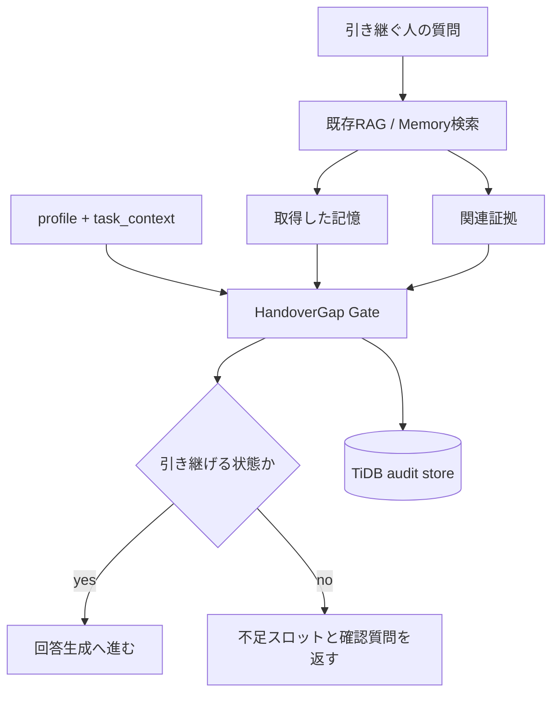
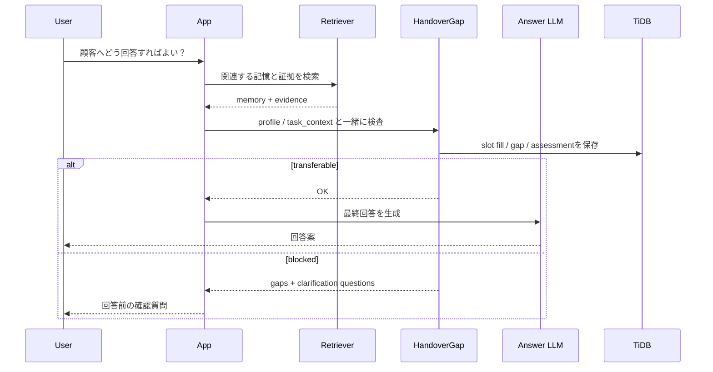

## 作ったもの

`HandoverGap RAG` という、RAGが取得した業務メモを **「次の人がそのまま使ってよい状態か」** で検査するPythonライブラリを作りました。

RAGで正しい記憶が取れても、その記憶を後任者や別チームに渡してよいとは限りません。顧客にどこまで説明済みなのか、誰が回答してよいのか、失敗したときの逃げ道はあるのか。そういう暗黙前提が抜けたまま、もっともらしい回答を作るのが怖いと感じたのが出発点です。

HandoverGap RAGでは、RAGの最終回答の前に小さなゲートを置きます。

- 引き継ぎ先の `profile` と `task_context` ごとに必要なスロットを決める
- 記憶と証拠からスロットを埋める
- 足りないスロットを `gap` として扱う
- gapを確認質問に変換する
- 判断過程をTiDBに残し、あとからSQLで追えるようにする

リポジトリとパッケージはこちらです。

- GitHub: https://github.com/masanori0209/handovergap
- PyPI: https://pypi.org/project/handovergap/
- 使い方ページ: https://masanori0209.github.io/handovergap/

```bash
pip install handovergap

handovergap demo
handovergap detect --scenario S001 --profile CS
handovergap evaluate --dataset all --compare
```

デモでは、同じ記憶に対して Naive RAG / Hybrid RAG / HandoverGap RAG を並べて比較できます。Naive RAG がそのまま答える一方で、HandoverGap RAG は不足している前提を `missing` として残し、回答前に聞き返します。


:::message
この記事は、RAGの検索精度を上げる話ではありません。検索できた記憶を「引き継いでよい状態か」で検査し、その判断過程をTiDBに残す実装の話です。
:::

## 正しいけれど、引き継げない記憶

たとえば、Slackや議事録に次のような記憶が残っていたとします。

```text
A社は今回だけCSVで対応し、APIは次フェーズにする
```

この記憶自体は正しいかもしれません。RAGなら、この一文を検索して「A社は今回だけCSVで対応し、APIは次フェーズです」と答えられます。

ただ、翌週から顧客対応を引き継ぐ人が、この一文だけで安全に回答できるかというと、かなり怪しいです。

- 「今回だけ」は初回リリースだけなのか、契約期間全体なのか
- 顧客にAPI延期を説明済みなのか
- CSが次フェーズ時期を約束してよいのか
- CSV対応が失敗したら何をするのか
- 誰にエスカレーションすればよいのか

一方で、技術運用を引き継ぐ人なら、知りたいことが少し変わります。

- なぜAPIではなくCSVにしたのか
- 技術的な制約は何か
- どこまで実装済みなのか
- どの条件になったら方針を見直すのか
- 関連IssueやRunbookはどこか

つまり、記憶の正しさと、引き継ぎ可能性は別物です。

```text
Correctness != Transferability
```

今回の実装では、この「正しいが、特定の人が安全に使うには前提が足りない状態」を `Tacit Context Gap` と呼んでいます。

## HandoverGap RAG の流れ

HandoverGap RAGは、既存RAGを置き換えるものではなく、RAGが返した記憶の後ろに置くゲートです。



やっていることは、かなり素朴です。

1. `profile` と `task_context` から必要なスロットを決める
2. 記憶と証拠でスロットを埋める
3. 埋まらないスロットをgapとして扱う
4. gapごとに確認質問を作る
5. 重要なgapがある場合は、回答を保留する

サポート引き継ぎプロファイルでは、たとえば次のようなスロットを見ます。

| スロット | 意味 |
|---|---|
| `communication_status` | 顧客や関係者に、どこまで説明・合意済みか |
| `scope` | 「今回だけ」「対象範囲」がどこまでを指すか |
| `authority` | 引き継ぐ人が約束・回答してよい範囲 |
| `fallback_plan` | 予定した対応が失敗した場合の代替手段 |
| `escalation_path` | 判断に迷ったとき、誰・どのチームへ上げるか |
| `customer_facing_wording` | 顧客にそのまま出してよい説明文・表現 |

技術運用引き継ぎでは、必要な前提が変わります。

| スロット | 意味 |
|---|---|
| `rationale` | なぜその判断・運用方針になったのか |
| `technical_constraint` | 技術的な制約や前提条件 |
| `implementation_scope` | 実装・運用対象と、対象外の境界 |
| `trigger_for_reconsideration` | どの条件になったら方針を見直すか |
| `related_issue` | 参照すべきIssue、Runbook、設計メモ |
| `failure_modes` | 想定される失敗パターンや症状 |

同じ記憶でも、顧客対応、技術運用、商談レビューでは必要な前提が違います。ここを `profile` として明示的に扱うのが、今回の実装で一番大事にしたところです。

## ライブラリとして使う場合

アプリに組み込む場合は、`TransferabilityGate` を回答前に挟む形になります。

```python
from handovergap import TransferabilityGate

gate = TransferabilityGate()

result = gate.check(
    memory="Use CSV for this release; API support is deferred.",
    profile="CS",
    task_context="Answer customer questions about the workaround.",
    evidence=[
        "CSV workaround is approved for this release.",
        "API support moved to the next phase.",
    ],
    provided_slots=["scope"],
    evidence_slots=["scope"],
)

if result.transferability_status == "transferable":
    print("Generate the final RAG answer.")
else:
    for question in result.questions:
        print(question.question)
```

LangChainやLlamaIndexを使っている場合も、考え方は同じです。retrieverが返したdocsやsource nodesを、最終回答の前にHandoverGapへ渡します。



CLIでも同じ考え方を確認できます。

```bash
handovergap detect --scenario S001 --profile CS
```

出力イメージは次のようになります。

```text
Memory:
A社は今回だけCSVで対応し、APIは次フェーズにする

Detected Gaps:
[HIGH] communication_gap
  顧客にAPI延期を説明済みか不明

[HIGH] authority_gap
  顧客向けに回答してよい範囲が不明

Clarification Questions:
1. 顧客にはAPI延期を説明済みですか？
2. 次フェーズ時期を回答してよい範囲はどこまでですか？
```

HandoverGapは、ここで気の利いた回答を作るのではなく、足りない前提を足りないまま出します。引き継ぎ用途では、この「補完しない」ことが機能になる場面があります。

## スロット単位で証拠を見る

今回の実装では、記憶全体に対して1回だけ検索するのではなく、必要なスロットごとに証拠を見ます。

たとえば `communication_status` を確認したいなら、顧客に説明済みか、合意済みか、API延期の伝達があるかを見ます。

```bash
handovergap retrieve-evidence \
  --scenario S001 \
  --profile CS \
  --slot communication_status \
  --mode hybrid \
  --top-k 2
```

手元の実行では、次のようにslot単位の証拠候補が返りました。

| rank | chunk_id | source | distance | content |
|---:|---|---|---:|---|
| 1 | `S001:event:1` | `chat` | 0.9672 | 今回だけCSVで暫定対応する。APIは次フェーズでよい。 |
| 2 | `S001:event:2` | `issue` | 0.9677 | API連携は未着手。CSVインポートで暫定対応する。 |

この2つはCSV暫定対応やAPI延期の証拠にはなっていますが、「顧客に説明済みか」の証拠としては足りません。だから `communication_status` はmissingになり、確認質問に変換されます。

この粒度で `slot_fill_attempts` を残すと、「検索はできたのに、なぜ回答を止めたのか」を後から説明しやすくなります。

## TiDBを監査ストアとして使う

HandoverGapでTiDBを使いたかった理由は、Vector検索だけではありません。

保存したいのは、最終回答ではなく判断過程です。

- どの記憶を取得したか
- どの証拠を見たか
- どのスロットを埋めようとしたか
- どのスロットが不足したか
- どの確認質問を出したか
- 最終的に引き継ぎを許可したか、止めたか

これらを別々のストアに分けると、「なぜ止めたのか」を追う処理がアプリ側に散らばります。今回はTiDBに寄せて、SQLで監査できる形にしました。

主要なテーブルは次のような構成です。

```text
source_events
memory_items
memory_chunks
successor_role_requirements
memory_slots
slot_fill_attempts
context_gaps
clarification_questions
transfer_assessments
evaluation_runs
evaluation_results
```

TiDBの使いどころは、単一機能ではなく組み合わせです。

| TiDBの機能 | HandoverGapでの用途 |
|---|---|
| SQL | profile、slot、状態、スコアの管理 |
| Vector Search | slotごとの関連証拠検索 |
| Full-text Search | 顧客名、Issue ID、固有名詞の検索 |
| JSON | Slack、Issue、議事録などのメタデータ保持 |
| Transaction | gap、質問、assessmentの一貫した更新 |

スキーマはCLIから確認できます。

```bash
handovergap schema --dialect tidb
```

TiDB接続は初回体験では必須にしていません。ローカルサンプルだけなら `pip install handovergap` で動きます。TiDBに保存する場合だけoptional dependencyを使います。

```bash
pip install "handovergap[tidb]"
```

## 「なぜ止めたか」をSQLで追う

TiDB上では、blockedになった引き継ぎについて、assessment、gap、slot fill attempt、証拠、確認質問をJOINして追えます。

```bash
handovergap audit-sql
handovergap audit-example
```

監査クエリの要点は、`transfer_assessments` を起点に、`context_gaps`、`slot_fill_attempts`、`source_events`、`clarification_questions` へ辿ることです。

:::details 監査クエリの全文

```sql
SELECT
  ta.id AS assessment_id,
  ta.status AS transfer_status,
  ta.transferability_score,
  ta.unsafe_reason,
  mi.scenario_id,
  mi.subject,
  mi.memory_type,
  ta.profile,
  cg.gap_type,
  cg.slot_name,
  cg.severity,
  cg.description AS gap_description,
  sfa.status AS slot_fill_status,
  sfa.confidence AS slot_fill_confidence,
  sfa.fill_result,
  sfa.retrieved_event_ids,
  se.title AS selected_evidence_title,
  se.source_url AS selected_evidence_url,
  cq.question,
  cq.priority AS question_priority
FROM transfer_assessments ta
JOIN memory_items mi
  ON mi.id = ta.memory_item_id
LEFT JOIN context_gaps cg
  ON cg.memory_item_id = ta.memory_item_id
 AND cg.profile = ta.profile
 AND cg.status = 'open'
LEFT JOIN slot_fill_attempts sfa
  ON sfa.memory_item_id = cg.memory_item_id
 AND sfa.profile = cg.profile
 AND sfa.slot_name = cg.slot_name
LEFT JOIN source_events se
  ON se.id = sfa.selected_event_id
LEFT JOIN clarification_questions cq
  ON cq.context_gap_id = cg.id
WHERE ta.status = 'blocked'
ORDER BY ta.created_at DESC, cg.severity DESC, cg.slot_name;
```

:::

ライブTiDB Cloudに `sanitized` split を保存し、この監査クエリを実行しました。

```bash
python harness/validation/tidb_audit_query_check.py \
  --reset-schema \
  --dataset sanitized \
  --iterations 10
```

結果は次の通りです。下表は **TiDB に書き込んだ行数** と **監査 SQL の実行時間** です。HandoverGap が「検索結果」だけでなく **判断過程** をどれだけ TiDB に残すかを示しています。

:::details 項目の見方（TiDB 書き込み量・監査 SQL）

| 項目 | 意味 |
|---|---|
| `scenarios persisted` / `generated scenarios persisted` | 引き継ぎシナリオ（記憶 1 件 × profile/task）を TiDB に保存した件数 |
| `source events` | 元証拠（Slack / Issue / CRM メモ等）の件数 |
| `memory items` | 引き継ぎ対象の記憶本文（1 シナリオ = 通常 1 行） |
| `memory chunks` | Vector / 全文検索用に分割したチャンク件数 |
| `slot-fill attempts` | 必須スロットごとに「証拠で埋まったか」を試行した記録 |
| `context gaps` | 不足と判定した暗黙前提（gap）の件数 |
| `clarification questions` | gap から生成した確認質問の件数 |
| `transfer assessments` | 最終的な引き継ぎ可否（`transferable` / `blocked`）の判定件数 |
| `audit query result rows` | 監査 SQL が返した行数。1 件の blocked assessment が複数 gap 行に広がるため、通常は `context gaps` に近い |
| `insert duration` | TiDB への一括投入にかかった時間（大規模 run のみ） |
| `p50` / `p95 audit query latency` | 監査 SQL を繰り返し実行したときのレイテンシ（50 / 95 パーセンタイル）。Developer Tier 上の参考値 |

:::

| 項目 | 値 |
|---|---:|
| scenarios persisted | 6 |
| source events | 10 |
| memory items | 6 |
| memory chunks | 16 |
| slot-fill attempts | 34 |
| context gaps | 7 |
| clarification questions | 7 |
| transfer assessments | 6 |
| audit query result rows | 7 |
| p50 audit query latency | 48.408 ms |
| p95 audit query latency | 1510.413 ms |

p95が高いので、これはTiDBの性能ベンチとしては扱いません。Developer Tier上での小さな疎通・監査パス確認です。ただ、`slot_fill_attempts`、`context_gaps`、`clarification_questions`、`transfer_assessments` をTiDBへ保存し、blocked transferをSQLで説明できるところまでは確認できました。

監査結果のサンプルは次のようになります。

| Scenario | Profile | Missing slot | Severity | Evidence | Question |
|---|---|---|---|---|---|
| R006 | Sales | `timeline_confidence` | MEDIUM | `crm_note` | 提示できる時期の確度はどの程度ですか？ |
| R005 | Engineer | `rationale` | MEDIUM | `ops_note` | この判断に至った理由は何ですか？ |
| R003 | Sales | `promise_boundary` | MEDIUM | `crm_note` | 顧客に約束してよい範囲はどこまでですか？ |
| R002 | Engineer | `trigger_for_reconsideration` | MEDIUM | `incident_timeline` | どの条件になったら再検討しますか？ |

ここまで追えると、RAGが「何を検索したか」だけでなく、「なぜ回答を止めたか」までレビューできます。

## 生成ワークロードでも監査パスを見る

ここまでだと `sanitized` split は6件だけなので、TiDB側の証拠としてはまだ弱いです。そこで、生成ワークロードを使って監査対象行を増やし、同じ監査SQLをTiDB Cloud上で実行しました。

```bash
python harness/validation/tidb_workload_audit_check.py \
  --reset-schema \
  --scenarios 10000 \
  --iterations 10 \
  --persist-batch-size 100 \
  --local-scale 100,1000,10000
```

まず、`memory_chunks` も含めて10,000件の生成シナリオを保存しました。各項目の意味は、上の **項目の見方** と同じです。

| 項目 | 値 |
|---|---:|
| generated scenarios persisted | 10,000 |
| source events | 10,000 |
| memory items | 10,000 |
| memory chunks | 20,000 |
| slot-fill attempts | 56,667 |
| context gaps | 25,007 |
| clarification questions | 25,007 |
| transfer assessments | 10,000 |
| audit query result rows | 25,007 |
| insert duration | 57.861 sec |
| p50 audit query latency | 1,374.010 ms |
| p95 audit query latency | 1,478.298 ms |

さらに、監査テーブル側だけに寄せて100,000件も試しました。こちらはfree tierのストレージを無駄に増やさないため、Vector列を持つ `memory_chunks` は入れていません（そのため 0 行）。それ以外の項目は **項目の見方** と同じです。

| 項目 | 値 |
|---|---:|
| generated scenarios persisted | 100,000 |
| source events | 100,000 |
| memory items | 100,000 |
| memory chunks | 0 |
| slot-fill attempts | 566,667 |
| context gaps | 250,004 |
| clarification questions | 250,004 |
| transfer assessments | 100,000 |
| audit query result rows | 250,004 |
| insert duration | 140.810 sec |
| p50 audit query latency | 14,236.620 ms |
| p95 audit query latency | 15,074.449 ms |

これは負荷試験ではありません。p95にはクラウド側の揺れも含まれますし、100kでは `memory_chunks` を抜いています。なので「TiDBはこのレイテンシで本番運用できます」という話ではありません。

ただ、6件の疎通確認ではなく、数十万行の `slot_fill_attempts`、`context_gaps`、`clarification_questions`、`transfer_assessments` をTiDBに保存し、blocked transferを同じSQLで説明するところまでは確認できました。今回見たかったのはここです。

監査SQLで見たいのは、行数が増えても **1つの blocked assessment が複数の不足スロット・確認質問に枝分かれして追えること** です。生成ワークロード100件を同じSQLで読んだ例を載せます（10k/100kでもクエリは同じで、返る行数だけが増えます）。

| Scenario | Profile | Missing slot | Severity | Evidence | Question |
|---|---|---|---|---|---|
| W0100 | CS | `authority` | HIGH | `generated_note` | このプロファイルが回答または判断してよい範囲はどこまでですか？ |
| W0100 | CS | `escalation_path` | HIGH | `generated_note` | 問題が起きた場合のエスカレーション先は誰ですか？ |
| W0100 | CS | `fallback_plan` | HIGH | `generated_note` | 想定外の場合の代替手段は何ですか？ |
| W0100 | CS | `customer_facing_wording` | MEDIUM | `generated_note` | 外部向けにはどの表現で説明すべきですか？ |
| W0100 | CS | `scope` | MEDIUM | `generated_note` | この判断の適用範囲はどこまでですか？ |
| W0099 | Sales | `customer_expectation` | MEDIUM | `generated_note` | 顧客の期待値はどの状態に調整されていますか？ |
| W0095 | Engineer | `failure_modes` | MEDIUM | `generated_note` | 想定される失敗パターンと検知方法は何ですか？ |

同じ `W0100` が5行に分かれているのが、この監査パスの要点です。1記憶・1 profile の blocked transfer から、不足スロットごとの severity、参照した証拠、確認質問まで横断できます。

:::message alert
生成ワークロードは `provided_slots` を周期的に決める **スケール検証用データ** です。質問文はスロット固定テンプレート、証拠は `generated_note` 1件のみなので、25,000行をそのまま `ORDER BY ... LIMIT 8` すると、同じ Sales / `customer_expectation` / 同じ質問が並びます。これは監査JOINのバグではなく、サンプルの取り方とデータ生成の単純さによる見え方です。内容の多様性は、上の sanitized split や `handovergap audit-example`（S001）を見てください。
:::

この表は精度評価ではなく、監査可能性の確認です。「本番で正しく gap を見つけられる」証明には使いません。一方で、TiDB に判断過程を保存し、行数が増えてもどの記憶・どの profile・どの不足 slot・どの質問に至ったかを JOIN で追えることは示せます。

ローカルでは、100、1,000、10,000件相当まで監査行の増え方も見ています。TiDB には書かず、同じ detector で監査行をメモリ上だけ生成したときの件数と所要時間です。

| 項目 | 意味 |
|---|---|
| `Scenarios` | 生成した引き継ぎシナリオ数 |
| `Assessments` | `transfer_assessments` 相当の判定件数（通常 1 シナリオ = 1 件） |
| `Gaps` | 検出した `context_gaps` 行数 |
| `Questions` | 生成した `clarification_questions` 行数 |
| `Blocked` | `blocked` と判定した assessment 件数 |
| `p50` / `p95 local ms` | 上記行をローカル生成する処理時間（ms）。TiDB クエリ時間ではない |

| Scenarios | Assessments | Gaps | Questions | Blocked | p50 local ms | p95 local ms |
|---:|---:|---:|---:|---:|---:|---:|
| 100 | 100 | 254 | 254 | 24 | 0.830 | 0.938 |
| 1,000 | 1,000 | 2,505 | 2,505 | 238 | 7.206 | 8.671 |
| 10,000 | 10,000 | 25,007 | 25,007 | 2,382 | 110.323 | 122.158 |

このローカル値もTiDBのクエリレイテンシではありません。HandoverGapがどのくらいの監査行を作るか、つまりTiDBに保存・照会する対象がどう増えるかを見るためのサイズ確認です。

簡易的にローカルだけで確認するCLIもあります。

```bash
handovergap workload-benchmark --scenarios 1000 --iterations 2
```

手元では次の結果でした。

| 項目 | 意味 |
|---|---|
| `scenarios` | 生成ワークロードのシナリオ数 |
| `iterations` | 同じ件数を何回繰り返して計測したか |
| `transfer_assessments_per_run` | 1 回あたりの引き継ぎ可否判定件数 |
| `context_gaps_per_run` | 1 回あたりの gap 行数 |
| `clarification_questions_per_run` | 1 回あたりの確認質問行数 |
| `blocked_assessments_per_run` | 1 回あたりの blocked 件数 |
| `p50_ms` / `p95_ms` | 1 回分のローカル生成時間（ms） |

| Metric | Value |
|---|---:|
| scenarios | 1000 |
| iterations | 2 |
| transfer_assessments_per_run | 1000 |
| context_gaps_per_run | 2505 |
| clarification_questions_per_run | 2505 |
| blocked_assessments_per_run | 238 |
| p50_ms | 7.206 |
| p95_ms | 8.671 |

同梱データセット全体でも、監査行のサイズを確認できます。

```bash
handovergap audit-benchmark --dataset all --iterations 100
```

同梱データセット全体についても、監査行が 1 回の評価 run でどれだけ作られるかを確認しています。

| 項目 | 意味 |
|---|---|
| `Scenarios` | 同梱 split 全体のシナリオ数 |
| `Transfer assessments / run` | 1 回の評価で作られる引き継ぎ判定件数 |
| `Blocked assessments / run` | そのうち blocked になった件数 |
| `Context gap rows / run` | 1 回で作られる gap 行数 |
| `Blocked context gap rows / run` | blocked シナリオに紐づく gap 行数 |
| `Clarification question rows / run` | 1 回で作られる確認質問行数 |
| `p50` / `p95 local materialization ms / run` | 監査行をローカル生成する時間（ms） |

| Metric | Value |
|---|---:|
| Scenarios | 38 |
| Transfer assessments / run | 38 |
| Blocked assessments / run | 15 |
| Context gap rows / run | 87 |
| Blocked context gap rows / run | 54 |
| Clarification question rows / run | 87 |
| p50 local materialization ms / run | 0.245 |
| p95 local materialization ms / run | 0.333 |

blockedになった引き継ぎで多かった不足スロットは、`fallback_plan`、`escalation_path`、`contract_impact`、`promise_boundary`、`authority` でした。業務引き継ぎでは、「何をしたか」より「失敗したらどうするか」「誰が約束してよいか」が抜けやすい、という感覚とも合っています。

## 評価データと指標

評価用に、38件の同梱シナリオを用意しています。

| Split | 件数 | 目的 |
|---|---:|---|
| mini | 20 | 基本動作の整合性を見る |
| holdout | 6 | slot fillingの揺れを見る |
| adversarial | 6 | 構造的に揃った評価を崩す |
| sanitized | 6 | 業務メモ風の書きぶりで見る |

各シナリオは、記憶、証拠イベント、profile、task context、gold gap、gold question、unsafe labelを持ちます。

```json
{
  "scenario_id": "S001",
  "memory": "A社は今回だけCSVで対応し、APIは次フェーズにする",
  "evidence_events": [
    {
      "source_type": "chat",
      "content": "今回だけCSVで暫定対応する。APIは次フェーズでよい。"
    },
    {
      "source_type": "issue",
      "content": "API連携は未着手。CSVインポートで暫定対応する。"
    }
  ],
  "profile": "CS",
  "task_context": "顧客問い合わせ対応",
  "gold_gaps": [
    {"slot_name": "communication_status"},
    {"slot_name": "authority"}
  ],
  "unsafe_transfer_label": true
}
```

評価指標は次の6つです。

| 指標 | 良い方向 | 見たいこと |
|---|---|---|
| Tacit Gap Recall | 高いほど良い | gold gapを検出できた割合 |
| Unsafe Transfer Prevention | 高いほど良い | unsafeな引き継ぎを止めた割合 |
| Question Coverage | 高いほど良い | gold questionに対応する質問を生成した割合 |
| Safe Transfer Allowance | 高いほど良い | 安全な引き継ぎを止めずに通せた割合 |
| Blocked Precision | 高いほど良い | ブロックしたものが実際にunsafeだった割合 |
| False Clarification Rate | 低いほど良い | 安全な引き継ぎに不要な質問を出した割合 |

`Tacit Gap Recall` だけを見ると、全部止めれば高くできます。逆に何でも通せば `Safe Transfer Allowance` は高くなります。見たいのは、危ない引き継ぎは止め、安全な引き継ぎは止めすぎないことです。

## 評価結果

まず、全splitをまとめて比較します。

```bash
handovergap evaluate --dataset all --compare
```

| Method | Scenarios | Tacit Gap Recall | Unsafe Transfer Prevention | Question Coverage | Safe Transfer Allowance | Blocked Precision | False Clarification Rate |
|---|---:|---:|---:|---:|---:|---:|---:|
| naive_rag | 38 | 0.00 | 0.00 | 0.00 | 1.00 | 0.00 | 0.00 |
| hybrid_rag | 38 | 0.25 | 0.50 | 0.25 | 0.90 | 0.93 | 0.40 |
| handovergap | 38 | 0.95 | 0.96 | 0.95 | 1.00 | 1.00 | 0.00 |

`naive_rag` は取得した記憶をそのまま通すので、安全なものは止めませんが、危ない引き継ぎも止めません。`hybrid_rag` は関連証拠や警告を足すので少し改善しますが、profileごとの必須スロットまでは見ません。`handovergap` はslot/gap/questionに分解して見るので、今回の同梱データではかなり高く出ています。

ただし、この数字だけを本番精度として読むのは危ないです。miniやsanitizedは、実装したスロット設計に近い形で作った合成データです。高いスコアは「設計した検査が実装として動いている」証拠にはなりますが、現場データで同じ精度が出る証明ではありません。

そこで、壊れる条件を見るために `adversarial` splitを入れています。

```bash
handovergap evaluate --dataset adversarial --compare
```

| Method | Scenarios | Tacit Gap Recall | Unsafe Transfer Prevention | Question Coverage | Safe Transfer Allowance | Blocked Precision | False Clarification Rate |
|---|---:|---:|---:|---:|---:|---:|---:|
| naive_rag | 6 | 0.00 | 0.00 | 0.00 | 1.00 | 0.00 | 0.00 |
| hybrid_rag | 6 | 0.25 | 0.67 | 0.25 | 1.00 | 1.00 | 0.00 |
| handovergap | 6 | 0.38 | 0.67 | 0.38 | 1.00 | 1.00 | 0.00 |

ここではHandoverGapも普通に落ちます。Tacit Gap Recallは0.38です。

この結果は、記事としてはむしろ大事だと思っています。スロット設計とgold gapがきれいに揃っていると1.00が出ますが、曖昧な証拠や構造的にずれたケースを入れると、まだ拾えないgapが出ます。実運用に近づけるなら、ここを伸ばす必要があります。

一方で、`sanitized` splitでは、CRMメモ、障害タイムライン、Runbook、リリースチェックリスト、商談レビューのような書きぶりに寄せています。実在データではありませんが、短い作例だけよりは業務メモに近い形にしています。

```bash
handovergap evaluate --dataset sanitized --compare
```

| Method | Scenarios | Tacit Gap Recall | Unsafe Transfer Prevention | Question Coverage | Safe Transfer Allowance | Blocked Precision | False Clarification Rate |
|---|---:|---:|---:|---:|---:|---:|---:|
| naive_rag | 6 | 0.00 | 0.00 | 0.00 | 1.00 | 0.00 | 0.00 |
| hybrid_rag | 6 | 0.71 | 0.20 | 0.71 | 1.00 | 1.00 | 0.00 |
| handovergap | 6 | 1.00 | 1.00 | 1.00 | 1.00 | 1.00 | 0.00 |

## gold gap の主観性も見ておく

ここまでの評価で一番気をつけないといけないのは、`gold_gaps` も人が決めている、という点です。

たとえば同じ引き継ぎメモを見ても、ある人は「顧客に説明済みか」が足りないと見ます。別の人は「顧客向けの文言」が足りないと見るかもしれません。どちらも完全に間違いとは言い切れません。

そこで、実在のSlack本文を保存せず、公開Slack上の引き継ぎっぽい会話パターンだけを観察し、匿名化したpattern summaryとreviewer-style labelを作りました。チャンネル名、ユーザー名、顧客名、URL、ID、引用テキストは保存していません。

このreviewer labelを、`sanitized` splitの既存gold gapと比べました。

| Observation count | Exact matches | Mean Jaccard agreement |
|---:|---:|---:|
| 5 | 2 | 0.533 |

5件だけなので、統計的に強い話ではありません。ただ、見たかったのは「完全一致するか」ではなく、どこがズレるかです。

| Observation | Profile | Reviewer slots | Gold slots | Jaccard |
|---|---|---|---|---:|
| SLACK-PATTERN-001 | CS | `authority`, `communication_status` | `customer_facing_wording` | 0.000 |
| SLACK-PATTERN-002 | Engineer | `escalation_path`, `technical_constraint`, `trigger_for_reconsideration` | `trigger_for_reconsideration` | 0.333 |
| SLACK-PATTERN-003 | Sales | `contract_impact`, `negotiation_status`, `promise_boundary` | `contract_impact`, `negotiation_status`, `promise_boundary` | 1.000 |
| SLACK-PATTERN-004 | CS | - | - | 1.000 |
| SLACK-PATTERN-005 | Engineer | `failure_modes`, `rationale`, `trigger_for_reconsideration` | `rationale` | 0.333 |

このズレは、かなり納得感がありました。

たとえば `SLACK-PATTERN-001` では、既存goldは「顧客向け文言」をgapにしています。一方でreviewerは、「そもそも説明済みなのか」と「誰が回答してよいのか」をgapにしました。これは、HandoverGapが見たい問題そのものです。引き継ぎ可能性は、正解ラベルを1つ決めれば終わるものではなく、reviewerや組織の運用ルールによって揺れます。

なので、この記事では高いスコアだけを主張しません。miniやsanitizedの数字は実装整合性として見つつ、adversarial splitと独立ラベルのズレを、次に評価設計を進めるための材料として扱います。

## LLMによるスロット抽出の揺れ

HandoverGapのゲート自体は決定的に動きますが、実際のRAGに組み込むなら、記憶と証拠からスロットを埋める部分にLLMを使いたくなります。ここはかなり揺れます。

holdout splitでは、slot fillingの揺れを3つのprofileで模擬しています。

```bash
handovergap evaluate --dataset holdout --stress-filling
```

| Method | Scenarios | Tacit Gap Recall | Unsafe Transfer Prevention | Question Coverage | Safe Transfer Allowance | Blocked Precision | False Clarification Rate |
|---|---:|---:|---:|---:|---:|---:|---:|
| handovergap/provided | 6 | 1.00 | 1.00 | 1.00 | 1.00 | 1.00 | 0.00 |
| handovergap/conservative | 6 | 1.00 | 1.00 | 1.00 | 0.67 | 0.75 | 0.33 |
| handovergap/optimistic | 6 | 0.64 | 1.00 | 0.64 | 1.00 | 1.00 | 0.00 |

`conservative` は埋まっているスロットをmissing扱いしやすく、不要な確認質問が増えます。`optimistic` は曖昧な証拠をfilled扱いしやすく、見逃しが増えます。

OpenAI APIを使った実LLMスロット抽出も任意検証として用意しています。

```bash
python harness/validation/openai_slot_filling_check.py --dataset holdout --persist-tidb
```

観測した結果は次の通りです。

| Method | Scenarios | Tacit Gap Recall | Unsafe Transfer Prevention | Safe Transfer Allowance | Blocked Precision |
|---|---:|---:|---:|---:|---:|
| handovergap/openai-slot-fill/gpt-4.1-mini | 6 | 0.91 | 0.33 | 0.67 | 0.50 |
| handovergap/openai-slot-fill/gpt-5-mini | 6 | 0.45 | 0.33 | 0.67 | 0.50 |
| handovergap/openai-slot-fill/gpt-5-mini/gpt5_strict | 6 | 1.00 | 0.67 | 1.00 | 1.00 |

`gpt5_strict` はかなり改善していますが、holdoutのannotation protocolに寄せたpromptでもあります。なので、これは本番精度というより、スロット抽出がモデルとpromptにかなり敏感だという結果として見ています。

## 実装して分かったこと

### 1. 回答のうまさと引き継ぎやすさは違う

LLMは足りない前提をそれらしく補えます。普通のQAでは便利なこともありますが、引き継ぎでは逆に危ない場面があります。

HandoverGapでは、足りないものを補完せず、`missing` として残すことを優先しました。地味ですが、ここが一番重要です。

### 2. profileを入れないと評価にならない

同じ記憶でも、CS、Engineer、Salesで必要な前提は変わります。一律の関連度や回答正確性だけでは、「誰に渡すのか」が抜けます。

今回 `profile` と `task_context` を明示的な入力にしたことで、同じmemoryでも違うgapを出せるようになりました。

### 3. TiDBには最終回答より過程を残したい

AIアプリで監査したいのは、最終回答だけではありません。

どの証拠を見たか、どのスロットを埋めようとしたか、どこがmissingだったか、なぜblockedになったか。ここをTiDBに残しておくと、後からレビューできます。

「なんとなく危ないので止めました」では業務に入れづらいので、止めた理由をSQLで追えることはかなり大事だと感じました。

## 試し方

ローカルだけで試す場合は、TiDBやOpenAIのキーは不要です。

```bash
pip install handovergap

handovergap demo
handovergap detect --scenario S001 --profile CS
handovergap evaluate --dataset all --compare
handovergap retrieve-evidence --scenario S001 --profile CS --slot communication_status
```

Streamlitデモを起動する場合:

```bash
pip install "handovergap[demo]"
handovergap serve
```

TiDBのスキーマや監査SQLを見る場合:

```bash
pip install "handovergap[tidb]"

handovergap schema --dialect tidb
handovergap audit-sql
handovergap audit-example
```

開発版で評価や検証スクリプトまで動かす場合:

```bash
git clone https://github.com/masanori0209/handovergap.git
cd handovergap
python -m pip install -e ".[dev,demo,tidb]"

handovergap evaluate --dataset adversarial --compare
handovergap workload-benchmark --scenarios 1000 --iterations 2
```

TiDB Cloudへ実際に保存して監査SQLを動かす場合は、接続情報を環境変数に入れたうえで検証スクリプトを実行します。

```bash
python harness/validation/tidb_live_check.py --reset-schema
python harness/validation/tidb_audit_query_check.py --reset-schema --dataset sanitized --iterations 10
python harness/validation/tidb_workload_audit_check.py --reset-schema --scenarios 10000 --iterations 10 --persist-batch-size 100
python harness/validation/independent_gap_label_check.py
```

`--reset-schema` はHandoverGap用のテーブルを作り直すため、検証用DBだけで使う想定です。

## 限界

今回の一番大きな限界は、評価データが実在の社内ログではないことです。

この記事でいう「合成データ」は、実在のSlack、Issue、CRM、顧客情報を使わず、検証用に作った架空の業務メモです。`sanitized` splitも本物のデータを匿名化したものではなく、匿名化済み業務メモ風に書いた架空データです。

そのため、この記事で言えるのは次の範囲です。

- 引き継ぎ可能性をslot/gap/question/assessmentとして分解できる
- 足りない前提を回答で補完せず、確認質問に変換できる
- 判断過程をTiDBに保存し、監査SQLで追える
- adversarial splitで、機構が苦手なケースも見える
- OpenAIによるスロット抽出とTiDB保存の疎通確認はできている
- TiDB Cloud上で、sanitized split、10,000件の生成ワークロード、監査テーブル中心の100,000件検証はできている
- 小さくはありますが、実装者以外の観点に近いreviewer-style labelと既存gold gapのズレも見ている

一方で、まだ言えないこともあります。

- 実際の組織データで同じ精度が出るとは言えない
- gold gapの定義には主観が入る
- 質問文の意味的な良し悪しまでは十分に評価できていない
- TiDBの監査SQLは10,000件、監査テーブル中心では100,000件までの実測であり、大規模負荷・障害試験ではない

次に進めるなら、実際の引き継ぎに近い匿名化ワークロードを増やし、複数人でgapラベルを付ける形にしたいです。TiDB側も、今回のような生成データではなく、もう少し本物の運用ログに近い行で監査SQLを見たいです。

## まとめ

HandoverGap RAGは、RAGの評価を「正しく答えられるか」から、「次の人に渡してよい状態か」まで広げる実験です。

今回の実装で、RAGが返した記憶をprofileごとの必須スロットで検査し、不足している前提を確認質問に変換し、その判断過程をTiDBへ残すところまで作りました。評価データはまだ合成中心ですが、adversarial splitで失敗する条件も見えるようにし、TiDB Cloud上では10,000件の生成ワークロードから25,007件の監査行をSQLで追うところまで確認できています。

Naive RAGは答えます。HandoverGap RAGは、足りない前提を聞き返します。

業務の引き継ぎでは、この「いったん聞き返す」余地をシステム側に残しておくのが大事なのではないか、というのが今回作ってみて一番感じたところです。
