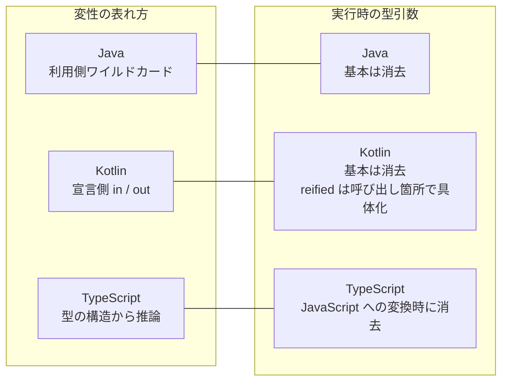
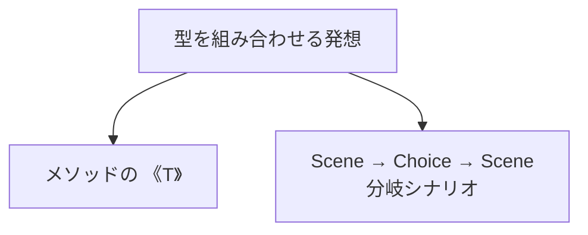
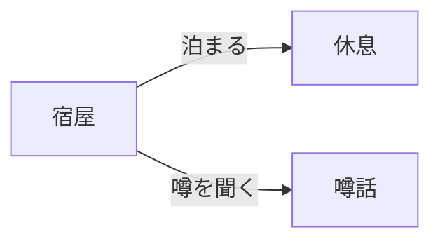
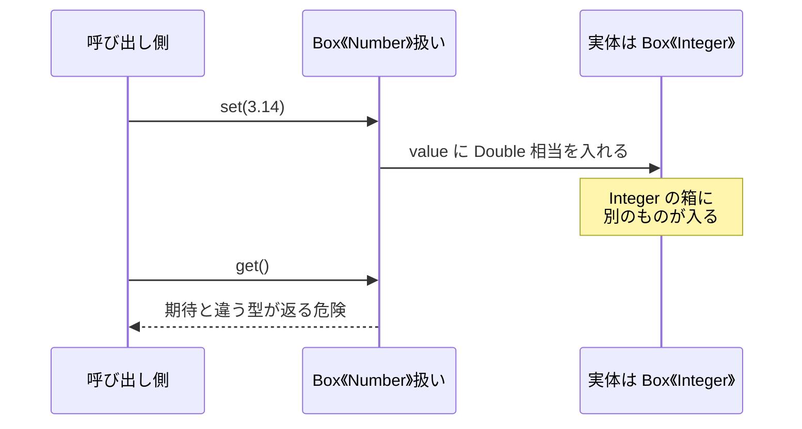
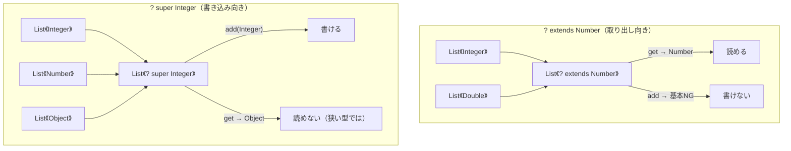
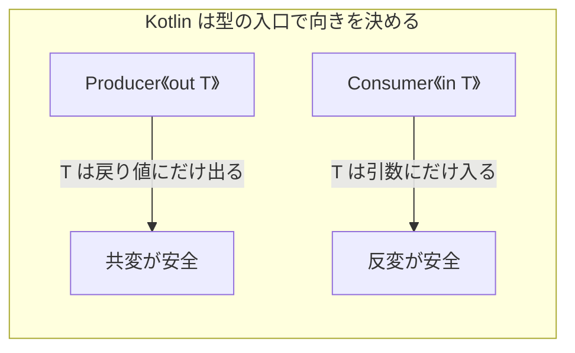
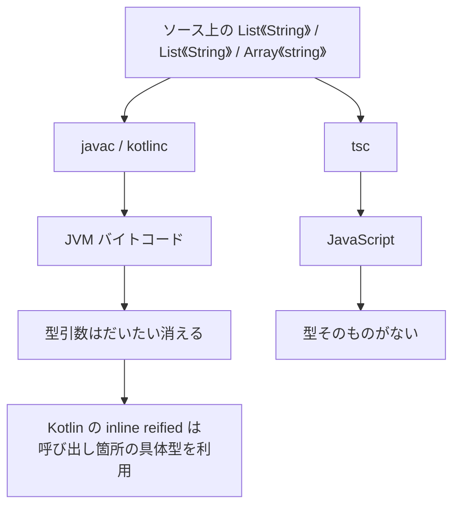

## はじめに

Java のジェネリクスは Java 5（2004）からあります。もう20年超の機能です。

大学の授業で初めて触れたときは、正直かなり感動しました。`List<String>` が便利、というより「型を引数に取れる」こと自体が衝撃で、メソッドにも付けられたら？ 分岐するシナリオみたいな再帰構造にも載せられたら？ と、先の方まで想像してしまった記憶があります。

手を止めたのは、どちらかというとあとから出てきた `List<? extends Number>` の方でした。型を引数に取る感覚はわかった気でいたのに、`extends` と `super` の矢印だけは、しばらく記号に見えました。

最近 TypeScript を触っていて、ふとそのころの授業を思い出しました。なので今回は、Kotlin と TypeScript の隣に Java のジェネリクスを置いて、軽く棚卸ししてみます。最初に、当時想像していた「メソッド」と「分岐シナリオみたいな再帰」を軽く触れてから、変性と実行時の型を見ます。

棚卸しのときに見るのは、だいたい次の2つです。

1. **変性（variance）** … 親子関係の型を、どこまで安全に入れ替えられるか
2. **実行時に型が残るか** … コンパイル後も型引数を見られるか

---

## 最初にざっくり並べる

三言語を並べると、だいたいこうなります。



| 観点 | Java | Kotlin | TypeScript |
|---|---|---|---|
| 変性の主戦場 | 利用側（`? extends` / `? super`） | 宣言側（`out` / `in`） | 型パラメータが使われる位置から推論 |
| 実行時の型引数 | 消える（型消去） | 基本は消える。`inline reified` では呼び出し箇所の具体型を利用できる | JavaScript への変換時に消える |
| 「箱」のイメージ | `List<T>` + ワイルドカード | 利用時は `List<T>`（定義側が `List<out E>`） | `Array<T>` / `ReadonlyArray<T>` など |

この表をコードで追う前に、まずは大学のころに想像していた「メソッド」と「再帰構造」の話から始めます。

---

## List の外側：メソッドと再帰構造

`List<T>` はジェネリクスの入口でしかありません。クラスだけでなくメソッドにも型引数を付けられるし、型を組み合わせると、もう一段おもしろい構造が出てきます。



### メソッドにも型引数を付ける

Java では、クラスがジェネリックでなくても、メソッド単体に型引数を付けられます。

```java
static <T> T identity(T value) {
    return value;
}

static <T, R> List<R> map(List<T> source, Function<T, R> f) {
    List<R> out = new ArrayList<>();
    for (T item : source) {
        out.add(f.apply(item));
    }
    return out;
}

String s = identity("hello");
List<Integer> lengths = map(List.of("a", "bb"), String::length);
```

呼び出し側で `<String>` と書かなくても、引数から推論されることが多いです。ここが「関数にも載せられたら面白そう」の、Java における実体です。

Kotlin だと、見た目はもっと関数に近いです。

```kotlin
fun <T> identity(value: T): T = value

fun <T, R> map(source: List<T>, f: (T) -> R): List<R> =
    source.map(f)

val s = identity("hello")
val lengths = map(listOf("a", "bb")) { it.length }
```

TypeScript も同じ発想です。実行時の関数はそのまま、型だけが消えます。

```typescript
function identity<T>(value: T): T {
  return value;
}

function map<T, R>(source: T[], f: (value: T) => R): R[] {
  return source.map(f);
}

const s = identity("hello");
const lengths = map(["a", "bb"], (x) => x.length);
```

三言語とも「その呼び出しだけの `T`」をメソッド／関数に付けられる、という意味では揃っています。差が出るのは、あとで見る実行時に型を使う方法（Kotlin の `reified` など）の方です。

### 再帰構造：分岐シナリオ

当時の自分は、RPG の会話分岐みたいなものをイメージしていました。場面があって、選択肢があって、また次の場面につながる。起点のシーンから Node を組み合わせていけば、シナリオの木が組めそうだ、という感覚です。ジェネリクスそのものの文法というより、「型を組み合わせて構造を作れる」と気づいた先に見えた景色に近いです。

```java
// Java 16+ の record で形状だけ示す
record Choice(String label, Scene next) {}

record Scene(String id, String text, List<Choice> choices) {}

Scene rest = new Scene("rest", "体力が回復した。", List.of());
Scene rumor = new Scene("rumor", "商人が北の洞窟の話をしていた。", List.of());

Scene inn = new Scene(
    "inn",
    "宿屋の主人「今夜はどうする？」",
    List.of(
        new Choice("泊まる", rest),
        new Choice("噂を聞く", rumor)
    )
);
```



Kotlin でも同じ形です。TypeScript は型エイリアスの再帰が書きやすいので、形だけならこうもできます。

```typescript
type Choice = {
  label: string;
  next: Scene;
};

type Scene = {
  id: string;
  text: string;
  choices: Choice[];
};
```

境界に自分を書く形もあります。`Enum` は `Enum<E extends Enum<E>>` のように、型パラメータの境界に自分が出てきます。`Comparable` はインターフェース自体が F-bound というより、`Foo implements Comparable<Foo>` のように「比較相手に自分を渡す」使い方が近いです。メソッドの戻りを具体型のまま保ちたいときにも、同じ発想が出てきます。

```java
abstract class Node<T extends Node<T>> {
    abstract T self();
    T bump() { return self(); }
}

class IntNode extends Node<IntNode> {
    int value;
    IntNode(int value) { this.value = value; }
    @Override IntNode self() { return this; }
}

IntNode n = new IntNode(1).bump(); // 戻りは IntNode のまま
```

---

## 共通の題材：数値の箱

ここからは、三言語で同じ役割の型を置きます。「数を入れて、取り出す」だけの箱です。

```java
// Java
class Box<T> {
    private T value;
    void set(T value) { this.value = value; }
    T get() { return value; }
}
```

```kotlin
// Kotlin
class Box<T>(var value: T)
```

```typescript
// TypeScript
class Box<T> {
  constructor(public value: T) {}
}
```

見た目は似ています。差が出るのは、「`Box<Integer>` を `Box<Number>` として扱ってよいか」です。

---

## 変性 — どこで親子関係を許すか

### 不変だと何が起きるか

次の代入を、Java でそのまま書くとコンパイルエラーになります。

```java
Box<Integer> ints = new Box<>();
// Box<Number> nums = ints; // コンパイルエラー
```

Kotlin も、何も付けない `Box<T>` は不変なので同じです。

```kotlin
val ints = Box(1)
// val nums: Box<Number> = ints // コンパイルエラー
```

ここで TypeScript は Java / Kotlin と違う動きをします。可変プロパティを持つ `Box<T>` でも、共変方向の代入が通ります。

```typescript
const ints = new Box(1);
const values: Box<unknown> = ints; // 通る
values.value = "x";                // ints.value の中身も変わる

const n: number = ints.value;      // 型上は number、実体は string
```

TypeScript は JavaScript との互換性や使いやすさを優先して、こうした不健全さを許す場面があります。配列だけの例外ではありません。

なぜ「入れる側まで広げると危ない」のか。直感的にはこうです。



「取り出す側」だけなら親子を許してよい場面があり、「入れる側」だけなら逆向きを許してよい場面があります。この非対称が、変性の本体です。

### Java：利用側で決める（ワイルドカード）

Java は、型そのものではなく **使う場所** で変性を書きます。

```java
// 取り出し専用っぽく扱う（producer）
void printAll(List<? extends Number> numbers) {
    for (Number n : numbers) {
        System.out.println(n.doubleValue());
    }
    // numbers.add(1); // コンパイルエラー（null 以外は入れられない）
}

// 入れ専用っぽく扱う（consumer）
void addOne(List<? super Integer> sink) {
    sink.add(1);
    // Integer x = sink.get(0); // 取り出しは Object 扱いになる
}
```

いわゆる PECS（Producer Extends, Consumer Super）です。

- **出す側**（producer）→ `? extends T`
- **入れる側**（consumer）→ `? super T`

図にすると、矢印の向きが逆になります。



Java を読むときのコツは、「クラス定義を見に行かず、**引数のその場の記号**を読む」ことです。`List` 自体は不変のまま、メソッド引数だけが伸び縮みします。

### Kotlin：宣言側で決める（`out` / `in`）

Kotlin は、型パラメータに最初から向きを付けられます。

```kotlin
// 出すだけなら out（共変）
interface Producer<out T> {
    fun get(): T
}

// 入れるだけなら in（反変）
interface Consumer<in T> {
    fun accept(value: T)
}

val intProducer: Producer<Int> = object : Producer<Int> {
    override fun get() = 42
}
val numberProducer: Producer<Number> = intProducer // OK（out のおかげ）

val numberConsumer: Consumer<Number> = object : Consumer<Number> {
    override fun accept(value: Number) {}
}
val intConsumer: Consumer<Int> = numberConsumer // OK（in のおかげ）
```

Kotlin 標準ライブラリの `List` は、定義側で `List<out E>` と宣言されています。利用するときは普通に `List<T>` と書きます。可変なのは `MutableList<T>` 側、という分け方です。Java の「同じ `List` にワイルドカードを足す」発想とは、設計の置き場所が違います。



Java から来ると、「なぜ `MutableList` と `List` が分かれているのか」が、ここでつながります。変性を宣言側で安全に保つための分割、と読むとしっくり来ます。

### TypeScript：型の構造から推論する

TypeScript は Java / Kotlin と違い、型パラメータがどこで使われているかを見て変性を推論します。**nominal（名前）より structural（形）** で型がつながる言語なので、まず構造の方が効きます。

```typescript
type Getter<T> = () => T;          // T は共変側
type Setter<T> = (value: T) => void; // T は反変側

const getInt: Getter<number> = () => 1;
const getUnknown: Getter<unknown> = getInt; // 戻り値は広げられる

const setUnknown: Setter<unknown> = (v) => {};
const setNumber: Setter<number> = setUnknown; // 引数は狭められる方向
```

この反変チェックは `strictFunctionTypes: true`（`strict: true` に含まれます）が前提です。メソッド構文は互換性の都合で扱いが違うため、ここでは関数型に絞ります。

可変配列にも同じ不健全さがあります。Java / Kotlin の配列と並べた方が違いが見えやすいので、これは最後にまとめて比べます。TypeScript 側で安全に読み取りだけを許したいなら、`readonly T[]` や `ReadonlyArray<T>` を使えます。

TypeScript を隣に置く意味は、「変性は OOP 言語だけの話ではなく、**関数の引数と戻り値の位置**の話でもある」と再確認できることです。Java の `? extends` / `? super` も、結局は「出す位置」と「入れる位置」の記号です。

### 三言語の変性を一文で

| 言語 | 覚え方 |
|---|---|
| Java | 使う場所で `extends` / `super` を足す |
| Kotlin | 型パラメータに `out` / `in` を付ける。読み取りと書き込みで型を分けることが多い |
| TypeScript | 型の構造から推論する。配列や可変プロパティでは不健全さを許す場合があり、`readonly` で安全側へ寄せられる |

「親子を許すか」は言語の癖ではなく、**データの流れ（in/out）の話**に寄せると、記号の暗記量が減ります。

---

## 実行時に型は残るか

変性はコンパイル時の話です。実行時に目を移すと、三言語の差がもっとはっきりします。



### Java：型消去が前提

```java
List<String> strings = new ArrayList<>();
List<Integer> integers = new ArrayList<>();

System.out.println(strings.getClass() == integers.getClass()); // true
// if (strings instanceof List<String>) {} // コンパイルエラー
```

実行時に残るのは生の `List` に近い情報で、`String` か `Integer` かは消えています。そのため、次のようなこともできません。

```java
// T[] values = new T[10]; // コンパイルエラー
```

実行時に型が必要なら、型トークン（`Class<T>`）を別途渡します。配列を本当に作るなら、たとえばリフレクションを使います。

```java
import java.lang.reflect.Array;

@SuppressWarnings("unchecked")
static <T> T[] createArray(Class<T> type, int length) {
    return (T[]) Array.newInstance(type, length);
}

String[] values = createArray(String.class, 10);
```

Jackson などでデシリアライズ先の型を渡すときも、考え方は同じです。「ジェネリクスがあるのに `Class<T>` が要る」のは矛盾ではなく、消去された型を自分で運び直しています。

### Kotlin：基本は同じ、`reified` だけ別枠

Kotlin も JVM 上では型消去が基本です。ただし、インライン関数では型引数を **reified（具体化）** して、呼び出し箇所の具体型を検査に使えます。

```kotlin
inline fun <reified T> List<*>.filterIsInstanceReified(): List<T> =
    filter { it is T }.map { it as T }

val mixed: List<Any> = listOf(1, "a", 2)
val onlyInt = mixed.filterIsInstanceReified<Int>() // [1, 2]
```

`inline` + `reified` のとき、コンパイラが関数を展開し、呼び出し箇所の具体型を使ったコードを生成するので `is T` が書けます。通常のジェネリック関数では同じことはできません。

```kotlin
fun <T> broken(list: List<*>): List<T> {
    // return list.filter { it is T } // コンパイルエラー
    return emptyList()
}
```

ただし、`List<String>` の `String` のような入れ子の型引数まで、オブジェクトが保持するわけではありません。Java から見ると、「消去が前提の世界で、呼び出し箇所の具体型を限定的に使える」と覚えるのがちょうどよいです。

### TypeScript：コンパイル後に型がない

TypeScript の型は、出力 JS には残りません。

```typescript
function identity<T>(value: T): T {
  return value;
}

// 出力 JS はだいたいこうなる（型引数も消える）
// function identity(value) { return value; }
```

実行時に型を分岐したいなら、自分でタグやユーザー定義型ガードを書きます。

```typescript
type Ok<T> = { ok: true; value: T };
type Err = { ok: false; error: string };
type Result<T> = Ok<T> | Err;

function isOk<T>(r: Result<T>): r is Ok<T> {
  return r.ok;
}
```

TypeScript も、公式に **型消去（type erasure）** と呼ばれる仕組みです。Java と違うのは、変換先が型システムを持たない JavaScript であることです。型注釈、`interface`、型引数などは出力から取り除かれ、実行時の検査には使えません。

### 実行時まわりの対照表

| やりたいこと | Java | Kotlin | TypeScript |
|---|---|---|---|
| 要素型が違うコレクションを実行時に区別 | できない（どちらも同じ `List`） | できない（どちらも同じ `List`） | できない（どちらも同じ `Array`） |
| `instanceof` 的な判定 | `List<?>` などの reifiable type まで | `reified` なら `is T` 可（入れ子の型引数は別） | 型ガードやタグを自前で |
| デシリアライズ先の型 | `Class<T>` / `TypeReference` | `reified` や `KClass` | スキーマや Zod 等と併用が多い |

---

## 同じ失敗を三言語で見る

変性と実行時をまたぐ、よくあるつまずきを1つだけ置きます。「共変な箱に入れてしまう」パターンです。

```java
// Java: 配列は共変なので、実行時に爆発しうる
Object[] objects = new String[1];
objects[0] = 42; // コンパイルは通る。実行時に ArrayStoreException
```

```kotlin
// Kotlin: Array は不変。この代入自体がコンパイルエラーになる
val strings = arrayOf("a")
// val objects: Array<Any> = strings // コンパイルエラー
```

```typescript
// TypeScript: 可変配列は歴史的に共変（不健全）。実行時ガードもない
const strings: string[] = ["a"];
const objects: unknown[] = strings; // 通る
objects.push(42); // strings[1] は型上 string、実体は number
```

ここが三言語で一番温度差が出るところです。

| 言語 | 可変配列/配列の変性 | 壊れたときの検知 |
|---|---|---|
| Java 配列 | 共変（歴史的） | 実行時に `ArrayStoreException` |
| Kotlin `Array` | 不変 | コンパイル時に止める |
| TypeScript `T[]` | 共変（歴史的） | 実行時チェックがない |
| TypeScript `readonly T[]` | 共変で安全寄り | 書き込み自体を型で禁止 |

Java のジェネリクス（不変＋ワイルドカード）と、Java 配列の共変は別物です。Kotlin は配列側も不変に寄せ、TypeScript は `readonly` で安全側へ退避する、と読むとしっくり来ます。

並べてみると、記号は違っても「出すだけなら広げてよい／入れるなら逆」の線には、だいたい乗っている気がします。

---

## まとめ

TypeScript を書いていて、大学の Java の授業をふと思い出したのがきっかけです。せっかくなので、Kotlin も隣に置いて、当時感動したところと、あとから記号に見えていたところを、一度棚卸ししてみました。

`List<T>` から始まって、メソッドやシナリオ分岐みたいな再帰まで想像していた感覚は、今見てもそんなに的外れではなかったな、という感じです。`? extends` の矢印も、データの向きだとわかると、少しだけ親しみやすいです。

実行時まで眺めると、三言語とも型はだいたい消えます。ただ、Java と Kotlin は JVM の型消去、TypeScript は JavaScript への変換で消える。Kotlin は `reified` で呼び出し箇所の具体型を使える。このあたりの違いも、並べてみてようやく頭の中で整理できました。

## 参考

参考にした公式ドキュメントです。

- [Java Language Specification — Generics](https://docs.oracle.com/javase/specs/jls/se21/html/jls-4.html#jls-4.5)
- [Kotlin docs — Generics](https://kotlinlang.org/docs/generics.html)
- [TypeScript Handbook — Generics](https://www.typescriptlang.org/docs/handbook/2/generics.html)
