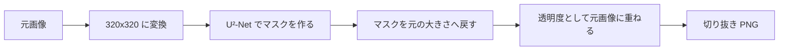

## 作ったもの

LiteRT.js で、写真の背景を消す小さな Web アプリを作りました。

タイトルはちょっと勢いがありますが、やっていることは堅実です。画像から被写体を見つけて、背景を透明にして、切り抜き PNG にする。スマホの写真アプリにある消しゴム機能のうち、被写体だけを残すほうに近いです。

Google が出した [LiteRT.js](https://ai.google.dev/edge/litert/web) と、Hugging Face の [U²-Net LiteRT モデル](https://huggingface.co/litert-community/U-2-Net)（`.tflite`）を使っています。

- GitHub: https://github.com/masanori0209/litert-cutout

文章で説明する前に、まず動いているところを見てもらったほうが早いと思います。


左が元画像、真ん中が切り抜き結果、右がマスクです。チェッカー柄の上に被写体だけが残っています。

:::message
今回の「消す」は、写真に写り込んだ人や物を消して背景を描き直す処理ではありません。背景を透明にして、被写体を切り抜く処理です。
:::

## これの何がうれしいのか

背景を消すだけなら、すでに便利な Web サービスがあります。写真を選んで、少し待って、切り抜き PNG をダウンロードする。十分便利です。

ただ、プロフィール写真や仕事で扱う画像になると、「この1枚を切り抜くために外部サービスへ上げるのか」と一瞬だけ手が止まります。公開済みの商品写真なら気にならなくても、顔写真や社内資料のスクリーンショットでは話が変わります。

それなら、モデルのほうをブラウザへ持ってきて、画像は手元に残したまま処理できないか。今回試したかったのはそこです。

LiteRT.js を使うと、`.tflite` モデルを Wasm や WebGPU でブラウザ実行できます。サーバー側に推論 API や GPU を用意する必要もありません。初回にモデルと Wasm を取得しますが、選んだ画像そのものは推論のために外へ送りません。

便利さの中心は、派手なマジック感より「その画像、上げなくて大丈夫です」のほうでした。

## なぜ LiteRT.js なのか

LiteRT は、以前 TensorFlow Lite と呼ばれていたオンデバイス向けランタイムです。LiteRT.js はその JavaScript バインディングで、`.tflite` をブラウザで動かせます。

バックエンドはだいたい次の3つです。

- `wasm` … CPU（XNNPACK）
- `webgpu` … GPU（今回の主戦場）
- `webnn` … NPU 向け（実験的）

今回は LiteRT community が公開している U²-Net の `.tflite` を使いました。入力サイズや正規化方法、出力マスクの形までモデルカードに書かれているので、ブラウザ側の処理を組み立てやすかったです。

## 動かしてみる

```bash
git clone https://github.com/masanori0209/litert-cutout.git
cd litert-cutout
bash scripts/setup.sh
npm run dev
```

`setup.sh` では、依存関係のインストール、LiteRT.js の Wasm の同期、U²-Net モデルの取得を行います。モデルは約 88 MB あります。ここは軽いとは言いにくいです。

ブラウザで `http://localhost:5173` を開き、「サンプル」→「消す」で一通り確認できます。画像をドラッグ＆ドロップしても動きます。

バックエンドは `auto`、`webgpu`、`wasm` から選べます。`auto` では WebGPU が使える場合は WebGPU、使えなければ Wasm を選びます。

## 消しているようで、残す場所を決めている

最初は「背景を消す処理」と考えていたのですが、中身を見ると少し逆でした。

U²-Net が出すのは完成した切り抜き画像ではありません。画像のどこを残したいかを表す、白黒のマスクです。

- 白に近いところは、被写体として残す
- 黒に近いところは、背景として透明にする
- 灰色のところは、少し透ける

画面右側に表示している白黒画像が、そのマスクです。これを元画像のアルファ（透明度）として使うと、背景が透明になった PNG を作れます。



つまり、消しゴムで背景をこすっているのではなく、残す部分の型紙を作っています。

## LiteRT.js で推論する

モデルを動かす部分は、思ったより短く書けました。

```typescript
import { loadLiteRt, loadAndCompile, Tensor } from '@litertjs/core'

await loadLiteRt('/wasm/')

const model = await loadAndCompile('/models/u2net_fp16.tflite', {
  accelerator: 'webgpu',
})

const input = new Tensor(float32Nchw, [1, 3, 320, 320])
const gpuInput = await input.copyTo('webgpu')
const results = await model.run(gpuInput)
const mask = await results[0].moveTo('wasm')
```

このあたりは略語が一気に出てくるので、先に対応を整理します。

| 用語 | この記事での意味 |
|---|---|
| Tensor | 数値を多次元に並べた入れ物。今回は画像とマスクをモデルへ渡すために使う |
| NCHW | Tensor の並び順。`N` は画像の枚数、`C` は色チャンネル、`H` は高さ、`W` は幅 |
| saliency | 画像の中で目立つ部分、主役らしい部分 |
| mask | どこを残すかをピクセル単位で表した白黒の型紙 |
| normalize | 入力値を、モデルが学習時に見ていた値の分布へ揃える処理 |
| alpha | 画像の透明度。0 なら透明、255 なら不透明 |

`[1, 3, 320, 320]` を NCHW に当てはめると、「画像1枚、RGBの3チャンネル、高さ320、幅320」です。ブラウザの Canvas から取れる画素は通常、1ピクセルごとに RGB が並ぶ形ですが、U²-Net は色ごとに面を分けた NCHW を要求します。そのため、並び替えて `Float32Array` に詰めています。

正規化では、RGB の値をモデルカードに書かれた mean（平均）と std（標準偏差）に合わせます。画像を見やすく加工するためではなく、モデルが学習時に使った入力条件へ揃えるための処理です。

出力の `[1, 1, 320, 320]` は、「画像1枚、マスク1枚、高さ320、幅320」です。このマスクが saliency mask です。ここでいう saliency は「画像の中で主役らしい場所」くらいの意味で、人や商品の種類を理解して名前を付けているわけではありません。

最後に、この320×320のマスクを元画像の大きさへ拡大し、各ピクセルのアルファへ入れます。

言葉だけだと難しそうですが、役割を分けると「画像をモデル用に整える」「白黒マスクを作る」「透明度として貼る」の3段階です。

## 動かして気づいたこと

### 推論時間だけでは、最初の体感は分からない

手元の Mac（Chromium、WebGPU あり）では、640×640 のサンプル画像で次の数字が出ました。

<!-- evidence: command="npm run dev; sample cutout on product.png"; log="https://github.com/masanori0209/litert-cutout/blob/main/reports/cutout-local-2026-07-17.md" -->
| 項目 | 値 |
|---|---:|
| accelerator | webgpu |
| inference | 2.2 ms |
| total（初回・モデル読み込み込み） | 1681.8 ms |

<!-- evidence: command="npm run dev; sample cutout on product.png"; log="https://github.com/masanori0209/litert-cutout/blob/main/reports/cutout-local-2026-07-17.md" -->
`model.run` だけを見ると 2.2 ms でしたが、「消す」を押してから結果が出るまでには約 1.7 秒かかりました。初回はモデルの読み込みとコンパイルが支配的です。

数字だけなら 2.2 ms のほうが目を引きます。ただ、最初に触る人が感じるのは 1.7 秒のほうです。今回は UI に inference と total の両方を出すようにしました。

これは手元の1環境での実行例で、負荷試験ではありません。端末、ブラウザ、GPU、キャッシュ状態で変わります。

### 88 MB を配る重さは残る

画像をサーバーへ上げなくてよくても、何も通信しないわけではありません。最初に約 88 MB のモデルを利用者側へ届ける必要があります。

一度きりの社内ツールなら許容できても、誰でも開く公開ページで無条件に読み込むには重いです。実際に組み込むなら、処理を始める前にダウンロード量を見せる、キャッシュを使う、もっと小さいモデルを検討する、といった設計が必要になります。

### テンソルは自分で片付ける

LiteRT.js は手動メモリ管理です。入力、GPU へコピーしたテンソル、推論結果、CPU へ戻した出力を、使い終わったところで `delete()` しています。

特に、処理を繰り返す画面では後回しにしないほうがよさそうです。背景だけ消して、GPU メモリは残り続ける、では困ります。

## きれいに消せるかは、まだ別の話

今回のサンプル画像は、検証用に生成したマグカップの画像です。背景と被写体の色が分かれていて、輪郭もはっきりしています。切り抜きにはかなり都合がいい画像です。

実際のプロフィール写真では、髪の毛、半透明な服、背景と似た色の部分が出てきます。商品写真でも、ガラスや細いケーブルは難しそうです。U²-Net がマスクを返し、ブラウザで透明 PNG にできるところまでは確認できましたが、商用の切り抜きサービスと比べられるだけの画像セットでは試していません。

なので、現時点では「ブラウザ内だけで背景切り抜きの一連の処理を動かせた」ところまでです。「どんな写真でもきれいに消せる」とは言いません。

次に見るなら、きれいに抜ける写真を増やすより、髪、ガラス、背景と同系色の服あたりを並べたいです。失敗する境界が分かったほうが、この仕組みをどこで使えるか判断しやすくなります。

## まとめ

LiteRT.js と U²-Net を使って、画像の前処理、WebGPU での推論、マスクの合成、透明 PNG の保存までをブラウザ内で動かしました。

触る前は「ブラウザでモデルを動かせば速く背景を消せる」というところに目が行っていました。実際に作ると、推論時間より初回の 88 MB をどう見せるか、どんな写真ならマスクを信用できるか、テンソルをどう片付けるかのほうが気になりました。

それでも、顔写真や手元の素材を外へ送らず、その場で切り抜けるのは気持ちいいです。

LiteRT.js で消してやるのさ。まずは、きれいに消せない写真も含めて試していこうと思います。