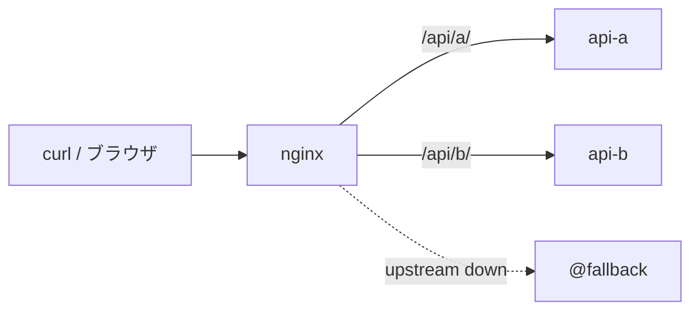

## 作ったもの

NGINX と Docker Compose だけで、クラウドの入口でよく見る処理を小さく再現しました。

- `/api/a` と `/api/b` への **パスルーティング**
- NGINX 側での **共通レスポンスヘッダ付与**
- `limit_req` による **簡単なレート制限**
- upstream 停止時の **fallback 応答**

デモのソースは GitHub に置いています。

- GitHub: https://github.com/masanori0209/nginx-alb-gateway-demo

起動後、次のように `curl` できます（ポートは環境に合わせて読み替えてください。ここでは `8080` を使います）。

```bash
git clone https://github.com/masanori0209/nginx-alb-gateway-demo.git
cd nginx-alb-gateway-demo
docker compose up -d

curl -s http://localhost:8080/api/a/
curl -s http://localhost:8080/api/b/
```


<!-- evidence: command="DEMO_PORT=19080 ./scripts/capture-media.sh"; log="nginx-alb-gateway-demo/.media-build/routing.txt" -->

ある実行例では、次のように別バックエンドへ振り分けられます。

```text
Hello from API A
Hello from API B
```

ヘッダも NGINX 側で足しています。

```bash
curl -s -D - -o /dev/null http://localhost:8080/api/a/ | grep -E 'HTTP|X-Gateway|X-Request'
```

<!-- evidence: command="curl -s -D - -o /dev/null http://localhost:19080/api/a/ | grep -E 'HTTP|X-Gateway|X-Request'"; log="nginx-alb-gateway-demo/reports/verify-20260701-222031.log" -->

```text
HTTP/1.1 200 OK
X-Gateway-Demo: nginx-compose
X-Request-Id: 7422535f373e52b3a2693adbd399a1a0
```

| 手元で作るもの | クラウドで近いもの | この記事で見る範囲 | 本番で足りないもの |
|---|---|---|---|
| NGINX の path routing | ALB / API Gateway | パスごとの転送 | TLS 終端、認証、監視、可用性など |
| `add_header` | API Gateway の response mapping など | 共通ヘッダの付与 | 条件分岐、署名、監査ログ連携など |
| `limit_req` | API Gateway throttling / Cloud Armor rate limiting | 単純なレート制限 | 分散環境、ユーザー/API キー単位制御など |
| `@fallback` | 簡易なエラー応答 | upstream 停止時の固定メッセージ | サーキットブレーカ、自動フェイルオーバなど |

:::message
この記事は「クラウドの入口サービスは NGINX で十分」という話ではありません。本番では ALB / API Gateway / Cloud Load Balancing / Cloud Armor / Cloud CDN などを使う判断も自然です。ここでやるのは、**マネージドサービスで何を買っているのか** を手触りで見るための、小さな再現実験です。
:::

## なぜ NGINX でやるのか

普段 AWS や GCP のマネージドサービスを触っていると、設定画面には「ルート」「スロットリング」「レスポンスヘッダ」といった項目が並びます。でも、中身が見えないままだと、設定項目がやや抽象語のまま残りがちです。

NGINX を Docker Compose で小さく立てると、次のような入口処理が **1 ファイルの設定** に落ちてきます。

- どのパスをどの upstream に送るか
- どのヘッダをクライアントへ返すか
- どのくらいの頻度で 429 を返すか
- upstream が落ちたとき何を返すか

つまり NGINX は、クラウドサービスの完全な置き換えではなく、**責務の分解を理解するためのレンズ** として使えます。手元で一度組むと、あとから ALB や API Gateway の設定画面を見たときに「あ、ここは NGINX だと `location` 側だな」と対応が取りやすくなります。

## 今回作らないもの

最初にスコープを切っておきます。ここを広げると、記事の目的から外れます。

- TLS 終端（ACM / Certificate Manager 相当）
- WAF、Bot 対策、IP 制限の本番設計
- OAuth / JWT / API キー認証
- 複数 AZ・複数リージョンを前提にした可用性
- 分散環境でのレート制限（Redis 等との連携）
- 本番監視、アラート、トレーシング基盤
- CDN キャッシュ

今回見るのは **入口で起きていることの最小セット** だけです。

## 構成



| サービス | 役割 |
|---|---|
| `nginx` | 入口。ルーティング、ヘッダ付与、レート制限、fallback |
| `api-a` | `/api/a/` 向けのモック API |
| `api-b` | `/api/b/` 向けのモック API |

バックエンドは `hashicorp/http-echo` を使い、本文だけ差し替えています。アプリ本体の実装は記事の主役ではないので、意図的に薄くしています。

## Docker Compose で動かす

リポジトリの構成は次のとおりです。

```text
nginx-alb-gateway-demo/
├── docker-compose.yml
├── nginx/
│   └── nginx.conf
├── scripts/
│   └── verify.sh
└── README.md
```

`docker-compose.yml` は最小です。

```yaml:docker-compose.yml
services:
  nginx:
    image: nginx:1.27-alpine
    ports:
      - "${DEMO_PORT:-8080}:80"
    volumes:
      - ./nginx/nginx.conf:/etc/nginx/nginx.conf:ro
    depends_on:
      - api-a
      - api-b

  api-a:
    image: hashicorp/http-echo:1.0.0
    command: ["-text=Hello from API A"]

  api-b:
    image: hashicorp/http-echo:1.0.0
    command: ["-text=Hello from API B"]
```

起動:

```bash
docker compose up -d
```

ポート `8080` が既に使われている場合は、環境変数で変えられます。

```bash
DEMO_PORT=19080 docker compose up -d
```

NGINX 側の要点は次の 4 点です。

1. `location /api/a/` と `location /api/b/` で upstream を分ける
2. `add_header ... always` で共通ヘッダを付ける
3. `limit_req_zone` + `limit_req` + `limit_req_status 429` でレート制限する
4. `error_page` と `@fallback` で upstream 停止時の応答を返す

設定全文はリポジトリの `nginx/nginx.conf` を見てください。記事本文に全部載せるより、そちらのほうがコピペしやすいです。

## ルーティングを確認する

`/api/a/` と `/api/b/` が別サービスへ向くことを確認します。

```bash
curl -s http://localhost:8080/api/a/
curl -s http://localhost:8080/api/b/
```

<!-- evidence: command="curl -s http://localhost:19080/api/a/ && curl -s http://localhost:19080/api/b/"; log="nginx-alb-gateway-demo/reports/verify-20260701-222031.log" -->

```text
Hello from API A
Hello from API B
```

レスポンスヘッダも確認できます。

```bash
curl -s -i http://localhost:8080/api/a/
```

<!-- evidence: command="curl -s -i http://localhost:19080/api/a/"; log="nginx-alb-gateway-demo/reports/verify-20260701-222031.log" -->

```text
HTTP/1.1 200 OK
Server: nginx/1.27.5
...
X-Gateway-Demo: nginx-compose
X-Request-Id: 7422535f373e52b3a2693adbd399a1a0

Hello from API A
```

`X-Request-Id` は NGINX の `$request_id` です。本番では ALB や API Gateway、あるいはアプリ側 middleware が Request ID を付与・伝播する、という話の入口に相当します（完全一致ではありません）。

## レート制限を確認する

<!-- evidence: command="grep limit_req nginx/nginx.conf"; log="nginx-alb-gateway-demo/nginx/nginx.conf" -->

今回の設定は `rate=2r/s`、`burst=3`、`nodelay` です。ざっくり言うと、短時間にまとめて来たリクエストのうち一定数だけ通し、それ以降は 429 を返します。

```bash
sleep 2
for i in $(seq 1 8); do
  echo -n "req $i: "
  curl -s -o /dev/null -w "%{http_code}\n" http://localhost:8080/api/a/
done
```


<!-- evidence: command="sleep 2; for i in $(seq 1 8); do curl -s -o /dev/null -w '%{http_code}\n' http://localhost:19080/api/a/; done"; log="nginx-alb-gateway-demo/reports/rate-limit-isolated-20260701.log" -->

ある実行例では次のようになりました。

```text
req 1: 200
req 2: 200
req 3: 200
req 4: 200
req 5: 429
req 6: 429
req 7: 429
req 8: 429
```

<!-- evidence: command="sleep 2; for i in $(seq 1 8); do curl -s -o /dev/null -w '%{http_code}\n' http://localhost:19080/api/a/; done"; log="nginx-alb-gateway-demo/reports/rate-limit-isolated-20260701.log" -->

429 が返るのは、API Gateway の throttling や Cloud Armor の rate limiting と **雰囲気は近い** です。ただし NGINX の `limit_req` は **1 台の NGINX プロセス内のメモリ** で動きます。ALB や API Gateway の背後に複数台並べたときの挙動とは一致しません。

また、`limit_req_zone` は IP 単位で状態を持ちます。直前に `/api/a/` や `/health` へリクエストしていると、レート制限テストの結果は変わります。検証用に `./scripts/verify.sh` も用意していますが、レート制限の節だけ試すなら、数秒待ってから burst を送るほうが読みやすいです。

## upstream 停止時の fallback を確認する

`api-a` を止めて、NGINX が固定メッセージを返す様子を見ます。

```bash
docker compose stop api-a
curl -i --max-time 5 http://localhost:8080/api/a/
docker compose start api-a
```


<!-- evidence: command="docker compose stop api-a && curl -i --max-time 5 http://localhost:19080/api/a/"; log="nginx-alb-gateway-demo/reports/verify-20260701-222031.log" -->

```text
HTTP/1.1 503 Service Temporarily Unavailable
...
upstream unavailable (fallback)
```

本番の graceful degradation や自動フェイルオーバとは距離があります。ここで見たいのは、「入口が upstream エラーをそのままユーザーへ返すのではなく、**入口側で別応答に差し替えられる**」という点です。

<!-- evidence: command="grep proxy_.*_timeout nginx/nginx.conf"; log="nginx-alb-gateway-demo/nginx/nginx.conf" -->

`proxy_connect_timeout` と `proxy_read_timeout` を 2 秒にしているのは、デモで `curl` が長時間待たないためです。本番値として推奨するものではありません。

## ALB / API Gateway と比べて何が見えたか

このデモを組んで分かったのは、マネージドサービスがやっていることのうち、かなりの部分が **入口の設定項目** として分解できる、という点です。

| 見えたこと | NGINX での表現 | マネージドサービス側のイメージ |
|---|---|---|
| パスで backend を分ける | `location` + `upstream` | ALB listener rule / API Gateway route |
| 共通ヘッダを付ける | `add_header` | Gateway response / integration response |
| 流量を絞る | `limit_req` | throttling / rate based ban |
| 障害時の見せ方を決める | `error_page` | custom error response（ただし本番はもっと複雑） |

逆に言うと、マネージドサービスを買っている理由もはっきりします。

- TLS、認証、監視、監査が設定画面や IAM と一体化している
- マルチ AZ / オートスケール前提の可用性がある
- WAF や Bot 対策、地理制限などを入口に足しやすい
- 分散環境でも一貫したスロットリングやクォータを運用できる

NGINX はその全部を **自分で背負う** ことになります。だから本番で ALB / API Gateway を選ぶのは自然で、手元 NGINX デモは **理解のための縮尺模型** です。

## 限界

一番大きな限界は、**この構成を本番入口としてそのまま使えない** ことです。意図的に小さく切っています。

そのため、この記事で言えるのは次の範囲です。

- パスルーティング、ヘッダ付与、単純レート制限、fallback が NGINX 設定として表現できる
- それらが ALB / API Gateway の設定項目とざっくり対応づけできる
- Docker Compose なら、数分で手元再現できる

一方で、まだ言えないこともあります。

- 本番トラフィック規模での性能・可用性
- セキュリティ境界として十分かどうか
- 複数 NGINX / 複数 AZ 構成でのレート制限の正しさ
- クラウド各社の最新機能との 1 対 1 対応

次に進めるなら、同じデモに **TLS 終端** か **API キー検証（`auth_request` など）** のどちらかを 1 個だけ足すのがよさそうです。入口処理の理解は、そのときも同じ分解の仕方で進められます。

## まとめ

今回やったことを振り返ると、次のとおりです。

- NGINX + Docker Compose で `/api/a` / `/api/b` へのルーティングを再現した
- 共通レスポンスヘッダ、`limit_req`、upstream 停止時 fallback を小さく見せた
- クラウドの入口サービスは NGINX の完全代替ではなく、責務の分解として理解できることを確認した

マネージドサービスは設定画面の裏側を隠してくれます。NGINX で一度組むと、その隠れていた入口処理が設定ファイルとして見えてきます。本番で何を買っているのかを考えるとき、その差は地味に効くと思います。

## 参考リンク

- デモリポジトリ: https://github.com/masanori0209/nginx-alb-gateway-demo
- NGINX `limit_req`: https://nginx.org/en/docs/http/ngx_http_limit_req_module.html
- NGINX `proxy_pass`: https://nginx.org/en/docs/http/ngx_http_proxy_module.html#proxy_pass
