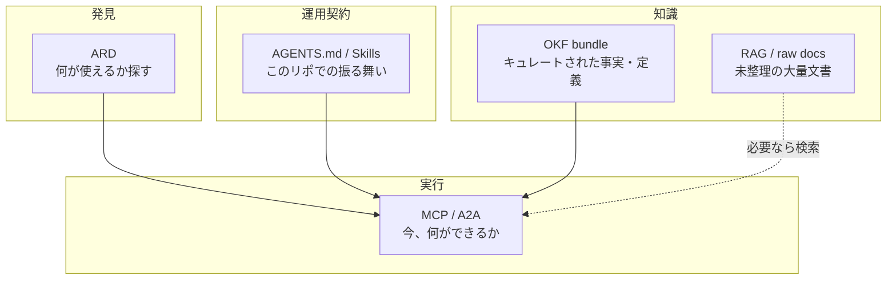

## はじめに

コーディングエージェントを入れたリポジトリを見ると、だいたい同じ光景になります。

`AGENTS.md`、`CLAUDE.md`、`SKILL.md`、`index.md`、Obsidian から移したメモ、データカタログのメモ、オンコール手順……。全部 Markdown です。人間にも読めるし、エージェントにも渡せる。最初は気持ちいいです。

しばらくすると、様子が変わります。

エージェントが「どのファイルを先に読むべきか」で迷い始める。似た説明が三箇所にあり、どれが新しいのか分からない。コンテキスト窓に全部載せようとして、肝心のコードが押し出される。Markdown 自体は悪くないのに、**増えた Markdown がエージェントの足を引っ張り始める**。

2026年6月、Google Cloud が公開した [Open Knowledge Format（OKF）](https://cloud.google.com/blog/products/data-analytics/how-the-open-knowledge-format-can-improve-data-sharing) は、その肥大化への打ち手として読むと分かりやすいです。新しい Wiki サービスではありません。YAML frontmatter 付き Markdown のディレクトリに、**最小の契約**を付けたオープン仕様です。

:::message
この記事は OKF v0.1 Draft の「置き場所」と「肥大化」の話です。clone して visualizer を回す手順の再現や、GCP のデータカタログ導入ガイドではありません。仕様の細部は [SPEC.md](https://github.com/GoogleCloudPlatform/knowledge-catalog/blob/main/okf/SPEC.md) を見てください。
:::

## 負債の正体は「Markdown」ではない

タイトルに「Markdown が足を引っ張る」と書きましたが、もう一段だけ踏み込みたいです。

負債になるのは、拡張子 `.md` そのものではありません。次の三つが混ざったまま増えることです。


| 混ざり方                        | 起きること                                    |
| --------------------------- | ---------------------------------------- |
| **手順と事実が同じファイル**            | 「デプロイのやり方」と「このテーブルの意味」が同居し、片方だけ更新される     |
| **リポジトリの運用契約とドメイン知識が同じ層**   | `AGENTS.md` に文体ルールも指標定義も載り、どれも「最初に読め」になる |
| **生の原料と、コンパイル済みの知識が区別されない** | 毎回 RAG で組み立て直すか、古い要約を信じるかの二択になる          |


つまり問題はファイル数というより、**誰が書いて、誰が読んで、何の契約で交換するか**が無いことです。チームごとに `CLAUDE.md` 慣習が違う、ベンダーごとにカタログ API が違う、エージェントごとに「このフォルダを読め」が違う。見た目は似た Markdown なのに、翻訳なしでは渡せない。

Google Cloud の言い方だと、これは [context-assembly problem](https://cloud.google.com/blog/products/data-analytics/how-the-open-knowledge-format-can-improve-data-sharing)（コンテキスト組み立て問題）です。エージェントが答えるたびに、散らばった知識をゼロからかき集める状態です。

## 肥大化が起きる現場のイメージ

個人のコーディングエージェントでも、組織の AI エージェントでも、だいたい同じ順番で膨らみます。

1. 最初に `AGENTS.md` を置く（運用ルール）
2. うまくいった手順を `SKILL.md` に切り出す
3. ドメインの説明が増え、メモや Wiki がリポジトリに入る
4. エージェントが「関連しそうな Markdown」をまとめて読む
5. コンテキストが足りなくなり、要約ファイルや index を増やす
6. 要約と本体の差分が生まれ、どれが正か分からなくなる

1〜2 は健全です。危ないのは 3 以降で、**運用契約・手順・ドメイン事実・検索用の原料**がいっせいに「エージェントに渡す Markdown」へ流れ込むところです。

このリポジトリ（Zenn 用）でも、役割はすでに分かれています。全部 `.md` ですが、同じ扱いにはできません。


| 置き場所                        | ざっくりした役割                     | OKF っぽいか        |
| --------------------------- | ---------------------------- | --------------- |
| `AGENTS.md` / `CLAUDE.md`   | 文体・禁止事項・公開ルールなど、エージェントへの運用契約 | いいえ（スキーマ／指示）    |
| `skills/*/SKILL.md`         | アイデア出し・公開など、手順の再利用           | いいえ（手順）         |
| `articles/*.md`             | 人間向けの記事本文                    | いいえ（読み物）        |
| データ／指標／API の意味、結合経路、オンコール手順 | 組織のドメイン知識                    | **ここが OKF の土俵** |


「Markdown を減らす」より先にやるのは、**どれをどの契約で置くかを分ける**ことだと思います。

## 層で見る：ARD / MCP / OKF / AGENTS.md / RAG

以前、[ARD（Agentic Resource Discovery）](https://zenn.dev/m2lab/articles/agentic-resource-discovery-ard) の記事では、「ツールが増えすぎる前に、探す層を分ける」話を書きました。OKF はその続きで、**静的な知識の側**の話です。




役割を一文ずつにすると、だいたいこうです。


| 層                  | 問うこと                    | 典型物                      |
| ------------------ | ----------------------- | ------------------------ |
| ARD                | このタスクに、どのツール／Skill があるか | Registry、カタログ検索          |
| MCP など             | 今この瞬間、何を実行できるか          | ライブなツール接続                |
| OKF                | すでに整理された知識として、何を知っているか  | Markdown + YAML の bundle |
| AGENTS.md / Skills | このリポジトリ／作業で、どう振る舞うか     | 規則・手順                    |
| RAG                | まだコンパイルしていない原料から、何を拾うか  | 生ドキュメント検索                |


OKF は MCP の代わりではありません。ARD の代わりでもありません。**「持ち運べる静的ナレッジ」のフォーマット**です。llms.txt が「どこを読めばいいか」の道しるべなら、OKF は道の先にある中身の形、くらいに捉えるとしっくり来ます。

## Open Knowledge Format が釘を打つ範囲

OKF v0.1 の中身は、意図的に薄いです。

- 知識は **ディレクトリ内の Markdown**
- **1 コンセプト = 1 ファイル**。パスが ID
- frontmatter の必須は `type` **だけ**
- 推奨は `title` / `description` / `resource` / `tags` / `timestamp`
- 予約ファイル名は `index.md`（段階的開示）と `log.md`（時系列）
- 普通の Markdown リンクでグラフになる
- 特定クラウド、SDK、アカウントは不要

公式ブログが強調しているのは、「もう一つの知識サービス」ではなく **format, not platform** です。誰でも書けて、誰でも読め、git に載せられる。価値は誰が所有するかではなく、何人が同じ形を話すか、という割り切りです。

形だけ見ると、[Karpathy の LLM Wiki](https://gist.github.com/karpathy/442a6bf555914893e9891c11519de94f) や Obsidian vault、各チームの `index.md` 運用とよく似ています。違うのは、**相互運用のための最小ルールが SPEC として釘打ちされている**点です。必須が `type` 一つ、というのもその象徴です。豊かな型システムより、摩擦の小さい共通語を取る、という賭けです。

公式サンプル（GA4）のコンセプトは、だいたいこんな顔をしています。

```markdown
---
type: BigQuery Table
title: Events table (Google Analytics BigQuery Export)
description: Contains Google Analytics event export data from the ga4_obfuscated_sample_ecommerce dataset.
resource: https://bigquery.googleapis.com/v2/projects/.../tables/events_*
tags: [events, Google Analytics, BigQuery]
timestamp: "2026-05-28T22:53:05+00:00"
---

# Overview
...

# Metrics
- [Event Count](../references/metrics/event_count.md) — Total number of events.
...
```

エージェントは `index.md` から降りていき、必要なコンセプトだけを開けばよい。全部を一度にコンテキストへ詰めなくても済む、というのが progressive disclosure の狙いです。

肥大化への打ち手として効くのは、だいたい次の三点だと思います。

1. **ドメイン知識を、運用契約ファイルから出す**（`AGENTS.md` を百科事典にしない）
2. **1 概念 1 ファイル +** `type` で、フィルタとルーティングの取っ掛かりを揃える
3. **書く側と読む側を分離する**（人が書いても、カタログ export でも、別エージェントが読める）

逆に、OKF が釘を打たない範囲もあります。どの `type` 値を使うかの中央レジストリ、保存先、検索基盤、権限、鮮度保証は仕様の外です。Non-goals にも、ドメイン固有スキーマ（OpenAPI や Protobuf）の置き換えではない、と書かれています。OKF はそれを参照する側です。

## 「どこに置くか」の決め方

実務では、次の表で振り分けるとしんどさが減ります。完璧な分類ではなく、迷ったときの初期値です。


| この情報は？                   | 置き場所の初期値                     | 理由              |
| ------------------------ | ---------------------------- | --------------- |
| このリポでの禁止事項・文体・レビュー手順     | `AGENTS.md` / Skills         | リポジトリ固有の運用契約    |
| 繰り返し実行する作業手順             | Skill / runbook（手順として）       | 「どうやるか」は手順層     |
| テーブル意味、指標定義、結合経路、API の前提 | **OKF bundle**               | 人とエージェントが共有する事実 |
| 今この瞬間のメトリクスやチケット状態       | MCP などライブ接続                  | ファイルに書くとすぐ腐る    |
| どの MCP / Skill があるか分からない | ARD（発見）                      | 実行の前に探す         |
| まだ整理していない大量の議事録・PDF      | RAG または raw → あとで OKF へコンパイル | 原料と成果を混ぜない      |


ポイントは、**全部を OKF にしない**ことです。運用契約まで bundle に吸い込むと、また別の肥大化が始まります。OKF は「持ち運びたいドメイン知識」用の箱、くらいのサイズ感がちょうどよいです。

OKF 側の発想は、そもそも引き継ぎやすい形へ **一度コンパイルしておき、育てる** ほうに寄っています。Karpathy の LLM Wiki が言う「毎回原料から再発見しない」と同じ方向です。

ただし、コンパイル済み wiki が常に勝つわけではありません。原料が巨大で、更新が激しく、誰もキュレーションしないなら、RAG のほうが正直なこともあります。OKF は銀の弾丸ではなく、**整理する意思がある知識**向けです。

## いま自分のリポジトリでできること

OKF を「導入する」前にできる、地味な打ち手もあります。

1. **エージェントに最初に読ませるファイルを棚卸しする**
  運用契約・手順・ドメイン事実が同じファイルに同居していないか見る。
2. **ドメイン事実だけを、別ディレクトリに切り出す**
  例: `knowledge/tables/`、`knowledge/metrics/`。まだ SPEC 完全準拠でなくてよい。
3. **各ファイルに** `type` **を足す**
  これだけで OKF v0.1 の適合条件のかなり近くまで行けます。
4. `index.md` **で入口を1つにする**
  エージェントに「全部 grep」させず、段階的に降りてもらう。
5. **腐る情報はファイルに書かない**
  ライブな状態は MCP 側。OKF には定義と経路を残す。

公式の enrichment agent や visualizer は、試すなら [knowledge-catalog/okf](https://github.com/GoogleCloudPlatform/knowledge-catalog/tree/main/okf) にあります。触り方の丁寧な記録は、すでに [DevelopersIO の記事](https://dev.classmethod.jp/articles/open-knowledge-format-okf-v01-guide/) があるので、ここでは重ねません。仕様を読むだけなら `SPEC.md` は短いです。

## 限界

一番大きな限界は、**いまの OKF が v0.1 Draft で、採用とエコシステムがこれからの話**だということです。フォーマットとして筋がよくても、「社内標準になった」とはまだ言えません。

そのため、この記事で言えるのは次の範囲です。

- エージェント用 Markdown の肥大化は、形式より役割の混線として説明できる
- OKF は、持ち運ぶ静的ナレッジ向けの最小契約として読める
- ARD / MCP / AGENTS.md / RAG と層を分けて置く、という整理は今日から使える

一方で、まだ言えないこともあります。

- OKF が業界標準として定着するか
- `type` のばらつきを、組織をまたいでどこまで許容できるか
- 自動 enrichment だけで、人間のキュレーションなしに品質が保てるか
- セキュリティ境界や権限制御を、ファイル配布だけで足りるか

次に進めるなら、まず「エージェントが毎回読んでいる Markdown」を1リポジトリ分だけ表に書き出し、運用契約／手順／ドメイン事実に色分けするのがよいと思います。色が混ざっているファイルが、肥大化の震源地です。

## まとめ

今回やったことを振り返ると、次のとおりです。

- Markdown が増えること自体より、契約のない知識が同じ層に積もることが足を引っ張る、と整理した
- ARD（探す）／MCP（実行する）／OKF（知っている）／AGENTS.md（振る舞う）／RAG（原料を拾う）を分けた
- OKF はサービスではなく、`type` を核にした持ち運び可能な知識フォーマットとして読んだ
- 全部を OKF にせず、ドメイン事実だけを切り出すところから始める、とした

エージェントの時代に Markdown は消えません。むしろ増えます。消えるべきなのは、役割の混線です。

**運用契約はリポジトリに、手順は Skill に、持ち運ぶ事実は OKF に。** 肥大化への打ち手は、まずその仕切りだと思います。

## 参考

- [Introducing the Open Knowledge Format（Google Cloud Blog）](https://cloud.google.com/blog/products/data-analytics/how-the-open-knowledge-format-can-improve-data-sharing)
- [Open Knowledge Format SPEC.md（v0.1 Draft）](https://github.com/GoogleCloudPlatform/knowledge-catalog/blob/main/okf/SPEC.md)
- [GoogleCloudPlatform/knowledge-catalog](https://github.com/GoogleCloudPlatform/knowledge-catalog)
- [Karpathy / llm-wiki.md](https://gist.github.com/karpathy/442a6bf555914893e9891c11519de94f)
- [Googleが公開したAIエージェント向け知識共有フォーマット『OKF』を触ってみた（DevelopersIO）](https://dev.classmethod.jp/articles/open-knowledge-format-okf-v01-guide/)
- [MCPサーバーが増えすぎる前に、ARDで「必要なツールを探す」仕組みを動かす](https://zenn.dev/m2lab/articles/agentic-resource-discovery-ard)

