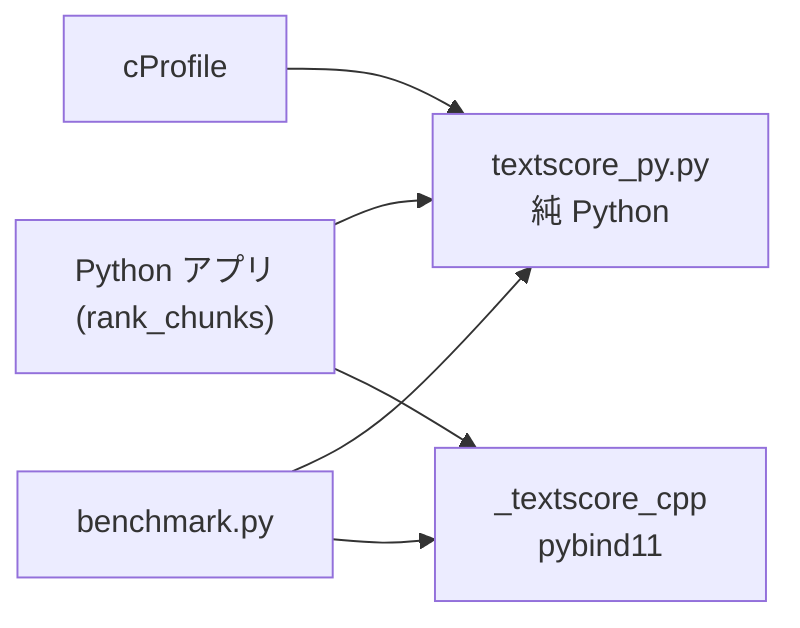

## 作ったもの

RAG のチャンク再ランキングを想定した小さな Python アプリで、**cProfile でボトルネックを特定 → 1 関数だけ pybind11 で C++ 化** までを通しました。

やっていること自体は地味です。クエリ文字列と多数のチャンク文字列に対して、文字 3-gram の Jaccard 類似度を計算し、スコア順に並べ替えます。ベクトル検索のあと、ルールベースで候補を絞りたいときに、こういう処理が残ることがあります。

デモのソースは GitHub に置いています。

- GitHub: [https://github.com/masanori0209/python-pybind11-profile-demo](https://github.com/masanori0209/python-pybind11-profile-demo)

```bash
git clone https://github.com/masanori0209/python-pybind11-profile-demo.git
cd python-pybind11-profile-demo
python3 -m venv .venv
source .venv/bin/activate
pip install -U pip scikit-build-core pybind11 cmake ninja
pip install -e .

# 純 Python 版を cProfile
python scripts/run_cprofile.py --chunks 3000 --top 12

# Python vs C++ を計測
python scripts/benchmark.py --chunks 10000 --rounds 5
```

ある実行例（macOS / Python 3.14 / Apple Silicon）では、10,000 チャンクの再ランキングで次の差が出ました。


<!-- evidence: command="ZENN_IMAGES_DIR=... ./scripts/capture-media.sh"; log="python-pybind11-profile-demo/.media-build/profile-python-3000.txt" -->


<!-- evidence: command="python scripts/benchmark.py --chunks 10000 --rounds 5"; log="python-pybind11-profile-demo/.media-build/benchmark-10000.txt" -->

| 実装 | median | min | max |
|---:|---:|---:|---:|
| 純 Python | 0.1812s | 0.1595s | 0.2001s |
| pybind11 / C++ | 0.0631s | 0.0627s | 0.0666s |

median だけ見ると **約 2.9 倍** です。「C++ にしたから劇的に速い」という話にはしたくありません。ただ、**計測で 1 関数に絞ってから C++ 化する** 手順と、そのときに見える限界まで、記事に残したかったのが今回の目的です。

<!-- evidence: command="python scripts/benchmark.py --chunks 10000 --rounds 5"; log="python-pybind11-profile-demo/.media-build/benchmark-10000.txt" -->

:::message
この記事は「Python は遅いから全部 C++ に書き換える」話ではありません。**どこが本当に重いかを cProfile で確認し、1 関数だけ C++ に逃がす** ところまでを扱います。RAG の検索精度や埋め込みモデルの話は対象外です。
:::

## 今回作らないもの

スコープを先に切ります。

- 全面 C++ 書き換え
- OpenMP / マルチスレッド最適化
- SIMD や GPU
- 本番 SLO を満たす負荷試験
- 埋め込みベクトルによる意味的 rerank
- Linux / Windows / 複数 Python バージョン向け wheel 配布

見るのは **cProfile → pybind11 → 再計測** の最小ループだけです。

## 構成




| ファイル                         | 役割                       |
| ---------------------------- | ------------------------ |
| `chunkscore/textscore_py.py` | 純 Python 実装。最初はここだけで動かす  |
| `chunkscore/pipeline.py`     | クエリとチャンク一覧を受け取り、スコア順に並べる |
| `src/textscore_cpp.cpp`      | pybind11 で公開する C++ 実装    |
| `scripts/run_cprofile.py`    | 純 Python 版を cProfile する  |
| `scripts/benchmark.py`       | Python / C++ の実行時間を比較する  |


## まず純 Python で動かす

再ランキングの核は `char_ngram_jaccard()` です。文字列を正規化し、3 文字 n-gram の集合を作り、Jaccard 係数を返します。

```python:chunkscore/textscore_py.py
def char_ngram_jaccard(left: str, right: str, n: int = 3) -> float:
    left_norm = normalize(left)
    right_norm = normalize(right)
    left_grams = char_ngrams(left_norm, n)
    right_grams = char_ngrams(right_norm, n)
    ...
```

チャンクが 3,000 件あると、この関数は 3,000 回呼ばれます。先に **正しい結果が Python だけで取れる状態** にしておくのが大事です。C++ 化は、そのあとです。

## cProfile でボトルネックを見る

`scripts/run_cprofile.py` で純 Python 版を計測しました。3,000 チャンクのある実行例では、全体 0.182 秒のうち、ほとんどが類似度計算側に乗っています。

```text
ncalls  tottime  cumtime  filename:lineno(function)
   3000    0.014    0.150  textscore_py.py:26(char_ngram_jaccard)
   6000    0.062    0.113  textscore_py.py:8(normalize)
   6000    0.022    0.023  textscore_py.py:20(char_ngrams)
489600    0.022    0.022  {method 'isalnum' of 'str' objects}
```

読み方のポイントは 2 つです。

1. `**char_ngram_jaccard()` が cumulative の上位** に来ている。ここを C++ 化の候補にする。
2. その内訳として `**normalize()` も重い**。1 関数だけ C++化すると言っても、実際には正規化 + n-gram 生成 + 集合演算をまとめて C++ 側へ移すのが自然。

つまり、記事タイトルの「1 関数」は、Python ファイル上の 1 関数を C++に置き換える、という意味合いに近いです。C++ 側では内部ヘルパーに分解してよい、という整理です。

## pybind11 で C++ 化する

C++ 側も API は Python と同じに揃えました。

```cpp:src/textscore_cpp.cpp
double char_ngram_jaccard(std::string_view left, std::string_view right, int n) {
  const auto left_norm = normalize(left);
  const auto right_norm = normalize(right);
  const auto left_grams = char_ngrams(left_norm, n);
  const auto right_grams = char_ngrams(right_norm, n);
  ...
}
```

pybind11 のモジュール定義は次のとおりです。

```cpp:src/textscore_cpp.cpp
PYBIND11_MODULE(_textscore_cpp, m) {
  m.def("char_ngram_jaccard", &char_ngram_jaccard, ...);
  m.def("rank_chunks", &rank_chunks, ...);
}
```

ビルドは **scikit-build-core + CMake** に寄せました。ローカル開発では `pip install -e .` だけで拡張モジュールまで入ります。

```toml:pyproject.toml
[build-system]
requires = ["scikit-build-core>=0.10", "pybind11>=2.13"]
build-backend = "scikit_build_core.build"
```

Python 3.14 環境でそのままビルドできました。環境差で CMake やコンパイラ周りが詰まることは普通にあります（その場合も記事の「限界」に書くべき話です）。

## 再計測した結果

10,000 チャンク × 5 回のある実行例:

<!-- evidence: command="python scripts/benchmark.py --chunks 10000 --rounds 5"; log="python-pybind11-profile-demo/.media-build/benchmark-10000.txt" -->

```text
python: median=0.1812s min=0.1595s max=0.2001s
cpp:    median=0.0631s min=0.0627s max=0.0666s
median_speedup=2.87x
```

3,000 チャンクでも同程度で、median 約 2.8〜2.9 倍でした。

<!-- evidence: command="python scripts/benchmark.py --chunks 3000 --rounds 5"; log="python-pybind11-profile-demo/reports/benchmark-3000.txt" -->

正直、**もっと大きく伸びるイメージを持っていた自分がいた** です。2.9 倍は悪くない一方で、「C++ に逃がせば何倍も速くなる」とは限りません。

<!-- evidence: command="python scripts/benchmark.py --chunks 10000 --rounds 5"; log="python-pybind11-profile-demo/.media-build/benchmark-10000.txt" -->

理由はだいたい次の 3 点です。

1. **Python ↔ C++ 境界で文字列コピーが起きる**
  呼び出し 1 回あたりは軽くても、3,000 / 10,000 回繰り返すと無視できません。
2. **ボトルネックはすでに 1 関数に集約されていた**
  残りはソートやループ制御など、C++ 化しても効きにくい部分です。
3. **アルゴリズム自体は同じ**
  集合演算を C++ 標準ライブラリに置き換えただけで、計算量のオーダーは変わりません。

**「ネイティブ言語にしたから速い」より「ホットパスだけ逃がしたから、必要な範囲で速くなった」** くらいの言い方が正確です。

## 実装して分かったこと

### 1. cProfile は「どの関数を C++ 化するか」を決めるのに向いている

`py-spy` や `scalene` も便利ですが、今回のように **関数単位で cumulative time を並べたい** だけなら、標準ライブラリの cProfile で足りました。まずはこれで十分、という判断です。

### 2. 「1 関数 C++ 化」は、実際には小さなモジュール単位になりがち

Python 側では `char_ngram_jaccard()` 1 本が重いですが、C++ 側では `normalize()` や `char_ngrams()` も一緒に移すのが自然でした。境界を跨ぐ回数を減らすほうが効く、という意味でも、細切れに 1 行ずつ C++ 化するよりまとめたほうがよいです。

### 3. 2 倍台の改善でも、記事化する価値はある

<!-- evidence: command="python scripts/benchmark.py --chunks 10000 --rounds 5"; log="python-pybind11-profile-demo/.media-build/benchmark-10000.txt" -->

100 倍速のベンチのほうが見栄えはします。ただ、実務では **「夜間バッチが 6 分 → 2.5 分」** くらいの改善のほうが現実的に効くことも多いです。数字を小さく見せるためではなく、**計測と限界の書き方を間違えない** ために、今回の結果をそのまま載せています。

## 限界

一番大きい限界は、**この記事の数字が合成チャンク・ローカル 1 台・非並列ベンチの結果だ** ことです。本番 RAG のレイテンシ改善を証明したわけではありません。

そのため、この記事で言えるのは次の範囲です。

- cProfile で `char_ngram_jaccard()` がボトルネックになるケースがある
- 同じ API を pybind11 で C++ 化し、`pip install -e .` まで持っていける
- ある実行例では median 約 2.9 倍になった

<!-- evidence: command="python scripts/benchmark.py --chunks 10000 --rounds 5"; log="python-pybind11-profile-demo/.media-build/benchmark-10000.txt" -->

一方で、まだ言えないこともあります。

- 埋め込み rerank より速い／精度が足りる、という一般論
- Linux / Windows / CI で同じ倍数が出ること
- 呼び出し回数が少ない API 全体を C++ 化したときの効果

次に進めるなら、**実アプリの cProfile 結果を 1 本取り、同じ手順で 1 モジュールだけ C++ 化する** のがよさそうです。HandoverGap 側で実際に重い関数が見つかれば、続編にできます。

## まとめ

今回やったことを振り返ると:

- RAG 再ランキング想定の純 Python 実装を先に作った
- cProfile で `char_ngram_jaccard()` がボトルネックだと確認した
- pybind11 + scikit-build-core で同じ API の C++ 版を追加した
- ある実行例では median 約 2.9 倍になったが、倍数だけを主張しない

<!-- evidence: command="python scripts/benchmark.py --chunks 10000 --rounds 5"; log="python-pybind11-profile-demo/.media-build/benchmark-10000.txt" -->

Python は遅いから捨てる、ではなく、**計測で 1 箇所に絞ってから C++ に逃がす** のが今回の結論です。

## 参考リンク

デモと公式ドキュメントへのリンクです。

- デモ: https://github.com/masanori0209/python-pybind11-profile-demo
- [pybind11 documentation](https://pybind11.readthedocs.io/)
- [scikit-build-core](https://scikit-build-core.readthedocs.io/)
- [Python cProfile](https://docs.python.org/3/library/profile.html)

