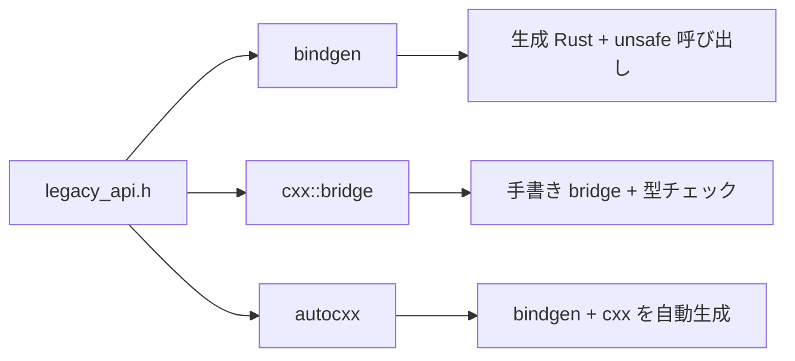

## 作ったもの

レガシー C++ の小さな API を題材に、**同じヘッダ**を Rust から触る 3 方式（bindgen / cxx / autocxx）を並べたデモと、選定表をまとめました。

- GitHub: https://github.com/masanori0209/rust-cpp-ffi-tooling-demo

```bash
git clone https://github.com/masanori0209/rust-cpp-ffi-tooling-demo.git
cd rust-cpp-ffi-tooling-demo
chmod +x scripts/run-all.sh
./scripts/run-all.sh
```

`run-all.sh` を実行すると、3 つの Rust クレートが同じ入力で走り、次のような出力になります。

```text
tool=bindgen
add=3
normalize=UNSUPPORTED
...

tool=cxx
add=3
normalize=hello,  world!
tokenize_count=3
parse_positive=42
text_stats_chars=16
text_stats_words=3

tool=autocxx
add=3
normalize=UNSUPPORTED
...
```

<!-- evidence: command="./scripts/run-all.sh"; log="reports/run-all.txt" -->


:::message
この記事は **Rust から C++ を呼ぶ** 方向の FFI ツール選定の話です。C++ 全面書き換え、呼び出し性能の数値比較、Windows / Linux 網羅検証は扱いません。題材も synthetic な小さな API で、社内レガシー全体を代表するつもりはありません。
:::

## なぜこの比較をしたか

brownfield では、C++ の既存資産を Rust から段階的に触りたい場面がよくあります。Chromium 周辺の話や Linux カーネル Rust 化の文脈でも、いきなり全部 Rust に書き換えるより **共存** の方が現実的です。

bindgen と cxx の違いはドキュメントを読めばざっくり分かるのですが、**autocxx をどこに置くか** だけは決めきれませんでした。公式の説明は「bindgen + cxx を自動化」と読める一方で、現場のレガシー API だとどこまで allowlist を広げられるのかが見えにくいからです。同じ C++ ヘッダを 3 方式で触り、手書き量・対応範囲・詰まりどころを並べてみました。

## 今回作らないもの

- C++ 全面 Rust 書き換え / 移行ロードマップ全体
- **C++ から Rust を呼ぶ** 方向を主役にした話（cbindgen / Crubit は参考リンク程度）
- FFI 呼び出しの性能比較（今回は測っていません）
- テンプレート・仮想継承・巨大コードベース全体への適用結果
- Windows MSVC / Linux / 複数 Clang 版の網羅検証
- Crubit / CXX-Qt の本格比較

## 3 ツールの位置づけ（ざっくり）

ざっくり言うと、次のような分担です。



| ツール | 公式 | 一言 |
|---|---|---|
| bindgen | [rust-bindgen](https://rust-lang.github.io/rust-bindgen/) | C 向きの自動バインディング生成 |
| cxx | [cxx.rs](https://cxx.rs/) | Rust ↔ C++ の **境界を手で設計** する |
| autocxx | [autocxx](https://google.github.io/autocxx/) | ヘッダから bindgen + cxx を **自動化** する試み |

## 題材にした C++ API

`cpp/legacy_api.h` は **変更不可のレガシー** という設定にしています。cxx 側で shim を足す前提です。

```cpp:cpp/legacy_api.h
namespace legacy {

int add(int a, int b);

std::string normalize_text(const std::string& input);

std::vector<std::string> tokenize(const std::string& text);

int parse_positive(const std::string& text);  // 例外あり

class TextStats {
public:
    explicit TextStats(std::string text);
    size_t char_count() const;
    size_t word_count() const;
private:
    std::string text_;
};

}  // namespace legacy
```

意図的に段階を分けています。

| 段階 | API | よくあるレガシーの型 |
|---|---|---|
| Easy | `add` | プリミティブ |
| Medium | `normalize_text` | `std::string` と所有権 |
| Hard A | `tokenize` | コンテナ返却 |
| Hard B | `parse_positive` | 例外 |
| Hard C | `TextStats` | C++ クラス |

## bindgen で触る

bindgen は `build.rs` でヘッダを読み、Rust の FFI 定義を生成します。今回の crate では `legacy::add` だけ allowlist しています。

```rust:bindgen-crate/build.rs
let bindings = bindgen::Builder::default()
    .header(cpp_dir.join("legacy_api.h").to_string_lossy())
    .clang_arg("-x")
    .clang_arg("c++")
    .clang_arg("-std=c++17")
    .clang_arg(format!("-I{}", cpp_dir.display()))
    .enable_cxx_namespaces()
    .allowlist_function("legacy::add")
    .layout_tests(false)
    .generate()
    .expect("Unable to generate bindings");
```

呼び出し側は生成物を `include!` し、`unsafe` で包みます。

```rust:bindgen-crate/src/main.rs
fn call_add(a: i32, b: i32) -> i32 {
    unsafe { ffi::root::legacy::add(a, b) }
}
```

`normalize_text` などを allowlist に追加すると、生成された Rust が `std::basic_string` 周りで `_CharT` 未定義エラーになり、**この環境ではコンパイルできませんでした**（[run-all ログ](https://github.com/masanori0209/rust-cpp-ffi-tooling-demo/blob/main/reports/run-all.txt)）。

bindgen の強みは、C 互換の関数なら手早く通せることです。逆に、C++ の所有権・コンストラクタ・メソッド・デストラクタは、生成物をそのまま使うのが難しい（今回の題材では `add` 以外は手作業の shim が必要になりそう、という結果でした）。

## cxx で触る

cxx は `#[cxx::bridge]` で **呼び出せるシグネチャを Rust 側で宣言** します。コンパイル時に C++ 側と整合性がチェックされます。

今回の legacy ヘッダは `std::string` や `std::vector` をそのまま bridge に載せられないため、**legacy ヘッダは触らず** `cpp/cxx_shim.h` に薄いラッパーを書きました。shim は合計 57 行です（`cxx_shim.h` 20 行 + `cxx_shim.cpp` 37 行）。

<!-- evidence: command="wc -l cpp/cxx_shim.*"; log="reports/run-all.txt" -->

```rust:cxx-crate/src/bridge.rs
#[cxx::bridge(namespace = "legacy")]
mod ffi {
    unsafe extern "C++" {
        include!("cxx_shim.h");

        fn add_shim(a: i32, b: i32) -> i32;
        fn normalize_text_shim(input: &str) -> Result<String>;
        fn tokenize_shim(text: &str) -> Result<Vec<String>>;
        fn parse_positive_shim(text: &str) -> Result<i32>;

        type TextStats;
        fn new_text_stats_shim(text: &str) -> UniquePtr<TextStats>;
        fn char_count(self: &TextStats) -> usize;
        fn word_count(self: &TextStats) -> usize;
    }
}
```

cxx だけが、今回の 5 段階すべてを **同じ CLI 出力** まで通しました。コストは shim の手書きです（ただし、境界の型を `&str` / `Result` / `UniquePtr` に寄せられるのは助かります）。

## autocxx で触る

autocxx は `include_cpp!` にヘッダと `generate!` の allowlist を書くと、内部で bindgen + cxx を回します。

```rust:autocxx-crate/src/cpp_bindings.rs
include_cpp! {
    #include "legacy_api.h"
    generate!("legacy::add")
    safety!(unsafe_ffi)
}
```

`build.rs` では `autocxx_build::Builder` に C++ ソースと include パスを渡しています。モジュール名は crate 名と衝突しないよう `cpp_bindings` にしています（`mod autocxx` だと crate `autocxx` とぶつかりました）。

`legacy::add` だけなら bindgen と同様に動きます。`normalize_text` などを `generate!` に追加した **拡張 allowlist** では、autocxx **0.30** では bindgen 生成コードと同系統の `_CharT` エラーでビルドが止まりました。

<!-- evidence: command="cargo build in .tmp-autocxx-full"; log="reports/autocxx-full-build.stderr" -->

```text
error[E0425]: cannot find type `_CharT` in this scope
error: could not compile `legacy-autocxx-demo` due to 1 previous error
```

### autocxx の版を変えたらどうなるか

デモ repo では `scripts/test-autocxx-versions.sh` で、autocxx **0.27〜0.30** × allowlist 2 パターン（`add` のみ / `normalize_text` など 4 関数）の **ビルド成否** を追いました。

<!-- evidence: command="./scripts/test-autocxx-versions.sh"; log="reports/autocxx-version-matrix.txt" -->

| autocxx | `add` のみ | `normalize_text` など 4 関数 |
|---:|---|---|
| 0.27 | OK | OK |
| 0.28 | OK | OK |
| 0.29 | OK | **FAIL**（`_CharT`） |
| 0.30 | OK | **FAIL**（`_CharT`） |

0.29 以降で同じ allowlist が壊れるのは、[autocxx#1480](https://github.com/google/autocxx/issues/1480) や [rust-bindgen#1051](https://github.com/rust-lang/rust-bindgen/issues/1051) と同系統の報告と一致します（Issue 上でも 0.28 までは通った、という声があります）。**新版で直ったのではなく、0.29 前後で後退した可能性** があります。

ただし、0.28 で string 系 allowlist が **コンパイルできた** ことと、cxx のように **同じ CLI 出力まで動いた** ことは別です。0.28 + 拡張 allowlist では生成 API が `&CxxString` 側に寄り、こちらでは `&str` からそのまま呼ぶ実行例までは確認できていません（デモ crate は autocxx 0.30 + `add` のみで固定）。

<!-- evidence: command="./scripts/test-autocxx-versions.sh"; log="reports/autocxx-version-matrix.txt" -->

autocxx は「ヘッダを変えずに Rust から触る」方向性が公式にも書かれていますが、**allowlist を広げた先** では版次第で bindgen 生成が壊れます。壊れなければ cxx 相当の呼び出し方の調整が残ります。

## 選定表

デモ repo を回した結果を、macOS + Apple Clang 21 + Rust 1.96 上の選定表にまとめました。

<!-- evidence: command="./scripts/run-all.sh"; log="reports/run-all.txt"; uname="Darwin 25.5.0 arm64" -->

| 観点 | bindgen | cxx | autocxx |
|---|---|---|---|
| 向いている規模 | C 互換の関数が多い小さな境界 | 境界設計を丁寧に書ける中〜大 | ヘッダ allowlist で試したい PoC |
| C++ ヘッダ変更 | 不要（ただし C++ 型は別問題） | 不要（shim は別ファイルで可） | 不要（想定どおり） |
| 手書き bridge / glue | allowlist + unsafe 呼び出しのみ（`add`） | bridge 19 行 + shim 57 行 | `include_cpp!` 数行（`add` のみ） |
| unsafe の量（体感） | 呼び出しごとに `unsafe` | bridge 外はほぼ safe | `add` はマクロ経由、`unsafe_ffi` 指定 |
| 対応できた API（今回・0.30） | `add` のみ | **全 API** | `add` のみ（0.28 なら string 系 allowlist は **ビルド** OK） |
| 詰まった API | `std::string` / vector / クラス | legacy 直結不可 → shim 必須 | 0.30 で allowlist 拡張 → `_CharT`（0.29 以降） |
| ビルドの複雑さ | `build.rs` + libclang | `cxx-build` + shim コンパイル | `autocxx_build` + libclang |
| Rust → C++ 逆方向 | 主目的ではない | 双方向が cxx の本領 | cxx 生成に依存 |

**こういうときはこれ。**

- **C 互換の関数だけ** なら bindgen が最短
- **`std::string` やクラスまで Rust から触る** なら cxx + shim（autocxx 0.30 拡張 allowlist は `_CharT` で停止）
- **Chromium 的にヘッダ allowlist で試したい** なら autocxx を PoC に（0.29+ では string 系 allowlist が壊れやすい。0.28 ならビルドは通ったが、呼び出し側の調整は別途）
- **境界の型安全を最優先** なら cxx を第一候補

## 実装して分かったこと

`add` だけなら bindgen も autocxx もすぐ通りました。C++ の `std::string` やクラスをそのまま Rust 型に落とすのは別レイヤの仕事で、bindgen 側は無理に通さず UNSUPPORTED と表記しました。cxx だけが shim 57 行のコストを払って全 API を同じ CLI 出力まで届けました。legacy ヘッダを触れない設定では `rust::Str` / `Result` / `UniquePtr` に寄せた shim が地味に効きますが、手数は増えます。

autocxx では `mod autocxx` が crate 名と衝突して最初からハマり、`cpp_bindings` に改名する遠回りをしました。0.30 で string 系 allowlist が `_CharT` で止まったので、「新版で直っているのでは」と思い、Issue の報告どおりか確かめるために 0.27〜0.30 を追いました。0.27 / 0.28 では同じ allowlist がビルドできたので、「std::string 系は autocxx では絶対無理」とは言えません。0.29 以降の後退の線も濃いです（0.28 でも cxx 並みにすぐ使える、とは言えませんでした）。整理すると、bindgen は生成、cxx は境界設計、autocxx はその間を自動化する試み、という分担がしっくり来ました。

<!-- evidence: command="./scripts/test-autocxx-versions.sh"; log="reports/autocxx-version-matrix.txt" -->

## 限界

今回の一番大きな限界は、**題材が synthetic な小さな API で、社内レガシー全体を代表しない** ことです。この記事でいう synthetic とは、実在の社内ヘッダを切り出したものではなく、比較用に書いた `legacy_api.h` という意味です。関数 4 つとクラス 1 つ、テンプレートなし・仮想継承なし、`std::string` / `vector` 程度の C++17 です。社内で困りがちな巨大ヘッダ、宏地獄、MSVC と Clang で ABI がずれるケースは、意図的に入れていません。

<!-- evidence: command="wc -l cpp/legacy_api.h"; log="cpp/legacy_api.h" -->

加えて、**レガシー C++ ヘッダは 1 行も触れない** という設定で比較しました。cxx では shim 57 行が必要になりましたが、C ABI ラッパーを足せる現場なら bindgen 側の見え方も変わります。

autocxx の版調査は macOS + Apple Clang 21 + Rust 1.96 上で **0.27〜0.30** まで行いました。MSVC / Linux では同じ表になるとは言えません。

<!-- evidence: command="./scripts/test-autocxx-versions.sh"; log="reports/autocxx-version-matrix.txt" -->

そのため、この記事で言えるのは、同一ヘッダを 3 方式で触ったとき bindgen / autocxx 0.30 は `add` のみ、cxx のみが 5 API すべてを同じ CLI 出力まで通したこと、autocxx 0.27 / 0.28 では string 系 allowlist がビルドできたが 0.29 / 0.30 では `_CharT` でビルド不能になったこと（[版別表](https://github.com/masanori0209/rust-cpp-ffi-tooling-demo/blob/main/reports/autocxx-version-matrix.txt)）、そして「bindgen = 生成」「cxx = 境界設計」「autocxx = その自動化」という役割分担、くらいです。

一方で、まだ言えないこともあります。

- 大規模レガシーでの autocxx allowlist 運用コスト
- MSVC / libstdc++ 環境での同一結果（今回は libc++ のみ）
- FFI 性能やバイナリサイズの優劣
- autocxx 0.28 + 拡張 allowlist を、cxx と同じ ergonomics まで持っていけるか（こちらでは実行例まで確認できていない）

次に進めるなら、実プロジェクトのヘッダ断片を 1 モジュール切り出し、同じ選定表を埋め直すのがよさそうです。テンプレートや仮想関数が 1 つ入るだけで、今回の Easy/Medium/Hard の分類は崩れるはずです。

## まとめ

同じ `legacy_api.h` を bindgen / cxx / autocxx で触るデモを公開し、3 方式の手書き量と対応 API を表にしました。環境は macOS 1 つに限られますが、**「全部自動化できる」わけではない** ことはログで確認できました。

bindgen と autocxx 0.30 は `add` まで自動で通りました。cxx だけが shim を書いた分、`std::string` とクラスまで触れました。autocxx 0.28 なら string 系 allowlist はビルドできましたが、0.29 以降は同じ allowlist が `_CharT` で止まりました。

選ぶのは生成速度より、**その shim を誰が・どこまで書けるか** だと思います。

## 参考リンク

- [rust-bindgen](https://rust-lang.github.io/rust-bindgen/)
- [cxx](https://cxx.rs/)
- [autocxx manual](https://google.github.io/autocxx/)
- [autocxx#1480 — `_CharT` / 0.29 以降の後退報告](https://github.com/google/autocxx/issues/1480)
- [rust-bindgen#1051 — `_CharT` テンプレート生成問題](https://github.com/rust-lang/rust-bindgen/issues/1051)
- [Comprehensive Rust — Chromium / cxx bridge 例](https://google.github.io/comprehensive-rust/ja/chromium/interoperability-with-cpp/example-bindings.html)
- [eShard — Rust/C++ interop 概観](https://www.eshard.com/blog/rust-cxx-interop)
- [KDAB — hybrid Rust/C++ best practices](https://publications.kdab.com/bestpractices/best-practices-hybrid-rust-cpp-apps.html)
- [Rust project goals — interop problem map](https://github.com/rust-lang/rust-project-goals/blob/main/src/2025h2/interop-problem-map.md)
