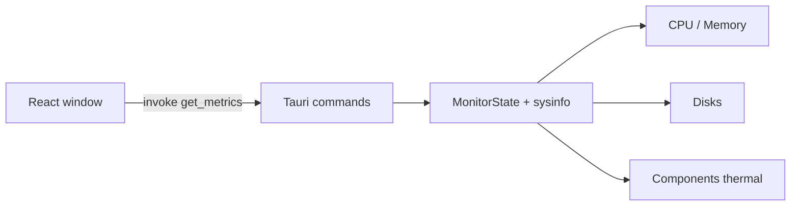

## 作ったもの

[sysgauge](https://github.com/masanori0209/sysgauge) という、Mac / Windows で動くシステムモニタを作りました。

Rust（Tauri v2）でマシンの数値を取って、画面は React です。見た目は今どきのダッシュボードにはせず、古い Mac のウィンドウに寄せています。

- CPU 使用率（全体とコア別）
- メモリ（used / available / free / swap）
- ディスク使用量
- 温度（`sysinfo` の `Components`）

手元の Mac（Apple Silicon）では、`npm run tauri dev` で起動したときに温度も出ました。ブラウザで Vite を開いただけだと本物の数値には届かないので、確認はネイティブ起動でやっています。

:::message
この記事は Tauri + sysinfo で監視ウィンドウを組んだ話です。GPU 温度、プロセス kill、アラート、Linux 対応まではやっていません。
:::


<!-- evidence: command="npm run tauri dev"; log="images/sysgauge-dashboard.png" -->

スクショを撮ったときの値です。

| 項目 | 値 |
|---|---:|
| CPU | 約 21%（10 cores） |
| Memory used | 約 24.8 GB（available 0 B） |
| Disk `/` | 約 463 GB / 926 GB |
| Thermal | `gas gauge battery` 約 34°C、`PMU tdie*` 約 57°C など |

温度のラベルは機種によって違います。全部が「CPU 温度」というわけではないので、このアプリでは `tdie` と `battery` だけ出しています。`tdev` には変な値が混ざることがあるためです。

---

## なぜ作ったのか

Rust でデスクトップアプリを出したくて、CPU 温度やメモリも見たいな、と思ったのがきっかけです。そうなるとシステムモニタになります。

CPU とディスクは素直でした。温度も、少なくともこの Mac では `sysinfo` で取れました。

困ったのはメモリです。used が高くて available が 0、swap が厚い。この並びをどう読むかがむずかしいです。

---

## 今回作らないもの

| やる | やらない（今回） |
|---|---|
| CPU / メモリ / ディスク / 温度の表示 | GPU 温度・電力 |
| 古い Mac 風の 1 画面 UI | どの環境でも温度が出る保証 |
| used / available / free / swap の併記 | プロセス一覧・kill |
| Mac / Windows | Linux の正式サポート |
| 1 秒ポーリング | 履歴 DB・アラート |

---

## 構成



数値の取得は Rust 側に置いています。フロントは 1 秒ごとに `get_metrics` を呼んで、表示するだけです。

```bash
git clone https://github.com/masanori0209/sysgauge
cd sysgauge
npm install
npm run tauri dev
```

`http://localhost:1420` は UI の確認用です。温度や実メモリを見るなら、Tauri で起動してください。

---

## CPU とメモリ

`sysinfo` の `System` をプロセスの中に持ち続けて、refresh しています。CPU 使用率は差分なので、毎回作り直すと最初が 0 になりやすいです。起動時に一度だけ温めてから、同じインスタンスを使い回しています。

```rust
pub struct MonitorState {
    sys: Mutex<System>,
}

impl MonitorState {
    pub fn new() -> Self {
        let mut sys = System::new_with_specifics(
            RefreshKind::nothing()
                .with_cpu(CpuRefreshKind::everything())
                .with_memory(MemoryRefreshKind::everything()),
        );
        sys.refresh_cpu_all();
        Self {
            sys: Mutex::new(sys),
        }
    }
}
```

これで上段の CPU / Memory と、コア別のバーまでは動きます。

---

## 温度

温度は `Components` です。

```rust
let components = Components::new_with_refreshed_list();
```

手元では `PMU tdie*` や `gas gauge battery` で ℃ が出ました。全部出すと `tdev` のようなチャンネルも混ざって、マイナスの温度が出たりします。なのでラベルで絞っています。

```rust
fn is_preferred_thermal_label(label: &str) -> bool {
    let lower = label.to_ascii_lowercase();
    lower.contains("tdie") || lower.contains("battery")
}

let sensors: Vec<ThermalSensor> = components
    .iter()
    .filter(|c| is_preferred_thermal_label(c.label()))
    .map(|c| ThermalSensor {
        label: c.label().to_string(),
        celsius: c.temperature(),
        max_celsius: c.max(),
    })
    .collect();
```

画面には最大 4 件まで出しています。`battery` があれば先に出して、あとは温度の高い `tdie` から並べています。

中では状態も持っています。

| status | 意味 |
|---|---|
| `available` | 温度が読めた |
| `partial` | 一部だけ読めた |
| `empty` | センサーがない / 値が空 |

今回のスクショは温度が読めた状態です。ただ、ラベルがそのまま「CPU」ではないことが多く、別のマシンだと空になることもあります。

<!-- evidence: command="npm run tauri dev"; log="images/sysgauge-dashboard.png" -->

「温度対応した」ではなく、**この Mac では取れた**、が正しいです。取れないときは `No sensors` と出して、アプリ自体は止めないようにしています。

フロントからは、次の形で Rust を呼びます。

```rust
#[tauri::command]
fn get_metrics(state: tauri::State<'_, MonitorState>) -> MetricsSnapshot {
    state.snapshot()
}
```

```ts
const next = await invoke<MetricsSnapshot>("get_metrics");
```

:::message
Windows で温度をもっと厚くしたいなら、WMI やベンダー SDK など別の経路が必要になることがあります。今回は共通クレートの範囲にとどめています。
:::

---

## メモリの読み方

温度が取れたあとに残ったのが、こっちでした。

`sysinfo` は次をくれます。

| 値 | 意味 |
|---|---|
| `total` | 搭載メモリ |
| `used` | OS が見ている使用量 |
| `available` | アプリが使える見込みの残り |
| `free` | より「未使用」に近い値（環境差が大きい） |
| `swap` | スワップの total / used |

スクショだと used が約 24 GB、available が 0 B、swap が厚い、という並びが出ることがあります。used / total だけ見ると「もうダメ」に見えますが、free と swap を並べると、もう少し様子が分かります。

<!-- evidence: command="npm run tauri dev"; log="images/sysgauge-dashboard.png" -->

macOS の `sysinfo` では、available は次の計算です。

```text
available ≈ (free + inactive + purgeable - compressor) × page_size
```

compressor（圧縮メモリ）が大きいと引き算がマイナスになって、`saturating_sub` で **0** になります。Activity Monitor や `memory_pressure` の「余裕」とは定義が違うので、available だけを信じすぎない方がいいです。

<!-- evidence: command="npm run tauri dev"; log="images/sysgauge-dashboard.png" -->

UI には説明文を置かず、4 つの数字を同じ段に並べるだけにしました。

数値自体は共通 API で取れます。同じフィールド名でも、頭の中の「使用率」とはズレることがあります。

---

## UI

今風のカード UI にすると、Web を箱に入れた感じになります。なので、古い Mac に寄せました。

- Platinum 風のタイトルバーとベベルボタン
- Controls 風の group box
- 斜線のプログレスバー
- グレーのドットデスクトップ
- 840×520 前後で、ほぼスクロールしない

fieldset はただの枠線ではなく、外枠と内側のハイライトを重ねて、昔のコントロールパネルに寄せています。

---

## 限界

一番大きいのは、温度の意味と再現性がマシン依存なことです。

この記事で言えるのは次の範囲です。

- 手元の Mac で、CPU / メモリ / ディスク / 温度をライブ表示できたこと
- メモリは used だけでなく available / free / swap を並べたほうがよいこと
- 古い Mac 風の 1 画面 UI にできたこと

まだ言えないこともあります。

- どの Mac / Windows でも同じように温度が取れること
- 各センサーが校正済みであること、どれが CPU 温度かの保証
- 本番監視や負荷試験の代わりになること

次にやるなら、Windows 向けの経路を feature flag で足すつもりです。

---

## まとめ

今回やったことです。

- Rust + Tauri + React で `sysgauge` を作った
- 手元の Mac では温度も取れた
- メモリは used だけだと読みにくいので、available / free / swap も並べた
- UI は古い Mac 風にした

数字が出ることと、数字の読み方は別物でした。温度は取れたけど、メモリの読み方が残りました。
