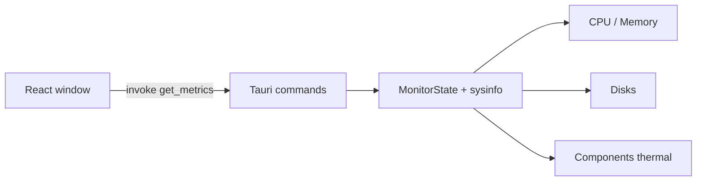

## 作ったもの

[sysgauge](https://github.com/masanori0209/sysgauge) という、Mac / Windows 向けのシステムメトリクスアプリを作りました。

Rust（Tauri v2）でホストの数値を取り、React で画面を描いています。見た目は Web ダッシュボードではなく、古い Mac の Controls ウィンドウに寄せています。

- CPU 使用率（全体 + コア別）
- メモリ（used / available / free / swap）
- ディスク使用量
- 温度センサー（`sysinfo` の `Components`）

手元の Mac（Apple Silicon）では、`npm run tauri dev` で起動すると温度も取れました。ブラウザの Vite プレビューだけだと本物のメトリクスには届かないので、確認はネイティブ起動で見ています。

:::message
この記事は「Tauri + sysinfo で監視ウィンドウを組む」話と、「温度が取れたあとに残るメモリの読み方」の話です。GPU 温度、プロセス kill、アラート通知、Linux 正式対応までは扱いません。
:::


<!-- evidence: command="npm run tauri dev"; log="images/sysgauge-dashboard.png" -->

スクショ時点では、たとえば次のような値が出ていました。

| 項目 | 値 |
|---|---:|
| CPU | 約 21%（10 cores） |
| Memory used | 約 24.8 GB（available 0 B） |
| Disk `/` | 約 463 GB / 926 GB |
| Thermal | `gas gauge battery` 約 34°C、`PMU tdie*` 約 57°C など |

温度ラベルは機種依存で、全部が「CPU 温度」として読めるわけではありません。このアプリでは `tdie`（ダイ温度）と `battery` だけを出しています。`tdev` などには絶対温度として使えない値が混ざることがあるためです。

---

## なぜ作ったのか

「Rust でデスクトップアプリを出したい」「CPU 温度とかメモリを見たい」。このふたつを重ねると、システムモニタになります。

作ってみると、CPU とディスクは比較的素直でした。温度も、少なくともこの Mac では `sysinfo` の `Components` で値が出ました。

残った山は、むしろメモリでした。used が高く、available がほぼ 0、swap が厚い——この並びをどう読むか。同じフィールド名でも、OS の感覚とずれることがあります。

---

## 今回作らないもの

| やる | やらない（今回） |
|---|---|
| CPU / メモリ / ディスク / 温度のライブ表示 | GPU 温度・電力 |
| 古い Mac 風の 1 画面 UI | どの環境でも温度が同じ意味で出る保証 |
| used / available / free / swap の併記 | プロセス一覧・kill |
| Mac / Windows | Linux の正式サポート |
| 1 秒ポーリング | 履歴 DB・アラート |

---

## 構成



メトリクス取得は Rust 側に寄せています。フロントは 1 秒間隔で `get_metrics` を呼び、表示だけに専念します。

```bash
git clone https://github.com/masanori0209/sysgauge
cd sysgauge
npm install
npm run tauri dev
```

ブラウザで `http://localhost:1420` を開くのは UI 確認用です。温度や実メモリを見るなら、上の **Tauri 起動**が本体です。

---

## CPU とメモリを先に固める

`sysinfo` の `System` をプロセス内に持ち続けて refresh します。CPU 使用率は差分なので、呼び捨てにすると最初のサンプルが 0 になりやすいです。起動時に一度温めてから、同じインスタンスを更新しています。

```rust
pub struct MonitorState {
    sys: Mutex<System>,
}

impl MonitorState {
    pub fn new() -> Self {
        let mut sys = System::new_with_specifics(
            RefreshKind::nothing()
                .with_cpu(CpuRefreshKind::everything())
                .with_memory(MemoryRefreshKind::everything()),
        );
        sys.refresh_cpu_all();
        Self {
            sys: Mutex::new(sys),
        }
    }
}
```

ここまでで、上段の CPU / Memory とコア別バーは動きます。

---

## 温度：この Mac では取れた

温度は `Components` です。

```rust
let components = Components::new_with_refreshed_list();
```

手元では `PMU tdie*` や `gas gauge battery` のようなセンサーで ℃ が出ました。UI では `tdie` / `battery` だけに絞り、値があるものを最大 4 件出しています（1 画面に収めるため。`tdev` などには絶対温度として使えない値が混ざることがあるため除外しています）。

ステータスは次の 3 つに分けています。

| status | 意味 |
|---|---|
| `available` | 温度値が読めた |
| `partial` | 一部だけ読めた |
| `empty` | センサーがない / 値が空 |

今回のスクショは `available` 寄りの状態です。ただし次は残ります。

- ラベルが人間向けの「CPU」ではないことが多い
- センサー全部を出すと、絶対温度として使えないチャンネルが混ざる（なので `tdie` / `battery` に限定）
- Windows や別マシンでは空になる可能性がある

<!-- evidence: command="npm run tauri dev"; log="images/sysgauge-dashboard.png" -->

なので「温度対応した」ではなく、**この環境では `Components` で温度が取れた**、が正確です。取れない環境では `No sensors` を出すだけにして、アプリ全体は止めません。

:::message
Windows で温度を厚くしたい場合は、WMI やベンダー SDK など別経路が必要になることがあります。この記事では共通クレートの範囲に留めています。
:::

---

## 本編：同じメモリでも、読み方がズレる

温度が取れたあとに残った本編が、ここです。

`sysinfo` はだいたい次をくれます。

| 値 | ざっくりした意味 |
|---|---|
| `total` | 搭載メモリ |
| `used` | OS が見ている使用量 |
| `available` | いまから使えそうな残り寄りの値 |
| `free` | より「未使用」に近い値（環境差が大きい） |
| `swap` | スワップの total / used |

スクショでは used が約 24 GB、available が 0 B、swap が厚い、という並びが出ることがあります。used / total だけ見ると「もう終わり」に見えますが、free と swap を並べると、圧迫の形がもう少し具体的になります。

<!-- evidence: command="npm run tauri dev"; log="images/sysgauge-dashboard.png" -->

macOS の `sysinfo` では、ざっくり言うと available を次のように計算しています。

```text
available ≈ (free + inactive + purgeable - compressor) × page_size
```

compressor（圧縮メモリ）が大きいと引き算がマイナスになり、`saturating_sub` で **0** になります。Activity Monitor や `memory_pressure` の「余裕」とは定義が違うので、available だけを絶対視しないほうがよいです。

<!-- evidence: command="npm run tauri dev"; log="images/sysgauge-dashboard.png" -->

だから UI では説明文を書かず、**4 つの数字を同じ段に並べる**だけにしました。読み方の注意は記事側に置いています。

数値そのものは共通 API で取れます。ただし、同じフィールド名でも、頭の中の「使用率」と一致するとは限りません。

---

## UI：Web っぽさを捨てて、古い Mac に寄せた

監視画面を今風のカード UI にすると、どうしても「Web を箱に入れただけ」に見えます。なので次に振りました。

- Platinum っぽいタイトルバーとベベルボタン
- Controls 風の group box（黒枠 + 内側ハイライト）
- 斜線のプログレスバー
- グレーのドットデスクトップ
- ほぼスクロールしない 1 画面（ウィンドウはだいたい 840×520）

fieldset の枠は、ただの線ではなく「コントロールパネルのグループ」に見えるよう、外枠と内側のハイライトを重ねています。

---

## 限界

一番大きな限界は、**温度の意味と再現性がホスト依存なこと**です。

そのため、この記事で言えるのは次の範囲です。

- 手元の Mac で、Tauri + sysinfo により CPU / メモリ / ディスク / 温度センサーをライブ表示できたこと
- メモリは used だけでなく available / free / swap を並べたほうが誤解が減ること
- 古い Mac 風の 1 画面 UI に落とせるること

一方で、まだ言えないこともあります。

- 任意の Mac / Windows で、同じ品質の温度が取れること
- 各センサー値の校正や、どれが CPU 温度かの保証
- 本番監視や負荷試験の代替になること

次に進めるなら、Windows 向けの別経路を feature flag で足すのが自然だと思います。

---

## まとめ

今回やったことを振り返ると、次のとおりです。

- Rust + Tauri + React で `sysgauge` を作った
- 手元の Mac では温度センサーも `sysinfo` で取れた
- それでもメモリは used だけだと読み間違えるので、available / free / swap を併記した
- UI は Web カードではなく、古い Mac の Controls ウィンドウに寄せた

数字が出ることと、数字をどう読むことは別物です。温度が取れたあとに残ったのは、その差でした。
