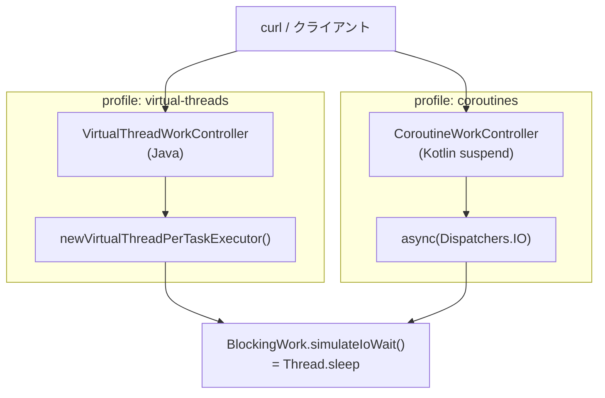

## 作ったもの

Spring Boot 3.5 / Java 21 で、**同じ REST API** を 2 通りで実装しました。

- **Java + 仮想スレッド（Virtual Threads）** … `Executors.newVirtualThreadPerTaskExecutor()` でブロッキング I/O を並列化
- **Kotlin + コルーチン** … `suspend` 関数と `async(Dispatchers.IO)` で同じ処理を並列化

どちらも「50 件の疑似 I/O（`Thread.sleep`）を同時に投げる」だけの小さな API です。RAG でもマイクロサービスでもない、意図的に地味な題材にしています。

デモのソースはこちらです（ローカル clone でも動きます）。

- GitHub（公開予定）: `https://github.com/masanori0209/spring-kotlin-java-concurrency-demo`
- ローカル: `/Users/m_m/develop/9999_m2lab/spring-kotlin-java-concurrency-demo`

```bash
git clone https://github.com/masanori0209/spring-kotlin-java-concurrency-demo.git
cd spring-kotlin-java-concurrency-demo
chmod +x gradlew scripts/*.sh

# Java 仮想スレッド版
./scripts/run-virtual-threads.sh

# Kotlin コルーチン版（別ターミナル）
./scripts/run-coroutines.sh
```

起動後、同じ curl で叩けます（ポートは **18080**）。

```bash
curl http://127.0.0.1:18080/api/mode
curl "http://127.0.0.1:18080/api/work?tasks=50&delayMs=20"
```

ある実行例（macOS / Apple Silicon / JDK 21.0.11）では、次の JSON が返りました。


```json
{"mode":"virtual-threads","tasks":50,"delayMs":20,"elapsedMs":25,"successfulTasks":50}
{"mode":"coroutines","tasks":50,"delayMs":20,"elapsedMs":25,"successfulTasks":50}
```


50 タスク × 20ms の並列待ちなので、理論上の下限はだいたい 20ms 付近です。今回の環境では **22〜28ms** に収まり、どちらも同じオーダーでした。「どちらか一方が桁違いに速い」という話にはしたくありません。見たかったのは、**同じ Spring MVC アプリで 2 つの書き方を並べたとき、何が変わって何が変わらないか** です。

:::message
この記事は Spring Boot 上の **I/O 待ちが多い処理** を想定しています。Android の UI スレッド、WebFlux / Project Reactor との三者比較、本番負荷試験は対象外です。
:::

## なぜ 2 通りを並べたのか

Java 21 で Virtual Threads が LTS に入り、Spring Boot 3.2 以降は `spring.threads.virtual.enabled=true` だけで Tomcat が仮想スレッドを使えるようになりました。一方 Kotlin 側は、Spring MVC でも `suspend` 付きコントローラが書けます。

現場ではだいたい次の分岐が起きます。

- **Java 中心のチーム** … 既存の blocking コード（JDBC、`RestTemplate`）を活かしたい → Virtual Threads が候補
- **Kotlin を書き始めたチーム** … 構造化並行性や `async`/`await` で読みたい → Coroutines が候補

「どちらが正解か」より、**同じ API・同じ負荷で並べて、トレードオフを自分の目で確認したい** のが今回の動機です。

## 今回作らないもの

スコープを先に切ります。

- WebFlux / Reactor との 3 者ベンチ
- CPU バウンド処理のスループット比較
- 本番相当の負荷試験（JMeter 等）
- Android / クライアント向け Virtual Threads
- Java/Kotlin 混在プロジェクトの null 安全・相互運用の全整理

見るのは **Spring MVC + 同一エンドポイント + I/O 待ちの fan-out** だけです。

## 構成




1 つの Gradle プロジェクトに Java / Kotlin のソースを同居させ、`@Profile` でコントローラを切り替えています。


| profile           | 言語     | HTTP 層                        | 並列化                        | `spring.threads.virtual.enabled` |
| ----------------- | ------ | ----------------------------- | -------------------------- | -------------------------------- |
| `virtual-threads` | Java   | 通常の `@GetMapping`             | Virtual Thread Executor    | `true`                           |
| `coroutines`      | Kotlin | `suspend fun` + `@GetMapping` | `coroutineScope` + `async` | `false`                          |


## API の契約

エンドポイントは共通です。

```http
GET /api/work?tasks=50&delayMs=20
```


| パラメータ     | 意味                  | 上限   |
| --------- | ------------------- | ---- |
| `tasks`   | 並列に投げる疑似 I/O の件数    | 500  |
| `delayMs` | 1 件あたりのブロッキング待ち（ms） | 5000 |


レスポンス例:

```json
{
  "mode": "virtual-threads",
  "tasks": 50,
  "delayMs": 20,
  "elapsedMs": 25,
  "successfulTasks": 50
}
```

`elapsedMs` はリクエスト受信から全タスク完了までの壁時計時間です。厳密なベンチマークではなく、**「50 並列 × 20ms sleep が何 ms で返るか」** のざっくり確認用です。


## 実装 1: Java + 仮想スレッド


### Spring Boot 側の設定

`application-virtual-threads.properties`:

```properties
concurrency.mode=virtual-threads
spring.threads.virtual.enabled=true
```

`spring.threads.virtual.enabled=true` により、Tomcat がリクエストごとに **仮想スレッド** でコントローラを呼びます。HTTP 層は従来どおり blocking MVC のままです。

### Java 側のコントローラ

```java
@RestController
@Profile("virtual-threads")
public class VirtualThreadWorkController {

    @GetMapping("/api/work")
    public WorkResponse work(
            @RequestParam(defaultValue = "50") int tasks,
            @RequestParam(defaultValue = "20") int delayMs) {
        int safeTasks = Math.clamp(tasks, 1, 500);
        int safeDelayMs = Math.clamp(delayMs, 1, 5_000);

        long startNs = System.nanoTime();
        int successful = runConcurrentBlockingWork(safeTasks, safeDelayMs);
        long elapsedMs = (System.nanoTime() - startNs) / 1_000_000;

        return new WorkResponse(
                "virtual-threads", safeTasks, safeDelayMs, elapsedMs, successful);
    }

    private static int runConcurrentBlockingWork(int tasks, int delayMs) {
        try (var executor = Executors.newVirtualThreadPerTaskExecutor()) {
            List<Future<Integer>> futures = IntStream.range(0, tasks)
                    .mapToObj(i -> executor.submit(() -> {
                        BlockingWork.INSTANCE.simulateIoWait(delayMs);
                        return i;
                    }))
                    .toList();
            int count = 0;
            for (Future<Integer> future : futures) {
                future.get();
                count++;
            }
            return count;
        } catch (Exception ex) {
            throw new IllegalStateException("virtual thread work failed", ex);
        }
    }
}
```

ポイントは次の 2 つです。

1. **HTTP リクエスト自体**が仮想スレッド上で動く（Spring Boot 設定）
2. **アプリ内の fan-out** も `newVirtualThreadPerTaskExecutor()` で仮想スレッドに載せる

JDBC や HTTP クライアントをループで呼ぶ既存 Java コードに近い形です。

## 実装 2: Kotlin + コルーチン


### 依存関係

`build.gradle.kts` に次が必要でした。

```kotlin
implementation("org.jetbrains.kotlinx:kotlinx-coroutines-core")
implementation("org.jetbrains.kotlinx:kotlinx-coroutines-reactor")
```

`kotlinx-coroutines-reactor` がないと、Spring MVC の `suspend` コントローラが **500 Internal Server Error** になります。ハマりどころとして覚えておくとよいです（デモでも最初ここで落ちました）。

### Kotlin 側のコントローラ

```kotlin
@RestController
@Profile("coroutines")
class CoroutineWorkController {

    @GetMapping("/api/work")
    suspend fun work(
        @RequestParam(defaultValue = "50") tasks: Int,
        @RequestParam(defaultValue = "20") delayMs: Int,
    ): WorkResponse {
        val safeTasks = tasks.coerceIn(1, 500)
        val safeDelayMs = delayMs.coerceIn(1, 5_000)

        val startNs = System.nanoTime()
        val successful = runConcurrentBlockingWork(safeTasks, safeDelayMs)
        val elapsedMs = (System.nanoTime() - startNs) / 1_000_000

        return WorkResponse(
            "coroutines", safeTasks, safeDelayMs, elapsedMs, successful,
        )
    }

    private suspend fun runConcurrentBlockingWork(tasks: Int, delayMs: Int): Int =
        coroutineScope {
            (0 until tasks)
                .map { index ->
                    async(Dispatchers.IO) {
                        BlockingWork.simulateIoWait(delayMs)
                        index
                    }
                }
                .awaitAll()
                .size
        }
}
```

`suspend fun` のコントローラは、内部で Tomcat の async 機構と coroutine を橋渡しします。ログ上では `WebAsyncManager: Started async request` と出ます。

### あえて `delay()` ではなく `Thread.sleep` にした理由

Kotlin には非ブロッキングの `delay()` もあります。今回は **Java 側と同じ「blocking I/O 待ち」** を再現するため、共有の `BlockingWork` で `Thread.sleep` を呼んでいます。

```kotlin
object BlockingWork {
    fun simulateIoWait(delayMs: Int) {
        Thread.sleep(delayMs.toLong())
    }
}
```

`delay()` はスレッドを占有しません。DB ドライバや古い HTTP クライアントのように **スレッドをブロックする API** を包むなら、`Dispatchers.IO` + `sleep` の方が Java 版との対比が素直です（ただし、本番ではブロッキング JDBC を coroutine 内に長時間置かない、という別の議論があります）。

## 計測結果

`tasks=50`, `delayMs=20` で 5 回ずつ叩いた結果です。


| mode            | elapsedMs（5 回）     | 中央値   |
| --------------- | ------------------ | ----- |
| virtual-threads | 25, 25, 25, 22, 25 | 25 ms |
| coroutines      | 28, 25, 25, 25, 25 | 25 ms |


この条件では **差は誤差レベル** でした。I/O 待ち中心の fan-out なら、どちらも「OS スレッドを 50 本占有しない」方向に寄せられます。

数字だけを本番 SLA の根拠にはできません。DB レイテンシ、コネクションプール、pinning（後述）が入ると話は変わります。

## 実装して分かったこと


### 1. Virtual Threads は「blocking のまま並列度を上げる」道

Java 21 + Spring Boot 3.2+ なら、HTTP 入口は設定 1 行で仮想スレッドに載せられます。アプリ内も `newVirtualThreadPerTaskExecutor()` に載せ替えれば、`CompletableFuture` **地獄に入らず** fan-out できます。

既存 Java 資産を活かすチームには、心理的ハードルが低い選択肢だと思います。

### 2. Coroutines は「非同期の構造」を言語に書ける

`coroutineScope` + `async` + `awaitAll` は、タイムアウトやキャンセルの伝播を `withTimeout` 等で組み立てやすいです。Virtual Threads 単体では、構造化並行性は Java 21 以降の `StructuredTaskScope`（Preview 系）に寄せる形になり、Spring MVC との一体感は coroutine 側の方が Kotlin チームには読みやすいことが多いです。

### 3. 混在プロジェクトでは profile 分離が楽

今回は `@Profile("virtual-threads")` / `@Profile("coroutines")` でコントローラを排他にしました。本番で Java と Kotlin を同居させる場合も、**同一エンドポイントの二重定義** に注意し、モジュールまたは profile で境界を切ると安全です。

## 使い分けの目安


| 状況                                | 寄せやすい方          | 理由                                     |
| --------------------------------- | --------------- | -------------------------------------- |
| 既存 Java が大半で、blocking API をそのまま使う | Virtual Threads | コード形状を変えずに並列度を上げやすい                    |
| 新規 Kotlin サービス、キャンセル/タイムアウトを明示したい | Coroutines      | `suspend` と structured concurrency が素直 |
| Spring WebFlux 採用済み               | 本記事の対象外         | VT は Servlet 向け。WebFlux では別設計          |
| CPU バウンド                          | どちらも主役にしない      | スレッド/コルーチンを増やしても速くならない                 |


つまり、**「Java を捨てるか Kotlin に全振りか」ではなく、チームとコード形状で選ぶ** のが現実的です。

## 限界

まず一番大きい限界を言い切ります。**今回のデモは** `Thread.sleep` **による疑似 I/O で、本番 DB / HTTP の挙動を再現していません。**

そのため、この記事で言えるのは次の範囲です。

- 同一 Spring MVC アプリで VT / Coroutine の 2 実装を並べられる
- I/O 待ち fan-out のオーダーでは、今回の条件では差は小さかった
- Spring MVC の `suspend` には `kotlinx-coroutines-reactor` が要る

一方で、まだ言えないこともあります。

- 本番 QPS / p99 レイテンシでの優劣
- Virtual Thread の **pinning**（`synchronized` やネイティブ JNI でキャリアが固定されるケース）の影響
- Kotlin/Java 混在時の null 安全（Platform Type）や `@JvmStatic` 周り
- WebFlux / R2DBC 前提の非ブロッキングスタックとの比較

次に進めるなら、同じ API で **実際の HTTP クライアント（**`RestClient`**）を N 件叩く** 版を足し、pinning が疑われる箇所を JFR の `jdk.VirtualThreadPinned` で記録する、くらいがよさそうです。

## まとめ

今回やったことを振り返ると、次のとおりです。

- Spring Boot 3.5 / Java 21 で `/api/work` を **Java VT** と **Kotlin Coroutine** の 2 通りで実装した
- 50 並列 × 20ms の疑似 I/O では、elapsedMs は **22〜28ms** で、大きな差は出なかった

- Spring MVC の suspend には `kotlinx-coroutines-reactor` が必要だった
- 使い分けは速度より **既存 Java を活かすか、Kotlin の structured concurrency を取るか**

Virtual Threads は blocking の延長線上で並列度を上げ、Coroutines は非同期の構造をコードに書く。

同じ JVM 上でも、選ぶのは「速さ」より **チームが読み続けられる形** だと思います。

## 参考リンク

公式ドキュメントと、今回のデモリポジトリへのリンクです。

- [Spring Boot 3.2 Release Notes — Virtual Threads support](https://github.com/spring-projects/spring-boot/wiki/Spring-Boot-3.2-Release-Notes)
- [JEP 444: Virtual Threads](https://openjdk.org/jeps/444)
- [Kotlin docs — Calling Java from Kotlin](https://kotlinlang.org/docs/java-interop.html)
- [Kotlin coroutines on JVM](https://kotlinlang.org/docs/coroutines-guide.html)
- デモリポジトリ: `https://github.com/masanori0209/spring-kotlin-java-concurrency-demo`

