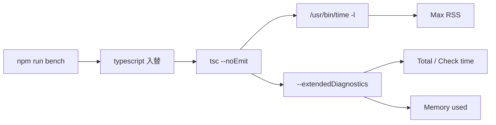

## 計測したもの

TypeScript 7 では、コンパイラが Go 製（`tsgo` / Project Corsa）になり、公式ベンチでは型チェックが約10倍速く、メモリは約50%削減と案内されています。

ただ、公式の数字は VS Code や Sentry 規模のコードベース向けです。自分のリポジトリで 5.9 / 6.0 / 7.0 を同じソースで比べたときの倍率までは、表を読むだけでは見えませんでした。

そこで、タスク一覧と UI コンポーネントを詰めた React + TypeScript アプリを新規に作り、同じ `tsconfig.json`・同じソースのまま TypeScript 5.9.3 / 6.0.3 / 7.0.2 で型チェック時間とメモリを測りました。

- GitHub: https://github.com/masanori0209/typescript-toolchain-bench
- 計測スクリプト: `scripts/run-benchmark.sh`
- 生ログ: `reports/summary.json`

```bash
git clone https://github.com/masanori0209/typescript-toolchain-bench.git
cd typescript-toolchain-bench
npm install
npm run bench
```


:::message
この記事はアプリの実行速度の話ではありません。`tsc --noEmit` にかかる時間と、プロセスが確保したメモリの話です。計測対象は約 1,700 行の TypeScript（40 ファイル弱）の単一パッケージで、monorepo や CI 並列度の検証は含みません。
:::

## 結論だけ先に

<!-- evidence: command="npm run bench"; log="reports/summary.json"; env="macOS Apple Silicon, Node v26.0.0, 2026-07-09" -->

| バージョン | Total time（warm） | Check time | Memory used（tsc 内部） | Max RSS |
| --- | ---: | ---: | ---: | ---: |
| 5.9.3 | 0.42s | 0.24s | 148MB | 272MB |
| 6.0.3 | 0.37s | 0.21s | 128MB | 245MB |
| 7.0.2 | 0.052s | 0.033s | 61MB | 97MB |


5.9 と 6.0 は同じ JavaScript 実装なので、今回の規模では速度差は小さく、6.0 の方がわずかに速い程度でした。7.0 だけ別物で、warm の Total time は 5.9 比で約 8.1 倍速くなりました。公式の「10倍」までは出ませんでした。

メモリは 7.0 で下がりました。ただし `Memory used`（tsc 内部）と `Max RSS`（OS が見るピーク）は別物なので、片方だけ見ると誤解しやすいです。また、この規模では `--checkers` を上げても速くならず、むしろ Total time が伸びるケースがありました。

TaskFlow では 7.0 は確かに速かったです。ただ、速さの数字とメモリの数字は、分けて読んだ方がよさそうです。

## なぜ自分で測ったか

手元で確認したかったのは、次の点でした。

- 5.9 と 6.0 は本当に同じ速度なのか（JS 実装同士）
- 小〜中規模のフロントエンド repo でも 10 倍に近いのか
- メモリ削減は再現するのか
- `--checkers` はローカルでも効くのか

再現用に、計測専用リポジトリ `typescript-toolchain-bench` を作りました。

## 計測対象アプリ（TaskFlow）

中身は、実際に動くフロントエンド寄りの構成です。

- タスク一覧（フィルタ、ボード表示、追加モーダル）
- ダッシュボード（集計カード、更新履歴テーブル）
- UI コンポーネント群（Button, Modal, Tabs, Table, Toast など）
- hooks / ユーティリティ / 型定義

規模感は `--extendedDiagnostics` ベースで次のとおりです。

| 項目 | 値 |
| --- | ---: |
| TypeScript ソース行 | 1,688 |
| ソースファイル数 | 40 |
| `tsc` が読む Files（5.9） | 119 |

冒頭で触れた公式ベンチは、VS Code（約150万行）や Sentry のような大規模コードベース向けです。TaskFlow は TypeScript 本体が約1,700行で、小〜中規模のフロントエンド1アプリくらいのボリュームです。この差を頭に置いて、後半の倍率を読んでください。

## 計測設計

### 環境

| 項目 | 値 |
| --- | --- |
| 日付 | 2026-07-09 |
| OS | macOS（Apple Silicon） |
| Node.js | v26.0.0 |
| 比較バージョン | 5.9.3 / 6.0.3 / 7.0.2 |

### コマンド

各バージョンごとに `typescript@x.y.z` を `--no-save` で入れ替え、同じ `tsconfig.json` に対して実行しました。

```bash
# 時間 + Max RSS（macOS）
/usr/bin/time -l npx tsc --noEmit -p tsconfig.json

# tsc 内部の内訳
npx tsc --noEmit -p tsconfig.json --extendedDiagnostics
```

- **cold**: `.tsbuildinfo` を削除してから実行
- **warm**: 直後にもう一度実行（キャッシュ効果の確認用）
- **7.0 のみ**: `--checkers 4` / `--checkers 8` も追加

### 見る指標



| 指標 | 意味 |
| --- | --- |
| `Total time` | パース〜型チェックまでの合計（`--extendedDiagnostics`） |
| `Check time` | 型チェック部分だけ |
| `Memory used` | tsc が報告する内部メモリ |
| `Max RSS` | `/usr/bin/time -l` の maximum resident set size |

速さは wall clock、`Memory used` はコンパイラ内部、RSS は OS 視点です。レイヤが違うので、同じグラフに載せない方がよいです。

## 結果：5.9 / 6.0 は近い、7.0 だけ桁が違う

### 型チェック時間（warm）

<!-- evidence: command="npm run bench"; log="reports/summary.json" -->

| バージョン | real | Total time | Check time | 5.9 比 |
| --- | ---: | ---: | ---: | ---: |
| 5.9.3 | 0.49s | 0.42s | 0.24s | 1.0x |
| 6.0.3 | 0.48s | 0.37s | 0.21s | 1.1x |
| 7.0.2 | 0.11s | 0.052s | 0.033s | 8.1x |

5.9 → 6.0 は JavaScript 実装同士なので、速度が大きく変わらないのは自然です。6.0 は非推奨設定の整理やデフォルト変更が主で、コンパイラエンジン自体は同系統です。

7.0 だけ Total time が桁違いでした。ただし約 8 倍で、公式ベンチの 10 倍には届いていません。コード量が小さいと、起動や I/O の比率が変わるためです。

cold 1 回目（5.9.3）は Total time 0.44s / real 0.79s とぶれました。以降の warm が 0.42s 前後に落ち着いたので、1 回だけ測らない方がよさそうです。

### メモリ：7.0 で下がるが、見る場所を間違えると誤解する

<!-- evidence: command="npm run bench"; log="reports/summary.json" -->

| バージョン | Memory used | Max RSS | 5.9 の Memory used 比 |
| --- | ---: | ---: | ---: |
| 5.9.3 | 148MB | 272MB | 100% |
| 6.0.3 | 128MB | 245MB | 86% |
| 7.0.2 | 61MB | 97MB | 41% |

7.0 では tsc 内部メモリも RSS も下がりました。公式の「約50%削減」に近いのは、今回の小規模プロジェクトでも再現できた部分です。

ただし、別環境では「速いのに RSS が増えた」という報告もあります。プロジェクト規模、並列度、計測コマンドで変わるので、自分の repo で `/usr/bin/time -l` と `--extendedDiagnostics` を両方取るのが無難です。

### `--checkers` は小規模では効果が出ない

7.0.2 の cold 実行を1回ずつ抜き出すと次のとおりです（複数回平均ではないので、あくまで参考値です）。

<!-- evidence: command="npm run bench"; log="reports/summary.json" -->

| 設定 | Total time | Check time | Memory used |
| --- | ---: | ---: | ---: |
| デフォルト | 0.048s | 0.029s | 61MB |
| `--checkers 4` | 0.049s | 0.030s | 61MB |
| `--checkers 8` | 0.048s | 0.029s | 72MB |

Total time の差は 1ms 前後で、測定誤差の範囲です。はっきり言えるのは「速くならない」ことと、`--checkers 8` で Memory used がむしろ増えたことです。`tsc` が読む Files は 111、型チェック対象が小さいと、goroutine 起動コストの方が支配的になります。`--checkers` が効いてくるのは、もっとファイル数と型の複雑さがある側だと思います。並列度は環境依存なので、自分の repo で測った方が早いです。

## 移行でハマった点（6.0 / 7.0）

### CSS の side-effect import

最初、`src/main.tsx` で `import "./styles.css"` としており、6.0 / 7.0 では次のエラーが出ました。

```text
error TS2882: Cannot find module or type declarations for side-effect import of './styles.css'.
```

6.0 以降、`noUncheckedSideEffectImports` がデフォルトで有効になり、CSS のような副作用 import に型定義が必要です。`src/vite-env.d.ts` に Vite の参照を足して解消しました。

```typescript
/// <reference types="vite/client" />
```

5.9 では黙っていた差分が、6.0 で表面化する典型例です。

### 5.9 と 6.0 で Files 数が違う

5.9 は Files 119、6.0 / 7.0 は 111 でした。ライブラリ定義の読み方が変わっており、バージョン間で「同じ 1.0x」比較は Total time ベースの方が素直です。

## TypeScript 7 で変わったこと

言語機能の追加より、コンパイラ基盤の刷新が主です。

| 観点 | 5.9 / 6.0 | 7.0 |
| --- | --- | --- |
| コンパイラ実装 | TypeScript（JS） on Node.js | Go ネイティブ |
| 配布形態 | npm パッケージ（Node.js 必須） | npm + 単一バイナリ |
| 並列型チェック | 限定的 | `--checkers` / `--builders` |
| 6.0 非推奨の hard error | 6=警告、7=削除 | 7 で削除 |

アプリが速くなるわけではなく、型チェックとビルドの待ち時間が短くなるのが本丸です。

## 実装して分かったこと

### 1. 5.9 / 6.0 / 7.0 の 3 点で測ると、移行の抜けが減る

- 5.9：今、多くの現場が使っているバージョン
- 6.0：JS 実装の最終系。非推奨の洗い出し
- 7.0：Go 実装。速度・メモリが変わる

5.9 と 7.0 だけ比べると、6.0 で直すべき tsconfig 問題が見落とされます。

### 2. 速さは Total time を複数回見る

1 回の cold だけだと OS キャッシュなどでぶれます。今回も 5.9 cold の real が 0.79s まで跳ねました。

### 3. メモリは指標と規模で見え方が変わる

今回の小規模 repo では 7.0 で Memory used / RSS とも減りました。一方で `--checkers 8` では Memory used が増え（72MB 台）、別環境では RSS が増えた報告もあります。「7.0 はメモリ半減」と「7.0 で RSS が増えた」は矛盾しません。指標と規模が違うだけです。

## 限界

一番大きな限界は、計測対象が 1 リポジトリ・約 1,700 行であることです。

そのため、この記事で言えるのは次の範囲です。

- 小〜中規模の React + Vite プロジェクトでは、7.0 は 5.9 / 6.0 より桁が一つ変わるほど速い可能性が高い
- メモリも、`Memory used` / RSS の両方で 7.0 が下がるケースがある
- 5.9 と 6.0 の速度差は、今回の条件では小さい
- `--checkers` は、ファイル数が少ないと効果が薄い

まだ言えないこともあります。

- monorepo / project references での倍率
- CI runner（2 vCPU 等）での `--checkers` 最適値
- `typescript-eslint` など Compiler API 依存ツールとの併用判断
- 7.0 GA 後のエコシステム成熟度

次に進めるなら、同じスクリプトを仕事用 monorepo に持ち込み、`--builders` も含めた matrix 計測がよさそうです。

## まとめ

今回やったことを振り返ると、次のとおりです。

- タスク + UI コンポーネント入りの TypeScript アプリ `typescript-toolchain-bench` を作った
- TypeScript 5.9.3 / 6.0.3 / 7.0.2 で `tsc --noEmit` を横断計測した
- warm 実行の Total time では、7.0 が 5.9 比約 8.1 倍速く、メモリは約 59% 減（Memory used ベース）だった
- 5.9 と 6.0 は同系統の JS 実装で、速度差は小さかった
- 小規模 repo では `--checkers` を上げても速くならない

TaskFlow では 7.0 がいちばん速かった。移行を決めるときに見る数字は、公式の「10倍」より、cold / warm を分けて測った Total time の方が近いです。メモリも Memory used だけでなく RSS まで見ないと、本当に減ったのか判断しづらいです。
