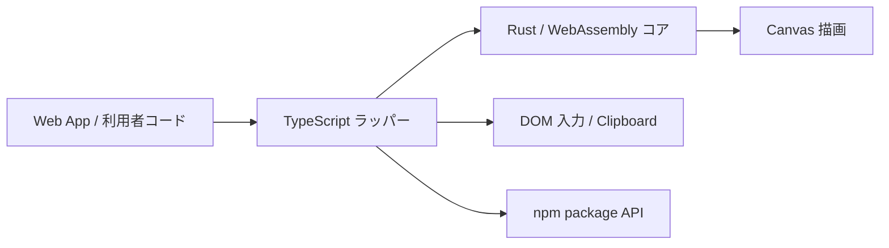

:::message
この記事は Zenn Fes Spring 2026「この春、始めたこと」への参加記事です。この春から作りはじめた OSS の話を書きます。
:::

## 作ったもの

`wasabi-table` という npm パッケージを作りました。Rust + WebAssembly + Canvas で動く、Excel 風に操作できるテーブルコンポーネントです。業務系 SaaS の管理画面で「マスタデータをガリガリ編集する画面」を作りたくて、その用途に振り切っています。

リンクを先に貼っておきます。

- npm: https://www.npmjs.com/package/wasabi-table
- GitHub: https://github.com/masanori0209/wasabi-table
- Demo: https://masanori0209.github.io/wasabi-table/examples/npm-package/index.html
- Benchmark: https://masanori0209.github.io/wasabi-table/examples/npm-package/benchmark.html

文章で説明する前に、まず動いているところを見てもらったほうが早いと思います。サンプルデータを読み込んで、セルを選択して、範囲選択して、そのまま編集する、という流れです。


できることはだいたい想像どおりで、セルの選択と範囲選択、インライン編集、コピー＆ペースト（Excel と同じ TSV 形式）、Undo/Redo、フィルターとソート、列リサイズあたりが一通り動きます。そして地味に一番うれしいのが、行数が増えても初期化や描画のコストがほとんど変わらないことです。これは後半で実際に数字を出します。

---

## なぜ作ったのか

業務系の SaaS を作っていると、管理画面に「マスタデータの一覧と編集」画面がだいたい必要になります。給与・勤怠・会計・在庫・請求みたいな領域だと、大量の行を一覧で見て、Excel みたいにセル単位で直して、範囲選択してまとめてコピーして、CSV やスプレッドシートから貼り付けて……という操作がごく当たり前に求められます。

データが少ないうちは普通の HTML テーブルでも全然いけます。困るのは行数が増えてきたときと、Excel っぽい操作を本気で実装し始めたときです。`<tr><td>` を行数ぶん並べると再レイアウトのたびに重くなりますし、仮想スクロールで行を間引いても DOM の更新コストは残ります。さらに「範囲選択してコピー」みたいな操作を足そうとすると、選択範囲の管理とイベント処理が一気にややこしくなって、気づくと小さな表計算ソフトを作りかけている、みたいなことになります。

それなら、描画と操作判定みたいな重い部分は Rust + WebAssembly + Canvas に寄せてしまって、TypeScript 側は Web アプリから使いやすい API を出すことに専念させればいいんじゃないか、と思ったのが出発点でした。

---

## 今回作らないもの

Excel 風のテーブルを作ると言っても、Excel そのものを作りたいわけではありません。目的はあくまで、管理画面で使える「大量データを編集するためのテーブル UI」です。ここを最初にはっきりさせておかないと、機能がいくらでも増えて完成しなくなります。

なので、数式エンジン（`=SUM` みたいなやつ）、ピボットテーブル、グラフ、セル結合、リアルタイム共同編集、Excel ファイルとの完全互換あたりは、最初からやらないと決めました。代わりに力を入れたのは、大量行でも軽く表示できること、Excel に近い感覚でセル選択や範囲選択ができること、コピペが自然にできること、Web アプリに組み込みやすいこと、そして npm で配れること、です。

「Excel を作る」と考えると終わりがないので、「管理画面に欲しい Excel っぽい操作感だけをコンポーネントとして切り出す」くらいに目標を下げました。今振り返ると、このスコープを切る作業が一番大事だった気がします。

---

## なぜ Rust / Wasm / Canvas なのか

Canvas を選んだのは、DOM テーブルだと行数に比例してノードが増えて、再レイアウトのコストがついて回るからです。Canvas は描いているのが 1 枚の絵なので、何行あっても見えている範囲だけバッチで描けば負荷は一定で済みます。

Rust と Wasm を選んだのは、描画ループやヒットテスト（クリック座標からセルを逆算する処理）、大量データのバッチ処理が、毎フレーム・毎イベントで走るホットパスだからです。このへんは GC の影響を受けやすい JavaScript より、メモリを自分で握れる Rust のほうが挙動が読めて安心でした。

ただ、「Rust と Wasm を使ったから速い」という話にはしたくありません。DOM との連携やクリップボード、npm パッケージとしての扱いやすさは、むしろ TypeScript で書いたほうが素直です。あくまで重い処理だけ Rust に寄せた、という温度感です。どこで線を引いたかは次の章で書きます。

---

## なぜ既存ライブラリではなく作ったのか

テーブル UI には [TanStack Table](https://tanstack.com/table) や [AG Grid](https://www.ag-grid.com/) という強力なライブラリがすでにあります。普通に一覧を出してソートやフィルターをかけたいだけなら、これらを使うのが間違いなく早いし確実です。今回これらを選ばなかったのは、機能が足りないからではありません。やりたいことの焦点がずれていたからです。

僕がやりたかったのは、一覧表示そのものより、描画レイヤーから自分で制御する Excel 風の直接操作のほうでした。Canvas 上での高速描画、セル単位のヒットテスト、範囲選択、キーボード操作、コピペ、大量行のスクロール。このあたりを低レイヤーから触りたかったんです。既存ライブラリの多くは DOM ベースで、そこをこちらから握る前提にはなっていないので、ラップして使うより自分で描画と状態管理を組んだほうが目的に合っていました。

それに、コアを Rust + Wasm に置いておくと、あとから差分計算や CSV の import/export、バリデーション、集計、変更履歴みたいな重い処理もブラウザ側で速く回せる余地が残ります。そのへんの将来性も込みで、今回は自作を選びました。繰り返しになりますが、既存ライブラリが劣っているという話ではないです。

---

## アーキテクチャ

Rust/Wasm 側と TypeScript 側で、けっこうきっちり責務を分けています。



どっちが何を持っているかを表にするとこんな感じです。

| 領域 | 担当 | 内容 |
|---|---|---|
| Canvas 描画 | Rust / Wasm | セル・グリッド・選択範囲などの描画 |
| ヒットテスト | Rust / Wasm | マウス座標からセル位置を判定 |
| スクロール計算 | Rust / Wasm | 表示範囲の計算 |
| セルデータ管理 | Rust / Wasm | 内部データ構造の保持 |
| 選択状態 | Rust / Wasm | アクティブセル・範囲選択の管理 |
| インライン編集 | TypeScript / DOM | 入力 UI（input 要素）との連携 |
| Undo / Redo | TypeScript | 操作履歴の管理 |
| フィルター・ソート | TypeScript | アプリ側から扱いやすい API として提供 |
| npm package | TypeScript | 利用者向けのラッパー API |

意識したのは、何でもかんでも Rust に寄せないことでした。描画やヒットテストみたいに頻繁に呼ばれる処理は Rust/Wasm に置く一方で、Undo/Redo やフィルター・ソート、DOM との連携は TypeScript 側に残しています。

特にフィルターとソートを TypeScript に置いたのは、Vitest で普通の関数としてユニットテストできるからです。Wasm 越しにテストするより圧倒的に速いし、新しい絞り込み条件を足すのに Wasm をリビルドしなくて済みます。Rust の速さを使いたいところでは使いつつ、npm パッケージとして Web フロントに組み込みやすい形を保つ、というあたりのバランスでこの線引きになりました。

---

## 実装した機能と最小コード

API は、どこまでやりたいかで段階的に使えるようにしています。まずは最小構成。npm から入れて、canvas を 1 枚渡すだけです。

```bash
npm install wasabi-table
```

```typescript
import { WasabiTable } from 'wasabi-table';

const canvas = document.getElementById('table') as HTMLCanvasElement;

// create() は static async。WASM の初期化を待つので await が必須
const table = await WasabiTable.create(canvas, {
  row_count: 20,
  col_count: 10,
});

table.setCellValue(0, 0, 'Hello');
table.render();
```

大量データを扱うときは、`dataSource` に配列とカラム定義を渡します。ここが 100 万行モードの入口です。

```typescript
const table = await WasabiTable.create(canvas, {
  dataSource: {
    records: bigArray, // 100万行でも可（あとで説明します）
    columns: [
      { field: 'id',   header: 'ID',   width: 80 },
      { field: 'name', header: '氏名', width: 160 },
      { field: 'age',  header: '年齢', width: 80 },
    ],
  },
});
```

セル選択やコピペ、Undo/Redo はそれぞれ素直なメソッドになっています。

```typescript
table.selectCell(0, 0);            // セル選択
table.copySelection();             // 選択範囲を TSV で取得
table.undo();                      // Undo
table.redo();                      // Redo
table.addFilterCondition(cond);    // フィルター
table.setSortCondition(sortCond);  // ソート
```

数式バーや統計表示と連携させたいときは、`createWasabiTableWithListeners` に DOM 側のセレクタを渡すと配線してくれます。

---

## ハマったところ

うまくいった話ばかりだと参考にならないので、Canvas と Wasm でテーブルを作るときに踏んだところを残しておきます。

まず、Canvas は当然ながら DOM ではないので、「セルごとの要素」が存在しません。なので、クリックされた座標がどのセルなのかを自分で逆算するヒットテストが必要になります。列幅やスクロール量、固定列の有無を全部考慮して座標を計算するので、ここは正確さと速さがほしくて Rust 側に持たせました。

次に、input 要素を Canvas に直接置けない問題です。Canvas に文字を描くことはできても、`input` のような編集体験はそのままでは作れません。そこで、セルを編集するときだけ、そのセルの位置に合わせて DOM の input 要素を上から重ねるようにしています。やっかいなのが位置合わせで、セルの座標は Rust が握っているため、「どこに input を置くか」を Rust 側で計算して DOM のスタイルに反映する、という連携が要りました。スクロールや列リサイズのたびにズレるので、都度同期しています。

あとは Rust と TypeScript の境界をどこに引くか、でけっこう悩みました。最初は「速いほうがいいだろう」と何でも Rust に寄せようとしたのですが、そうするとアプリ側から使いにくくなります。かといって全部 TS に置くと Wasm を使う意味が薄くなる。結局、頻繁に呼ばれる描画・ヒットテスト・選択状態だけ Rust に置いて、アプリ寄りの操作は TypeScript に残す、というところに落ち着きました。複雑なデータは JSON 文字列でやり取りして、wasm-bindgen の型マッピングで消耗しないようにしています。

地味に効いたのが Wasm のデバッグです。Wasm でパニックすると最初はスタックトレースが読めなくて困るのですが、`console_error_panic_hook` を入れておくとパニックの中身がブラウザのコンソールに出るようになって、かなり楽になりました。

```toml
# Cargo.toml
[dependencies]
console_error_panic_hook = "0.1"
```

---

## ベンチマーク

「100 万行対応」と書いた以上、実際にどれくらい動くのか数字を出します。リポジトリに同梱しているベンチマークページを走らせた結果です。

計測環境は、Apple Silicon の macOS、ブラウザは Chromium（Chrome 148 相当、Playwright 経由）、データは 20 列 × N 行、描画は Canvas + Rust/Wasm です。

| シナリオ | 結果 |
|---|---:|
| 初期化 + 初回描画（100 × 20） | 4.30 ms |
| 初期化 + 初回描画（1,000 × 20） | 0.80 ms |
| 初期化 + 初回描画（5,000 × 20） | 0.60 ms |
| 初期化 + 初回描画（10,000 × 20） | 0.50 ms |
| 初期化 + 初回描画（1,000,000 × 20） | 0.60 ms |
| 5,000 セル書き込み | 5.20 ms（約 96 万 cells/s） |
| 選択範囲コピー（TSV / 約 26KB） | 1.60 ms |
| スクロール FPS（2 秒間ホイール） | 59.0 FPS |
| Records 初期化 + 描画（1,000,000 × 5） | 11.80 ms |
| Records スクロール FPS（100 万行） | 59.0 FPS |


見てほしいのは、初期化と初回描画の時間が行数にほとんど関係ないところです。100 行のときだけ 4.30ms と妙に大きいのは、最初の `create()` で一度だけ走る WASM のウォームアップが乗っているからで、2 回目以降は行数によらず 1ms を切っています。100 万行でも 0.60ms でした。

これは魔法ではなくて、種を明かすとこういうことです。

:::message
「100 万行対応」というのは、100 万行を全部 DOM に描いているという意味ではありません。Canvas に描いているのは、いま見えている範囲を中心にした必要最小限のセルだけです。Records モードでは、100 万件の配列は JS 側に参照として持っておいて、表示範囲ぶんだけを WASM に同期しています。だから 100 万行でもスクロールが 59 FPS で回ります。
:::

全部を持って一気に描くのではなく、表示範囲を計算して描く対象を絞る。この割り切りが、ブラウザで大量データを現実的に扱うための肝でした。なお数字はあくまで 1 環境での測定なので、デバイスやブラウザ、負荷で変わります。自分の環境で試したい人は上のベンチページで動かせます。

---

## npm パッケージとして公開する

Rust で書いた処理を `wasm-pack` で WebAssembly にビルドして、TypeScript のラッパーと一緒に npm パッケージにしています。

```bash
wasm-pack build --target bundler   # pkg/ に .wasm + グルーコードが出る
npm publish
```

公開まわりでいくつかハマったので書いておきます。

一番ハマったのがビルドターゲットでした。最初は `--target web` でビルドしていたのですが、これだと `.wasm` を `fetch()` で読みにいくコードが wasm-bindgen のグルーに埋め込まれて、Vite でうまく動きませんでした。`--target bundler` にすると `.wasm` をバンドラーが静的アセットとして解決してくれます。これに気づくのが遅れて v1.0.4 で直しました。最初からドキュメントを読んでおけばよかったやつです。

あとは細かいところで、`package.json` の `files` に `dist/` と `pkg/*.wasm`、型定義（`*.d.ts`）を列挙して、npm パッケージから正しく参照できるようにしておくこと。demo 環境と実際にパッケージを使うときでパス解決が壊れないか確認すること。それと、開発中に `console.log` を大量に仕込んでいたので、公開前に消す処理を `prepublishOnly` に挟んでいます。

```json
"files": ["dist/", "pkg/wasabi_table_bg.wasm", "pkg/wasabi_table.d.ts", "..."],
"prepublishOnly": "npm run build && npm run strip-debug-logs:dist"
```

バンドルサイズは `.wasm` が約 1.2MB、JS ラッパーが約 250KB（どちらも gzip 前）です。初回ロードはちょっと重いですが、`.wasm` はキャッシュに乗るので 2 回目以降は気になりません。

---

## これからやりたいこと

作って終わりにはしたくないので、OSS として育てていくつもりです。今のところやりたいのは、キーボード操作の強化、CSV の import/export、範囲貼り付けの改善、バリデーションの拡充、React と Vue 向けのラッパー、アクセシビリティ対応、カラムや行の固定の改善、API の整理、ベンチの継続的な計測あたりです。このへんは Issue でも整理していく予定です。

---

## まとめ

この春から、Rust + WebAssembly + Canvas で Excel 風のテーブルコンポーネントを作って、npm に公開しました。

作ってみて思ったのは、Rust と Wasm は Web の UI を丸ごと置き換えるものではなくて、描画やヒットテスト、大量データの処理みたいなホットパスに絞って使うと相性がいい、ということです。DOM との連携や input 要素、クリップボード、npm パッケージとしての扱いやすさは、TypeScript で書いたほうがずっと素直でした。今回の構成も、頻繁に呼ばれる処理は Rust/Wasm、Web アプリとの接続は TypeScript、表示は Canvas、入力やクリップボードはブラウザの API、という具合に役割を分けています。

Excel をそのまま作るのではなく、管理画面で欲しくなる Excel っぽい操作感だけを切り出す、という意味では、思っていたよりいい手応えがありました。Rust や Wasm を UI コンポーネントに使うかどうか迷っている人の判断材料になれば、書いた甲斐があります。

今回作ったものはこちらです。よかったら触ってみてください。

- Demo: https://masanori0209.github.io/wasabi-table/examples/npm-package/index.html
- Benchmark: https://masanori0209.github.io/wasabi-table/examples/npm-package/benchmark.html
- GitHub: https://github.com/masanori0209/wasabi-table
- npm: https://www.npmjs.com/package/wasabi-table

Issue やフィードバックもお待ちしています。
